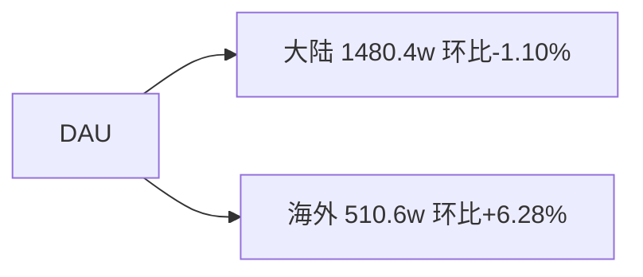

# 周报 Markdown 规范

> **适用范围**：上传至周报档案库的 `.md` 文件。不合规可能导致日期错误、趋势图不显示、知识库模块丢失、树状图无法渲染。

---

## 1. 文档骨架

| 序号 | 章节 | 标题 | 必须 |
|:--:|------|------|:--:|
| 1 | 总结 | `# 一、总结` | 是 |
| 2 | 下钻和归因 | `# 二、下钻和归因` | 是 |
| 3 | 异常指标检测 | `# 三、异常指标检测` | 是 |

章节之间可用 `---` 分隔。

---

## 2. 标题与日期

首行 `#` 标题 **必须** 含可解析的日期区间，否则 week 键回退到上传当天。

**推荐写法：**
```markdown
# 周报（2026-05-25 至 2026-05-31）
```

**解析优先级：**

| 优先级 | 模式 | 正则 | 示例 |
|:--:|------|------|------|
| 1 | 两个 8 位数字 + 非数字分隔 | `(20\d{6})\D+(20\d{6})` | `20260525_20260531` |
| 2 | 括号内两个完整日期 + 至/到 | `[\(（]\s*(20\d{2})[-/.]?(\d{2})[-/.]?(\d{2})\s*[至到~\-—_]+\s*(20\d{2})?[-/.]?(\d{2})[-/.]?(\d{2})\s*[\)）]` | `（2026-05-25 至 2026-05-31）` |
| 3 | ISO 周 | `(20\d{2})\s*[-_]?\s*w(\d{1,2})` | `2024-W16` |

---

## 3. 一、总结

### 3.1 必须包含的指标

| 指标 | 关键词 |
|------|--------|
| DAU | `DAU`、`日活`、`活跃用户`、`活跃` |
| 订阅收入 | `订阅收入`、`订阅营收`、`subscription revenue`、`收入`、`营收`、`整体收入`、`总收入` |

### 3.2 标识符

**整节包裹**用 `!summary1_str!` `!summary1_end!`（块级）：
- 包裹 `# 一、总结` 的**全部内容**（从标题下一行起，至节末尾 `---` 之前）

**DAU 关键句**用 `!dau_summary_str!` `!dau_summary_end!` 包裹（行内）：
- 取总结段中 **含 DAU 关键词 + 数值 + 环比** 的首句
- 以 `。！？!?；;` 为句边界

**收入关键句**用 `!revenue_summary_str!` `!revenue_summary_end!` 包裹：
- 取总结段中 **含收入关键词 + 数值 + 环比** 的首句

```markdown
# 一、总结

!summary1_str!
!dau_summary_str! DAU为**1,988万**，环比微涨0.69%，属稳定范围内波动。!dau_summary_end!

> - 大陆DAU为1,480万，环比下跌1.10%；
> - 海外DAU为511万，环比上涨6.28%。

!revenue_summary_str! 订阅收入为**313万**，环比下跌5.36%，续费回落是主因。!revenue_summary_end!
!summary1_end!
```

### 3.3 总结段定位正则

```
/#+\s*(?:一、|1\.)?\s*(?:结论|核心结论|总结|本周总结|Summary)/i
```

---

## 4. 二、下钻和归因

每个指标使用 `## 指标名` 二级标题独立成节。节内元素按顺序排列并包裹标识符。

### 4.1 标识符总览

| 元素 | 标识符对 | 包裹方式 | 顺序 |
|------|----------|----------|:--:|
| 指标总结 | `!summary2_str!` / `!summary2_end!` | 块级 | 1 |
| 知识库命中事件 | `!logic_lib_str!` / `!logic_lib_end!` | 块级 | 2 |
| 逻辑链 | `!logic_train_str!` / `!logic_train_end!` | 块级 | 3 |
| DAU 趋势表 | `!dau_trend_str!` / `!dau_trend_end!` | 块级 | 4 |
| 收入趋势表 | `!revenue_trend_str!` / `!revenue_trend_end!` | 块级 | 4 |
| 通用趋势表 | `!trend_str!` / `!trend_end!` | 块级 | 4 |
| mermaid 树 | `!tree_str!` / `!tree_end!` | 块级 | 5 |

无对应内容的元素跳过，不插入标识符对。

### 4.2 指标总结（`!summary2_str!` / `!summary2_end!`）

**识别**：每个 `##` 指标节内，含 `现象` 关键词的段落 + 紧接的分析 blockquote。

**包裹范围**：从"现象"行开始、到紧随其后的分析 blockquote 结束（含触发规则行）。

```markdown
!summary2_str!
现象：整体DAU环比0.69%（19,746,521 --> 19,883,164）

**触发规则：** 🟡｜DAU环比超±3%

> 下钻总结：海外古尔邦节多国假日修图需求增长是本周 DAU 上涨主因。
!summary2_end!
```

### 4.3 下钻总结

标签 `下钻总结：`（冒号全/半角均可），写在 blockquote 内：

```markdown
> 下钻总结：海外古尔邦节多国假日修图需求增长是本周 DAU 上涨主因。
```

### 4.4 知识库命中事件（`!logic_lib_str!` / `!logic_lib_end!`）

**识别**：blockquote 内出现 `知识库命中事件：` 标签。

**每条事件必须包含以下字段**，分隔符为 `，`；**事件名写在行首（无标签）**：

| 字段 | 标签 | 说明 |
|------|------|------|
| 事件 | （无标签，行首） | 事件名称，如 `古尔邦节（5/27-5/30）` |
| 出处 | `出处：` | 来源 |
| 命中原因 | `命中原因：` | 为何命中 |
| 事件描述 | `事件描述：` | 事件内容；缺省时可与事件名相同 |
| 关联度 | `关联度：` | **强 / 中 / 弱**（可带括号说明）；按时间重合、维度一致、方向同向、是否主因评级，**禁止一律写强** |

字段解析正则：`/(出处|命中原因|事件描述|关联度)\s*[：:]\s*/`

**关联度评级简表**：

| 等级 | 何时用 |
|------|--------|
| 强 | 时间重合 + 国家/渠道一致 + 方向同向 + 主因/高贡献 |
| 中 | 部分重合、非主导市场、历史同期佐证、间接解释 |
| 弱 | 方向矛盾、未见预期影响、解释力弱 |

```markdown
!logic_lib_str!
知识库命中事件：
>
> - 古尔邦节（5/27-5/30），出处：各国重要节假日，命中原因：时间段重合，事件描述：海外多国同时放假，关联度：强
> - 美国六月节（6/19），出处：各国节假日，命中原因：时间段重合，关联度：中（大陆贡献主导，海外影响面有限）
!logic_lib_end!
```

### 4.5 逻辑链（`!logic_train_str!` / `!logic_train_end!`）

**识别**：同时满足以下两条：
1. 行内含链标签关键字：`逻辑链` / `因果链` / `因果链路` / `归因逻辑链` / `归因链` / `核心逻辑`
2. 行内含箭头：`→` `->` `-->` `—>` `➔` `➡️`

**链标签关键字正则**：`/(逻辑链|因果链|因果链路|归因逻辑链|归因链|核心逻辑)/`

**箭头正则**：`/➡️|➔|—>|-->|->|→/`

可写在 blockquote 内或普通段落中。

```markdown
!logic_train_str!
逻辑链：
>
> - 古尔邦节 --> 海外用户闲暇修图 --> 海外DAU +6.28% --> 整体DAU +0.69%
!logic_train_end!
```

### 4.6 趋势表

趋势表识别条件（必须全部满足）：

| 条件 | 要求 |
|------|------|
| 首列表头 | `| 指标 |` |
| 周列数量 | ≥ 3 列 |
| 周列命名 | 匹配 `wk\d+`、`w\d+`、`\d+周前`、`前\d+周`、`本周`、`上周`、`本月`、`上月` |
| **不得含有** | `异常说明` 或 `异常详情` 列 |

周列正则：`/(wk\d+|w\d+|^\d+周前|前\d+周|本周|上周|本月|上月)/i`

**分类规则**：所有候选趋势表按内容归类：
- 表内（表头或行首列）含 `DAU`、`日活`、`活跃` 等 DAU 关键词 → 归为 DAU 候选
- 表内含 `收入`、`营收`、`订阅`、`单购`、`revenue` 等收入关键词 → 归为收入候选
- 既非 DAU 也非收入 → 归为通用类别

**文档级限制**：`!dau_trend_str!/!dau_trend_end!` 和 `!revenue_trend_str!/!revenue_trend_end!` 整篇文档各最多出现 1 次：
- 先扫描全文所有 `##` 指标节的 DAU/收入候选，按**最新时间列（最右数据列）中数据行指标值最大的那张**选出全局赢家
- 赢家所在节使用 `!dau_trend_str!/!dau_trend_end!` 或 `!revenue_trend_str!/!revenue_trend_end!`
- 非赢家的 DAU/收入趋势表降级使用 `!trend_str!/!trend_end!`
- 通用趋势表始终使用 `!trend_str!/!trend_end!`

```markdown
!dau_trend_str!
| 指标 | wk20 0511-0517 | wk21 0518-0524 | wk22 0525-0531 |
| --- | --- | --- | --- |
| **DAU** | 19,388,143 | 19,746,521 | 19,883,165 |
| **大陆DAU** | 14,590,397 | 14,968,446 | 14,803,956 |
| **海外整体DAU** | 4,822,522 | 4,804,527 | 5,106,159 |
!dau_trend_end!
```

### 4.7 树状图（`!tree_str!` / `!tree_end!`）

**mermaid 语法要求：**

| 项目 | 规范 |
|------|------|
| 代码块 | ` ```mermaid ` 围栏，direction 推荐 `flowchart LR` |
| 边 | 至少 2 条 `-->` |
| 节点标签 | `N1["显示文本"]`，优先提取贡献率（如 `+12.34%`），有贡献值时只显示贡献值；无贡献值时节点只显示名称，不显示其他数值 |
| 根节点 | 维度下钻取自 h2 标题文本；关联下钻取自标记行公式左侧主语（如 `保存量=保存用户数*人均保存` → `保存量`）。均须剥离内嵌 HTML |

树状图小节标记：`**维度下钻**`

```markdown
**维度下钻**

!tree_str!

!tree_end!
```

### 4.8 ASCII 树 → mermaid 转换

原始周报中常有 `├──` `└──` `│` 等字符绘制的维度下钻树，需转为 mermaid。

**树行正则**：`/^([│|\s]*)([├└])──\s+(.+?)\s*$/`
**缩进宽度**：4个空格/字符算一级

### 4.9 完整示例

```markdown
# 二、下钻和归因

## DAU

整体DAU环比0.69%（19,746,521 --> 19,883,164）

> 下钻总结：海外古尔邦节多国假日修图需求增长是本周 DAU 上涨主因。

!logic_lib_str!
知识库命中事件：
>
> - 古尔邦节（5/27-5/30），出处：各国重要节假日，命中原因：时间段重合，事件描述：海外多国同时放假，关联度：强
!logic_lib_end!

!logic_train_str!
逻辑链：
>
> - 古尔邦节 --> 海外用户闲暇修图 --> 海外DAU +6.28% --> 整体DAU +0.69%
!logic_train_end!

!dau_trend_str!
| 指标 | wk20 0511-0517 | wk21 0518-0524 | wk22 0525-0531 |
| --- | --- | --- | --- |
| **DAU** | 19,388,143 | 19,746,521 | 19,883,165 |
!dau_trend_end!

**维度下钻**

!tree_str!

!tree_end!
```

---

## 5. 三、异常指标检测

### 5.1 表格识别条件

| 条件 | 要求 |
|------|------|
| 首列表头 | 精确包含 `指标` |
| 环比列 | 含 `周环比变化` 或 `环比` 或 `环比变化` |
| 说明列 | 含 `异常说明` 或 `异常详情` |
| 周序列 | 含 `N周前` / `上周` / `本周` 等 |

### 5.2 标准表头

```markdown
# 三、异常指标检测

| 指标 | wk8 0216-0222 | wk9 0223-0301 | ... | 周环比变化 | 异常说明 |
| --- | --- | --- | --- | --- | --- |
| **DAU** | 1920.10 | 1959.28 | ... | +1.52% | 🟢 增长 |
| 大陆DAU | 1435.20 | 1459.20 | ... | +1.74% | 🟢 增长 |
| **订阅&单购收入** | 320.50 | 350.20 | ... | +2.70% | 🟢 增长 |
```

### 5.3 状态着色

| 单元格内容 | 颜色 |
|------------|------|
| `增长`、`+`、`🟢`、`升` | 绿 |
| `异常`、`-`、`🔴`、`跌` | 红 |
| `稳定`、`🟡`、`关注` | 金 |

### 5.4 指标名标识符（行内，AirBrush 周报）

异常表「指标」列：

| 原单元格 | 规范写法 |
|----------|----------|
| `**整体DAU**` | `!dau_data_str!**整体DAU**!dau_data_end!` |
| `**日均订阅毛利（剔除退款，$）**` | `!revenue_data_str!**日均订阅毛利（剔除退款，$）**!revenue_data_end!` |

### 5.5 毛利数值精度（AirBrush 周报）

异常表中 **日均订阅毛利（剔除退款，$） / 新增毛利 / 续订毛利** 各周数值须为**整数**（0 位小数；可用千分位，如 `136,684`），禁止保留 `.xx`。

---

## 6. 标识符速查

| 标识符对 | 位置 | 包裹内容 | 方式 |
|----------|------|----------|:--:|
| `!summary1_str!` / `!summary1_end!` | 一章总结 | section 一全部内容 | 块级 |
| `!summary2_str!` / `!summary2_end!` | 二章 ##指标 下 | 各指标的 现象+分析 blockquote | 块级 |
| `!logic_lib_str!` / `!logic_lib_end!` | 二章 ##指标 下 | 知识库命中事件块 | 块级 |
| `!logic_train_str!` / `!logic_train_end!` | 二章 ##指标 下 | 逻辑链块 | 块级 |
| `!dau_trend_str!` / `!dau_trend_end!` | 二章 ##指标 下 | DAU 趋势数据表（全文仅 1 个） | 块级 |
| `!revenue_trend_str!` / `!revenue_trend_end!` | 二章 ##指标 下 | 收入趋势数据表（全文仅 1 个） | 块级 |
| `!trend_str!` / `!trend_end!` | 二章 ##指标 下 | 通用/降级趋势数据表 | 块级 |
| `!tree_str!` / `!tree_end!` | 二章 ##指标 下 | mermaid 树状图 | 块级 |
| `!dau_summary_str!` / `!dau_summary_end!` | 一章总结 | DAU 关键描述句 | 行内 |
| `!revenue_summary_str!` / `!revenue_summary_end!` | 一章总结 | 收入关键描述句 | 行内 |
| `!dau_data_str!` / `!dau_data_end!` | 三章异常表 | 指标列 `**整体DAU**` | 行内 |
| `!revenue_data_str!` / `!revenue_data_end!` | 三章异常表 | 指标列 `**日均订阅毛利（剔除退款，$）**` | 行内 |

---

## 7. 禁止事项

| 禁止 | 后果 |
|------|------|
| 首行无 `#` 标题或标题无日期 | week 键错误 |
| 异常表缺少 `指标` 首列 | 无法识别为指标表 |
| 异常表缺少 `异常说明`/`异常详情` | 与趋势表混淆 |
| 下钻趋势表含 `异常说明` 列 | 无法抽取为折线图 |
| 下钻趋势表周列 < 3 | 不满足趋势图要求 |
| 知识库事件缺少行首事件名或 `出处：`/`命中原因：`/`事件描述：`/`关联度：` | 字段解析为空 |
| Mermaid 仅 1 条边 | 树渲染返回 null |
| 逻辑链无箭头分隔 | 无法拆分为步骤卡片 |
| 逻辑链仅有箭头、无链标签关键字 | 不被识别 |
| 使用旧标识符（`!table!`、`!trend_map!`、单行 `!logic_train!`、`!focus_param!`） | 新版无法解析 |
| summary1 缺失 | 总结段无法被整体提取 |
| summary2 缺失 | 指标级总结无法被独立索引 |

---

## 8. 自检清单

- [ ] 首行 `#` 标题含可解析日期区间
- [ ] 存在 `# 一、总结`，含 DAU + 订阅收入段落
- [ ] `# 一、总结` 整节包裹 `!summary1_str!` / `!summary1_end!`
- [ ] DAU 总结句包裹 `!dau_summary_str!` / `!dau_summary_end!`
- [ ] 收入总结句包裹 `!revenue_summary_str!` / `!revenue_summary_end!`
- [ ] 存在 `# 二、下钻和归因`，每个指标有 `## 指标名`
- [ ] 各指标 现象+分析 blockquote 包裹 `!summary2_str!` / `!summary2_end!`
- [ ] 知识库事件包裹 `!logic_lib_str!` / `!logic_lib_end!`，含三个字段
- [ ] 逻辑链包裹 `!logic_train_str!` / `!logic_train_end!`，含关键字+箭头
- [ ] DAU 趋势表包裹 `!dau_trend_str!` / `!dau_trend_end!`（全文最多 1 个），≥3 周列、无异常说明列
- [ ] 收入趋势表包裹 `!revenue_trend_str!` / `!revenue_trend_end!`（全文最多 1 个，若有），≥3 周列、无异常说明列
- [ ] 非赢家/通用趋势表包裹 `!trend_str!` / `!trend_end!`
- [ ] 树状图包裹 `!tree_str!` / `!tree_end!`，≥2 条边
- [ ] 存在 `# 三、异常指标检测`，含异常表
- [ ] 异常表含 `指标` 首列 + `周环比变化` + `异常说明` 列
- [ ] 异常表「指标」列：整体DAU / 日均订阅毛利已分别包裹 `!dau_data_str!` / `!revenue_data_str!`
- [ ] 异常表三个毛利（日均/新增/续订）周值为整数（0 位小数）
