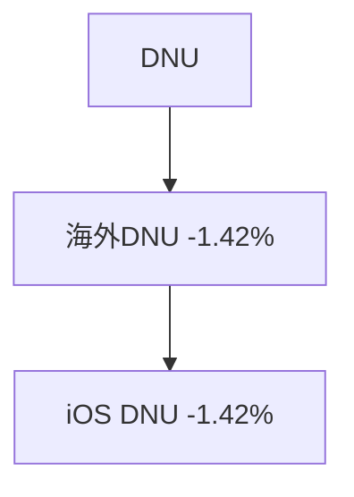

# 20260615_20260621周报

---

# 一、总结

!summary1_str!
!dau_summary_str! **DAU为2,010万，环比上涨2.89%（1,953万→2,010万, +56万）**，主要因**端午节假期（6/19-6/21）带动，**!dau_summary_end! 其中：

> - 大陆DAU环比上涨3.34%，主要因**端午节假期（6/19-6/21）带动**；
> - 海外DAU环比上涨1.58%，越南（+3.79%）、印度尼西亚（+5.41%）、中国台湾（+3.53%）、中国香港（+5.09%）普涨；泰国反向下跌-1.42%。

!revenue_summary_str! **订阅&单购收入为348万，环比上涨8.18%（322万→348万, +26万）**，主要由**大陆端午订阅活动（6/17-6/22）**强力拉动。!revenue_summary_end! 其中：

> - 新增收入+15.02%（贡献75.76%），大陆新增+30.93%：受端午运营活动影响，大陆iOS vip年+77.62%，Android vip年+106.36%，显著提升；
> - 海外新增收入-5.10%，中国台湾（-17.79%）、泰国（-12.78%）、美国（-17.02%）均下跌，推测wk24闪光滤镜推广末期收入高涨后的自然回落。
> - 续费收入+3.37%，大陆月续费iOS+7.88%、Android+7.77%，端午节假期用户活跃带动续费转化；
!summary1_end!

---

# 二、下钻和归因

## DAU 🔴 示例：h2 标题可内嵌 HTML span 标注异常状态

!summary2_str!
整体DAU环比2.89%（19,531,550 --> 20,096,175, 564,625）

> 下钻总结：主要由于大陆端上涨导致，贡献86.76%。大陆iOS端（贡献46.70%）和Android端（贡献34.66%）均有显著上涨。海外端贡献13.68%，其中越南（+3.79%）、印度尼西亚（+5.41%）、中国台湾（+3.53%）、中国香港（+5.09%）均上涨，泰国反向下跌-1.42%。
!summary2_end!

!logic_lib_str!
知识库命中事件：
>
> - 端午节（6/19-6/21），出处：各国节假日，命中原因：时间段重合（6/19-6/21含于本周末），国家维度：中国大陆+中国台湾+中国香港均放假，关联度：强
> - V12.12.0 全渠道发布（6/17 Android+iOS 11+商店），出处：发版事件，命中原因：时间段重合，事件描述：Live拼贴、一句话消除、超自然清透肤色、取色统一、一键美体、去灰功能、智能选区、AI Agent底导、旅行模式等75项需求，关联度：强
> - 越南5连推背景板（6/15-6/21），出处：背景板运营事件，命中原因：时间段重合+国家一致（越南），关联度：强
> - 美国六月节（6/19），出处：各国节假日，命中原因：时间段重合（6/19），关联度：中（大陆DAU贡献占比绝对主导，海外节日影响面有限）
> - 2025年端午节同期年SKU +51.20%，出处：2026年周报wk23记录，命中原因：历史同期节假日事件，关联度：中
>
!logic_lib_end!

!logic_train_str!
逻辑链：
>
> - 端午节（6/19-6/21）--> 3天小长假，用户拍照需求上升 --> DAU上升（大陆+3.34%、港台+3.53%~+5.09%）
> - V12.12.0全渠道发布（6/17）--> 新功能吸引用户更新/体验 --> DAU上升
> - 越南5连推背景板 --> 越南iOS DAU上涨3.89%
>
!logic_train_end!

!dau_trend_str!

| 指标 | wk2 0105-0111 | wk3 0112-0118 | wk4 0119-0125 | wk5 0126-0201 | wk6 0202-0208 | wk7 0209-0215 | wk8 0216-0222 | wk9 0223-0301 | wk10 0302-0308 | wk11 0309-0315 | wk12 0316-0322 | wk13 0323-0329 |
|---|---|---|---|---|---|---|---|---|---|---|---|---|
| **DAU** |---|---|---|---|---|---|---|---|---|---|---|---|
| **大陆DAU** |---|---|---|---|---|---|---|---|---|---|---|---|
| **海外整体DAU** |---|---|---|---|---|---|---|---|---|---|---|---|

!dau_trend_end!

**维度下钻**

!tree_str!

!tree_end!

---

# 三、异常指标检测

| 指标 | wk8 0216-0222 | wk9 0223-0301 | wk10 0302-0308 | wk11 0309-0315 | wk12 0316-0322 | wk13 0323-0329 | 周环比变化 | 指标状态 | 异常说明 |
|---|---|---|---|---|---|---|---|---|---|
| **DAU** |---|---|---|---|---|---|---|---|---|
| **大陆DAU** |---|---|---|---|---|---|---|---|---|
| **海外整体DAU** |---|---|---|---|---|---|---|---|---|
| **订阅&单购收入** |---|---|---|---|---|---|---|---|---|
| **证件照整体收入** |---|---|---|---|---|---|---|---|---|
| **付费修图** |---|---|---|---|---|---|---|---|---|