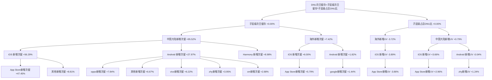
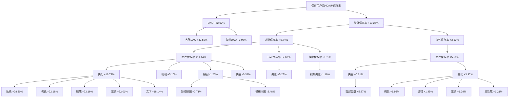
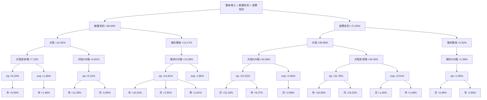
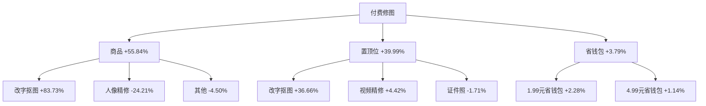

```mermaid
flowchart TD
    N1["DNU"]
    N2["中国大陆DNU +143.94%"]
    N1 --> N2
    N3["iOS DNU +102.80%"]
    N2 --> N3
    N4["自然量 DNU +85.63%"]
    N3 --> N4
    N5["App Store DNU +85.63%"]
    N4 --> N5
    N6["其他 DNU +85.63%"]
    N5 --> N6
    N7["投放量 DNU +17.20%"]
    N3 --> N7
    N8["苹果ASO DNU +9.32%"]
    N7 --> N8
    N9["量江湖ASO DNU +9.32%"]
    N8 --> N9
    N10["小红书 DNU +9.32%"]
    N7 --> N10
    N11["小红书聚光 DNU +9.32%"]
    N10 --> N11
    N12["Android DNU +26.87%"]
    N2 --> N12
    N13["自然量 DNU +36.54%"]
    N12 --> N13
    N14["OPPO DNU +16.33%"]
    N13 --> N14
    N15["oppo商店 DNU +16.33%"]
    N14 --> N15
    N16["VIVO DNU +16.04%"]
    N13 --> N16
    N17["vivo商店 DNU +16.04%"]
    N16 --> N17
    N18["其他 DNU +8.59%"]
    N13 --> N18
    N19["其他 DNU +8.59%"]
    N18 --> N19
    N20["荣耀 DNU -5.34%"]
    N13 --> N20
    N21["其他 DNU -5.34%"]
    N20 --> N21
    N104["其他 +1.67%"]
    N13 --> N104
    N26["投放量 DNU -10.04%"]
    N12 --> N26
    N27["今日头条 DNU -31.05%"]
    N26 --> N27
    N28["今日头条 DNU -31.05%"]
    N27 --> N28
    N29["华为 DNU -13.55%"]
    N26 --> N29
    N30["华为商店（点击归因） DNU -13.55%"]
    N29 --> N30
    N31["广点通 DNU +12.88%"]
    N26 --> N31
    N32["广点通 DNU +12.88%"]
    N31 --> N32
    N33["荣耀 DNU +8.39%"]
    N26 --> N33
    N34["荣耀商店（点击归因） DNU +8.39%"]
    N33 --> N34
    N105["其他 +15.91%"]
    N26 --> N105
    N45["harmony DNU +14.28%"]
    N2 --> N45
    N46["自然量 DNU +14.67%"]
    N45 --> N46
    N47["华为 DNU +14.67%"]
    N46 --> N47
    N48["华为商店 DNU +14.67%"]
    N47 --> N48
    N49["海外DNU -43.94%"]
    N1 --> N49
    N50["iOS DNU -49.11%"]
    N49 --> N50
    N51["泰国 DNU -9.49%"]
    N50 --> N51
    N52["自然 DNU -7.77%"]
    N51 --> N52
    N53["渠道 DNU -1.72%"]
    N51 --> N53
    N54["日本 DNU -7.30%"]
    N50 --> N54
    N55["自然 DNU -7.46%"]
    N54 --> N55
    N56["巴西 DNU -6.36%"]
    N50 --> N56
    N57["渠道 DNU -5.20%"]
    N56 --> N57
    N58["自然 DNU -1.16%"]
    N56 --> N58
    N106["其他 -21.50%"]
    N50 --> N106
    N78["Android DNU +5.17%"]
    N49 --> N78
    N79["孟加拉 DNU -22.25%"]
    N78 --> N79
    N80["自然 DNU -21.93%"]
    N79 --> N80
    N81["印度尼西亚 DNU +12.24%"]
    N78 --> N81
    N82["自然 DNU +20.65%"]
    N81 --> N82
    N83["渠道 DNU -8.60%"]
    N81 --> N83
    N84["伊拉克 DNU +5.20%"]
    N78 --> N84
    N85["自然 DNU +5.16%"]
    N84 --> N85
    N107["其他 +4.07%"]
    N78 --> N107
```

```mermaid
flowchart TD
    N1["收入"]
    N2["续费收入 +71.50%"]
    N1 --> N2
    N3["大陆 +68.98%"]
    N2 --> N3
    N4["大陆iOS端 +34.36%"]
    N3 --> N4
    N5["人像美容 +20.72%"]
    N4 --> N5
    N6["人像美容_面部重塑 +7.47%"]
    N5 --> N6
    N91["其他 +9.25%"]
    N5 --> N91
    N12["图片美化 +5.43%"]
    N4 --> N12
    N13["图片美化_美化滤镜 +2.62%"]
    N12 --> N13
    N14["图片美化_消除笔 +1.48%"]
    N12 --> N14
    N90["其他 +7.88%"]
    N4 --> N90
    N20["大陆安卓端 +34.34%"]
    N3 --> N20
    N21["人像美容 +17.85%"]
    N20 --> N21
    N22["人像美容_面部重塑 +5.83%"]
    N21 --> N22
    N23["人像美容_丰盈提拉 +2.35%"]
    N21 --> N23
    N24["人像美容_瘦脸瘦身 +2.29%"]
    N21 --> N24
    N25["人像美容_增高塑形 +1.52%"]
    N21 --> N25
    N26["人像美容_祛皱 +1.44%"]
    N21 --> N26
    N27["图片美化 +7.87%"]
    N20 --> N27
    N28["图片美化_美化滤镜 +2.57%"]
    N27 --> N28
    N29["图片美化_消除笔 +1.50%"]
    N27 --> N29
    N30["图片美化_贴纸 +1.21%"]
    N27 --> N30
    N92["其他 +6.86%"]
    N20 --> N92
    N36["海外整体 +2.52%"]
    N2 --> N36
    N37["日本 +4.02%"]
    N36 --> N37
    N38["日本iOS端 +3.36%"]
    N37 --> N38
    N39["h5活动&弹窗 +1.17%"]
    N38 --> N39
    N40["整体 +2.52%"]
    N36 --> N40
    N41["整体iOS端 +1.39%"]
    N40 --> N41
    N42["韩国 -1.64%"]
    N36 --> N42
    N43["韩国iOS端 -1.65%"]
    N42 --> N43
    N44["人像美容 -1.21%"]
    N43 --> N44
    N45["人像美容_面部重塑 -1.19%"]
    N44 --> N45
    N46["中国台湾 +1.20%"]
    N36 --> N46
    N47["中国台湾iOS端 +1.30%"]
    N46 --> N47
    N48["新增收入 +28.50%"]
    N1 --> N48
    N49["大陆 +14.32%"]
    N48 --> N49
    N50["大陆安卓端 +7.13%"]
    N49 --> N50
    N51["图片美化 +1.98%"]
    N50 --> N51
    N52["人像美容 +1.73%"]
    N50 --> N52
    N53["h5活动&弹窗 +1.47%"]
    N50 --> N53
    N54["大陆iOS端 +5.81%"]
    N49 --> N54
    N55["h5活动&弹窗 +3.79%"]
    N54 --> N55
    N56["图片美化 -2.05%"]
    N54 --> N56
    N57["图片美化_美化滤镜 -3.34%"]
    N56 --> N57
    N58["图片美化_贴纸 +1.57%"]
    N56 --> N58
    N59["证件照 +1.28%"]
    N54 --> N59
    N60["证件照_证件照大陆-寸照 +1.27%"]
    N59 --> N60
    N61["拼图 +1.08%"]
    N54 --> N61
    N62["RoboNeo +1.06%"]
    N54 --> N62
    N63["海外整体 +14.17%"]
    N48 --> N63
    N64["整体 +14.20%"]
    N63 --> N64
    N65["整体iOS端 +13.39%"]
    N64 --> N65
    N66["泰国 +6.75%"]
    N63 --> N66
    N67["泰国iOS端 +5.61%"]
    N66 --> N67
    N68["人像美容 +1.73%"]
    N67 --> N68
    N69["会员主页 +1.28%"]
    N67 --> N69
    N93["其他 +5.92%"]
    N63 --> N93
```

# 20260608_20260614周报

---

# 一、总结

DAU为1,953万，环比下跌1.98%（1,993万 --> 1,953万, -39.5万），其中：

> - 中国大陆DAU为1,468万，环比下跌2.13%，主要受六一儿童节效应消退后自然回落以及高考期间学生群体活跃度下降影响，属正常范围波动；
> - 海外DAU为488万，环比下跌1.53%，古尔邦节结束后持续自然回落，已连续3周下跌，属正常范围波动。

DNU为37.1万，环比上涨1.97%（+7,189），其中：

> - 中国大陆DNU为25.1万，环比上涨4.31%，主要受V12.11.0版本铺开（oppo 6/8、华为6/10）和「ai蓝调印象」「闪光理光滤镜」背景板上线驱动，iOS App Store自然量DNU大幅上涨；
> - 海外DNU为12.1万，环比下跌2.55%，古尔邦节获客热度持续消退，泰国、日本、巴西iOS端自然量DNU均有下跌。

新增次留为21.29%，环比上涨5.82%（+1.17个百分点），主要受V12.11.0版本新功能上线后新用户首次体验优化带动，大陆iOS端新增次留提升最为显著。

影像保存量为6,521万，环比下跌3.73%（-253万），已连续3周下跌。其中：

> - 图片保存量为5,579万，环比下跌3.83%，主要因六一效应消退后相机/美化类功能使用高峰回落，大陆人均保存数下降；
> - Live保存量为427万，环比下跌4.97%，连续3周下跌；
> - 视频保存量为516万，环比下跌1.67%。保存量下降主要由DAU下降和人均保存数下降共同驱动，与DAU下跌逻辑一致。

订阅&单购收入为**328万**，**环比大幅下跌7.74%（-27.5万）**，需重点关注。其中：

> - 新增收入为139万，环比下跌5.34%（-7.8万）。大陆iOS端h5活动&弹窗新增收入上涨（六一活动残量），但图片美化新增收入下滑，大陆安卓端也小幅下滑；海外泰国受主动触发购买页策略带动新增收入上涨，部分对冲大陆下滑；
> - **续费收入为189万，环比大幅下跌9.44%（-19.7万）**，为主要拖累。表现为大陆iOS端vip月SKU和安卓端vip年/月SKU普遍下跌，原因为上周受五一假期月续费高峰+去年端午节年续费叠加驱动续费冲高，本周自然回落至正常水平。海外续费波动平稳。

证件照收入为17.2万，环比微涨2.24%（+0.4万），属正常波动。高考结束后入学证件照需求增长以及「证件照-标准证件照」「高智感职场照」背景板持续曝光，带动收入微涨。

**付费修图收入为2.17万，环比下跌3.34%（-750）**，连续7周下跌且达近一年最低值。主要因5月19日起美化配方/美容配方引流位关闭至今未恢复，改字抠图为核心下跌来源，改字抠图和视频精修商品及置顶位收入均持续下滑。需关注引流位恢复进展。

---

# 二、下钻和归因

## DAU

整体DAU环比-1.98%（19,927,008 --> 19,531,550, -395,457）

| 指标          | wk13 0323-0329 | wk14 0330-0405 | wk15 0406-0412 | wk16 0413-0419 | wk17 0420-0426 | wk18 0427-0503 | wk19 0504-0510 | wk20 0511-0517 | wk21 0518-0524 | wk22 0525-0531 | wk23 0601-0607 | wk24 0608-0614 |
| ----------- | -------------- | -------------- | -------------- | -------------- | -------------- | -------------- | -------------- | -------------- | -------------- | -------------- | -------------- | -------------- |
| **DAU**     | 19,592,772     | 20,035,119     | 19,558,663     | 19,826,875     | 19,383,750     | 21,028,991     | 20,904,194     | 19,388,143     | 19,746,521     | 19,883,165     | 19,927,008     | 19,531,550     |
| **大陆DAU**   | 14,568,239     | 15,121,269     | 14,768,026     | 14,881,675     | 14,616,079     | 15,926,313     | 15,955,993     | 14,590,397     | 14,968,446     | 14,803,956     | 15,001,291     | 14,682,302     |
| **海外整体DAU** | 5,048,823      | 4,939,961      | 4,816,108      | 4,970,524      | 4,792,400      | 5,133,497      | 4,976,390      | 4,822,522      | 4,804,527      | 5,106,159      | 4,952,155      | 4,876,560      |

> 下钻总结：主要由于大陆DAU下跌导致，贡献80.65%，海外贡献19.12%，二者合计约100%
>
> 知识库命中事件：
>
> - 六一儿童节效应消退，出处：历史周报（wk23），命中原因：上周六一儿童节带动大陆DAU环比上涨1.50%后本周自然回落至节前水平
> - 高考（6/7-10），出处：考试日，命中原因：时间段重合，事件描述：6/7-10全国高考，新高考省份延续至6月10日，学生群体活跃度下降
>
> 逻辑链：
>
> - 六一儿童节效应消退 --> 大陆用户活跃度自然回落 --> 大陆DAU下降
> - 高考期间学生群体活跃度下降 --> 大陆DAU下降

---

## DNU

整体DNU环比1.97%（364,061 --> 371,251, 7,189）

**维度下钻**

| 指标          | wk13 0323-0329 | wk14 0330-0405 | wk15 0406-0412 | wk16 0413-0419 | wk17 0420-0426 | wk18 0427-0503 | wk19 0504-0510 | wk20 0511-0517 | wk21 0518-0524 | wk22 0525-0531 | wk23 0601-0607 | wk24 0608-0614 |
| ----------- | -------------- | -------------- | -------------- | -------------- | -------------- | -------------- | -------------- | -------------- | -------------- | -------------- | -------------- | -------------- |
| **整体DNU**   | 366,061        | 366,739        | 348,620        | 337,117        | 327,405        | 375,738        | 358,825        | 334,541        | 352,829        | 360,686        | 364,107        | 371,297        |
| **中国大陆DNU** | 229,244        | 246,977        | 233,552        | 225,740        | 216,354        | 258,171        | 248,425        | 224,933        | 241,815        | 232,276        | 240,186        | 250,534        |
| **海外DNU**   | 136,816        | 119,761        | 115,068        | 111,377        | 111,051        | 117,567        | 110,400        | 109,608        | 111,014        | 128,411        | 123,922        | 120,763        |

> 下钻总结：主要由于中国大陆DNU上涨导致，贡献143.94%，其中iOS端自然量（App Store）贡献85.63%断层领先，Android端自然量（OPPO +16.33%、VIVO +16.04%）也贡献显著；海外DNU下跌-43.94%，主要为海外iOS端下跌-49.11%（泰国 -9.49%、日本 -7.30%、巴西 -6.36%）
>
> > 海外iOS端在大盘中贡献为负，但其分支内泰国DNU下跌绝对值最高；海外Android端内印度尼西亚DNU上涨绝对值最高（+12.24%），孟加拉下跌绝对值最高（-22.25%）
>
> 知识库命中事件：
>
> - 「ai蓝调印象」与「闪光理光滤镜」背景板上线，出处：发版事件（背景板运营），命中原因：时间段重合（6/9及6/10），事件描述：大陆iOS+Android首屏上线ai蓝调印象(男版+女版)及闪光理光滤镜，带动自然量增长
>
> 逻辑链：
>
> - 「ai蓝调印象」+「闪光理光滤镜」背景板上线 --> 内容吸引力提升 --> 自然量DNU上涨
> - 古尔邦节(5/27-5/30)结束后两周 --> 海外获客热度持续回落 --> 海外iOS端DNU下跌

---

## 新增次留

整体DNU次日留存环比5.82%（20.12% --> 21.29%, 1.17%）

**关联下钻：DNU次日留存=子层级次日留存*子层级占总DNU比**

| 指标         | wk13 0323-0329 | wk14 0330-0405 | wk15 0406-0412 | wk16 0413-0419 | wk17 0420-0426 | wk18 0427-0503 | wk19 0504-0510 | wk20 0511-0517 | wk21 0518-0524 | wk22 0525-0531 | wk23 0601-0607 | wk24 0608-0614 |
| ---------- | -------------- | -------------- | -------------- | -------------- | -------------- | -------------- | -------------- | -------------- | -------------- | -------------- | -------------- | -------------- |
| **整体新增次留** | 20.60%         | 20.96%         | 19.46%         | 20.13%         | 19.95%         | 21.81%         | 18.98%         | 19.60%         | 19.78%         | 20.40%         | 20.12%         | 21.29%         |

> 下钻总结：主要由于中国大陆新增次留提升导致，贡献95.52%，其中iOS端贡献56.29%（App Store +47.45%），Android端贡献27.97%；海外新增次留贡献7.42%
>
> 知识库命中事件：
>
> - V12.11.0版本铺开，出处：v12.11.0版本需求，命中原因：时间段重合（6/3起iOS/Android陆续发布），事件描述：含闺蜜卡、皮肤美化取色统一+新肤色去黄、视频/Live手动瘦脸瘦身等核心功能，新用户首次体验提升
>
> 逻辑链：
>
> - V12.11.0版本新功能上线 --> 新用户首次体验优化 --> 新增次留提升

---

## 保存量 *🔴 整体保存量连续3周下跌；🔴 图片保存量连续3周下跌；🔴 Live保存量连续3周下跌*

整体保存量环比-3.73%（67,742,159 --> 65,212,301, -2,529,858）

**维度下钻**

```mermaid
flowchart TD
    N1["保存量"]
    N2["大陆保存量 +74.80%"]
    N1 --> N2
    N3["图片保存量 +62.86%"]
    N2 --> N3
    N4["美化 +32.77%"]
    N3 --> N4
    N5["滤镜 +27.40%"]
    N4 --> N5
    N6["调色 +21.06%"]
    N4 --> N6
    N7["编辑 +17.15%"]
    N4 --> N7
    N8["贴纸 +15.80%"]
    N4 --> N8
    N9["文字 +9.05%"]
    N4 --> N9
    N53["其他 +5.05%"]
    N4 --> N53
    N13["相机 +21.23%"]
    N3 --> N13
    N14["美容 +4.57%"]
    N3 --> N14
    N15["一键美颜 +3.67%"]
    N14 --> N15
    N54["其他 +10.00%"]
    N14 --> N54
    N22["拼图 +3.29%"]
    N3 --> N22
    N23["海报拼图 +1.47%"]
    N22 --> N23
    N24["模板拼图 +1.46%"]
    N22 --> N24
    N25["拼接拼图 +1.08%"]
    N22 --> N25
    N26["Live保存量 +8.61%"]
    N2 --> N26
    N27["相机 +4.55%"]
    N26 --> N27
    N28["修Live +1.60%"]
    N26 --> N28
    N29["美化 +1.60%"]
    N26 --> N29
    N30["视频保存量 +3.34%"]
    N2 --> N30
    N31["相机 +2.27%"]
    N30 --> N31
    N32["海外保存量 +25.20%"]
    N1 --> N32
    N33["图片保存量 +24.86%"]
    N32 --> N33
    N34["美容 +14.03%"]
    N33 --> N34
    N35["面部重塑 +8.05%"]
    N34 --> N35
    N36["瘦脸瘦身 +6.79%"]
    N34 --> N36
    N37["美妆 +6.77%"]
    N34 --> N37
    N55["其他 +23.93%"]
    N34 --> N55
    N47["美化 +7.87%"]
    N33 --> N47
    N48["滤镜 +4.49%"]
    N47 --> N48
    N49["调色 +2.98%"]
    N47 --> N49
    N50["编辑 +1.62%"]
    N47 --> N50
    N51["消除笔 +1.25%"]
    N47 --> N51
    N52["相机 +1.70%"]
    N33 --> N52
```

**关联下钻：保存量=保存用户数*人均保存**

```mermaid
flowchart TD
    N1["保存量=保存用户数*人均保存"]
    N2["整体保存用户数 +65.93%"]
    N1 --> N2
    N3["大陆保存用户数 +54.07%"]
    N2 --> N3
    N4["图片保存用户数 +48.26%"]
    N3 --> N4
    N5["美化 +29.56%"]
    N4 --> N5
    N6["滤镜 +24.97%"]
    N5 --> N6
    N7["调色 +22.41%"]
    N5 --> N7
    N8["编辑 +18.66%"]
    N5 --> N8
    N9["贴纸 +15.10%"]
    N5 --> N9
    N10["文字 +13.34%"]
    N5 --> N10
    N14["相机 +14.88%"]
    N4 --> N14
    N15["美容 +8.12%"]
    N4 --> N15
    N16["一键美颜 +5.72%"]
    N15 --> N16
    N26["拼图 +3.59%"]
    N4 --> N26
    N27["模板拼图 +2.00%"]
    N26 --> N27
    N28["海报拼图 +1.50%"]
    N26 --> N28
    N29["Live保存用户数 +10.66%"]
    N3 --> N29
    N30["相机 +3.88%"]
    N29 --> N30
    N31["美化 +1.65%"]
    N29 --> N31
    N32["修Live +1.31%"]
    N29 --> N32
    N33["视频保存用户数 +2.81%"]
    N3 --> N33
    N34["相机 +1.81%"]
    N33 --> N34
    N35["海外保存用户数 +12.07%"]
    N2 --> N35
    N36["图片保存用户数 +12.78%"]
    N35 --> N36
    N37["美容 +7.62%"]
    N36 --> N37
    N48["美化 +5.29%"]
    N36 --> N48
    N49["滤镜 +2.43%"]
    N48 --> N49
    N50["调色 +2.15%"]
    N48 --> N50
    N51["编辑 +1.32%"]
    N48 --> N51
    N52["消除笔 +1.04%"]
    N48 --> N52
    N53["整体人均保存数 +34.07%"]
    N1 --> N53
    N54["大陆人均保存数 +20.74%"]
    N53 --> N54
    N55["图片人均保存数 +14.60%"]
    N54 --> N55
    N56["相机功能人均保存数 +6.35%"]
    N55 --> N56
    N57["美容功能人均保存数 -3.55%"]
    N55 --> N57
    N58["一键美颜（二级）功能人均保存数 -2.05%"]
    N57 --> N58
    N59["瘦脸瘦身（二级）功能人均保存数 -1.48%"]
    N57 --> N59
    N60["增高塑形（二级）功能人均保存数 -1.46%"]
    N57 --> N60
    N61["面部重塑（二级）功能人均保存数 -1.04%"]
    N57 --> N61
    N62["美化功能人均保存数 +3.21%"]
    N55 --> N62
    N69["Live人均保存数 -2.05%"]
    N54 --> N69
    N70["海外人均保存数 +13.12%"]
    N53 --> N70
    N71["图片人均保存数 +12.08%"]
    N70 --> N71
    N72["美容功能人均保存数 +6.41%"]
    N71 --> N72
    N80["美化功能人均保存数 +2.58%"]
    N71 --> N80
    N81["滤镜（二级）功能人均保存数 +2.06%"]
    N80 --> N81
    N82["相机功能人均保存数 +1.05%"]
    N71 --> N82
```

**关联下钻：保存用户数=DAU*保存率**

| 指标          | wk13 0323-0329 | wk14 0330-0405 | wk15 0406-0412 | wk16 0413-0419 | wk17 0420-0426 | wk18 0427-0503 | wk19 0504-0510 | wk20 0511-0517 | wk21 0518-0524 | wk22 0525-0531 | wk23 0601-0607 | wk24 0608-0614 |
| ----------- | -------------- | -------------- | -------------- | -------------- | -------------- | -------------- | -------------- | -------------- | -------------- | -------------- | -------------- | -------------- |
| **整体保存量**   | 69,024,052     | 73,791,790     | 69,442,913     | 70,725,230     | 68,461,114     | 82,200,036     | 77,534,505     | 65,990,423     | 66,981,900     | 68,560,826     | 67,742,159     | 65,212,301     |
| **图片保存量**   | 59,119,643     | 63,046,955     | 59,353,682     | 60,539,258     | 58,578,929     | 70,232,939     | 66,380,264     | 56,412,487     | 57,273,598     | 58,554,824     | 58,005,924     | 55,786,823     |
| **视频保存量**   | 5,450,861      | 5,532,202      | 5,439,367      | 5,560,563      | 5,428,645      | 5,746,627      | 5,627,999      | 5,277,609      | 5,232,845      | 5,382,158      | 5,247,840      | 5,160,051      |
| **Live保存量** | 4,453,548      | 5,212,633      | 4,649,863      | 4,625,409      | 4,453,540      | 6,220,471      | 5,526,242      | 4,300,328      | 4,475,458      | 4,623,843      | 4,488,396      | 4,265,427      |

> 下钻总结（关联下钻优先）：主要由于保存用户数下降贡献65.93%，人均保存数下降贡献34.07%
>
> > 保存用户数下降根因为DAU下降（贡献52.67%，大陆DAU贡献42.59%）和保存率下降（贡献13.26%，大陆保存率贡献9.74%）
> > 人均保存数下降主要受大陆人均保存数下降（贡献20.74%）驱动
> > 维度下钻：大陆保存量下降贡献74.80%（图片保存量贡献62.86%：美化贡献32.77%、相机贡献21.23%），海外保存量下降贡献25.20%（图片保存量贡献24.86%：美容贡献14.03%、美化贡献7.87%）
>
> 知识库命中事件：
>
> - 六一儿童节效应消退，出处：历史周报（wk23），命中原因：上周六一带动相机/美化使用高峰，本周回落至正常水平
> - 高考（6/7-10），出处：考试日，命中原因：时间段重合，高考期间学生用户修图需求下降
>
> 逻辑链：
>
> - 六一儿童节效应消退 --> 相机/美化类功能使用高峰回落 --> 大陆人均保存数下降 --> 整体保存量下降
> - 高考期间学生群体活跃度下降 --> 大陆DAU下降 --> 保存用户数下降 --> 整体保存量下降

---

## 收入 *🔴 订阅&单购收入大幅下跌，需重点关注；🔴 新增收入大幅下跌，需重点关注；🔴 续费收入大幅下跌，需重点关注*

整体收入环比-7.74%（3,554,851.44 --> 3,279,651.10, -275,200.34）

**维度下钻**

**维度下钻**

| 指标          | wk13 0323-0329 | wk14 0330-0405 | wk15 0406-0412 | wk16 0413-0419 | wk17 0420-0426 | wk18 0427-0503 | wk19 0504-0510 | wk20 0511-0517 | wk21 0518-0524 | wk22 0525-0531 | wk23 0601-0607 | wk24 0608-0614 |
| ----------- | -------------- | -------------- | -------------- | -------------- | -------------- | -------------- | -------------- | -------------- | -------------- | -------------- | -------------- | -------------- |
| **订阅&单购收入** | 3,179,414      | 3,247,927      | 3,225,057      | 3,172,518      | 3,172,830      | 3,969,714      | 3,731,510      | 3,435,122      | 3,394,689      | 3,257,206      | 3,554,851      | 3,279,651      |
| **新增收入**    | 1,343,612      | 1,532,869      | 1,424,157      | 1,325,574      | 1,338,909      | 1,804,952      | 1,766,787      | 1,502,407      | 1,426,919      | 1,422,044      | 1,470,036      | 1,391,604      |
| **续费收入**    | 1,835,802      | 1,715,057      | 1,800,900      | 1,846,944      | 1,833,920      | 2,164,761      | 1,964,723      | 1,932,715      | 1,967,770      | 1,835,162      | 2,084,815      | 1,888,047      |

> 下钻总结：主要由于续费收入下降导致，贡献71.50%，新增收入贡献28.50%
>
> > 续费收入：大陆续费贡献68.98%（iOS端贡献34.36%：人像美容贡献20.72%含面部重塑+7.47%；安卓端贡献34.34%：人像美容贡献17.85%含面部重塑+5.83%），海外贡献2.52%（日本+4.02%、韩国-1.64%）。大陆iOS端vip月SKU贡献22.18%、年SKU贡献9.27%，大陆安卓端vip年SKU贡献16.05%、月SKU贡献16.02%
> > 新增收入：海外贡献14.17%（iOS端+13.39%，泰国+6.75%），大陆贡献14.32%（安卓端+7.13%，iOS端+5.81%：h5活动&弹窗+3.79%、图片美化-2.05%）
>
> 知识库命中事件：
>
> - wk23五一+端午续费高峰回落，出处：历史周报（wk23、wk19），命中原因：历史同期对比推理，事件描述：上周(wk23)受五一假期(wk18)月SKU续费+10.56%和去年端午节年SKU续费+51.20%叠加驱动，续费收入环比+12.87%创近期新高，本周自然回落至正常水平
> - V12.11.0订阅价格下探策略上线，出处：v12.11.0版本需求，命中原因：版本功能相关，事件描述：含订阅价格下探（营销敏感人群）、过期召回策略3期，驱动新增收入
>
> 逻辑链：
>
> - 五一假期月SKU续费高峰+去年端午节年SKU续费叠加效应消退 --> wk23续费收入冲高后本周自然回落 --> 大陆续费收入下降
> - V12.11.0订阅价格下探+过期召回策略上线 --> 新用户订阅转化提升 --> 海外新增收入部分对冲大陆新增收入下降

---

## 证件照收入

整体证件照收入环比2.24%（167,763.57 --> 171,526.95, 3,763.38）

| 指标          | wk13 0323-0329 | wk14 0330-0405 | wk15 0406-0412 | wk16 0413-0419 | wk17 0420-0426 | wk18 0427-0503 | wk19 0504-0510 | wk20 0511-0517 | wk21 0518-0524 | wk22 0525-0531 | wk23 0601-0607 | wk24 0608-0614 |
| ----------- | -------------- | -------------- | -------------- | -------------- | -------------- | -------------- | -------------- | -------------- | -------------- | -------------- | -------------- | -------------- |
| **证件照整体收入** | 177,212        | 150,665        | 161,886        | 165,642        | 156,759        | 124,649        | 164,412        | 173,543        | 169,206        | 165,442        | 167,764        | 171,527        |

> 下钻总结：证件照收入环比微涨2.24%（+3,763.38），属正常范围波动
>
> 知识库命中事件：
>
> - 高考（6/7-10），出处：考试日，命中原因：时间段重合（6/8-10），事件描述：高考结束后考生拍摄证件照用于大学入学报名需求增长，表现为形象照和寸照需求上涨
> - CET-4/6（6/13），出处：考试日，命中原因：时间段重合（6/13），事件描述：大学英语四六级考试当天考试报名照需求小幅带动
> - 「证件照-标准证件照」「高智感职场照」背景板持续在线（6/1-6/28），出处：发版事件（背景板运营），命中原因：时间段重合，事件描述：大陆首页第2、3位持续展示证件照入口
>
> 逻辑链：
>
> - 高考结束 --> 考生拍摄入学证件照需求增长 --> 证件照收入微涨
> - 「证件照-标准证件照」+「高智感职场照」背景板持续曝光 --> 证件照入口流量提升 --> 证件照收入微涨

---

## 付费修图 *🔴 付费修图连续7周下跌且达近一年最低值*

整体付费修图收入环比-3.34%（22,476 --> 21,726, -750）

**维度下钻**

| 指标       | wk13 0323-0329 | wk14 0330-0405 | wk15 0406-0412 | wk16 0413-0419 | wk17 0420-0426 | wk18 0427-0503 | wk19 0504-0510 | wk20 0511-0517 | wk21 0518-0524 | wk22 0525-0531 | wk23 0601-0607 | wk24 0608-0614 |
| -------- | -------------- | -------------- | -------------- | -------------- | -------------- | -------------- | -------------- | -------------- | -------------- | -------------- | -------------- | -------------- |
| **付费修图** | 25,463         | 27,166         | 25,243         | 24,686         | 24,369         | 29,778         | 27,501         | 24,737         | 23,815         | 22,819         | 22,477         | 21,726         |

> 下钻总结：改字抠图贡献83.73%为最大下跌来源（商品贡献55.84%+置顶位贡献39.99%），人像精修贡献-24.21%（商品内，意为逆势微涨）
>
> 知识库命中事件：
>
> - 美化配方、美容配方引流位关闭（5/19起），出处：北斗标注（marks），命中原因：5/19引流位关闭至今未恢复，事件描述：5月19日起付费修图首页美化配方/美容配方引流位关闭，导致付费修图入口流量持续下降，已连续7周下跌至近一年最低值21,726
>
> 逻辑链：
>
> - 引流位关闭（5/19起）--> 付费修图入口曝光持续下降 --> 改字抠图等商品收入持续下滑 --> 付费修图连续7周下跌

---

# 三、异常指标检测

| 指标          | wk19 0504-0510 | wk20 0511-0517 | wk21 0518-0524 | wk22 0525-0531 | wk23 0601-0607 | wk24 0608-0614 | 周环比变化  | 指标状态 | 异常说明               |
| ----------- | -------------- | -------------- | -------------- | -------------- | -------------- | -------------- | ------ | ---- | ------------------ |
| **DAU**     | 20,904,194     | 19,388,143     | 19,746,521     | 19,883,165     | 19,927,008     | 19,531,550     | -1.98% | 🔵   | DAU下跌，需关注          |
| **大陆DAU**   | 15,955,993     | 14,590,397     | 14,968,446     | 14,803,956     | 15,001,291     | 14,682,302     | -2.13% | 🔵   | 大陆DAU下跌，需关注        |
| **海外整体DAU** | 4,976,390      | 4,822,522      | 4,804,527      | 5,106,159      | 4,952,155      | 4,876,560      | -1.53% | 🔵   | 海外整体DAU连续3周下跌      |
| **整体DNU**   | 358,825        | 334,541        | 352,829        | 360,686        | 364,107        | 371,297        | +1.97% | 🔵   | -                  |
| **中国大陆DNU** | 248,425        | 224,933        | 241,815        | 232,276        | 240,186        | 250,534        | +4.31% | 🟢   | -                  |
| **海外DNU**   | 110,400        | 109,608        | 111,014        | 128,411        | 123,922        | 120,763        | -2.55% | 🔵   | 海外DNU连续3周下跌        |
| **整体新增次留**  | 18.98%         | 19.60%         | 19.78%         | 20.40%         | 20.12%         | 21.29%         | +5.82% | 🟢   | -                  |
| **整体保存量**   | 77,534,505     | 65,990,423     | 66,981,900     | 68,560,826     | 67,742,159     | 65,212,301     | -3.73% | 🔴   | 整体保存量连续3周下跌        |
| **图片保存量**   | 66,380,264     | 56,412,487     | 57,273,598     | 58,554,824     | 58,005,924     | 55,786,823     | -3.83% | 🔴   | 图片保存量连续3周下跌        |
| **视频保存量**   | 5,627,999      | 5,277,609      | 5,232,845      | 5,382,158      | 5,247,840      | 5,160,051      | -1.67% | 🔵   | 视频保存量连续3周下跌        |
| **Live保存量** | 5,526,242      | 4,300,328      | 4,475,458      | 4,623,843      | 4,488,396      | 4,265,427      | -4.97% | 🔴   | Live保存量连续3周下跌      |
| **订阅&单购收入** | 3,731,510      | 3,435,122      | 3,394,689      | 3,257,206      | 3,554,851      | 3,279,651      | -7.74% | 🔴   | 订阅&单购收入大幅下跌，需重点关注  |
| **证件照整体收入** | 164,412        | 173,543        | 169,206        | 165,442        | 167,764        | 171,527        | +2.24% | 🔵   | -                  |
| **付费修图**    | 27,501         | 24,737         | 23,815         | 22,819         | 22,477         | 21,726         | -3.34% | 🔴   | 付费修图连续7周下跌且达近一年最低值 |

*说明：环比增长超过3%为🟢增长(绿色)，环比变化在-3% -- 3%(含3%，不包含-3%)为🔵稳定(浅蓝色)，环比下跌超过3%(含-3%)为🔴异常(红色)。*