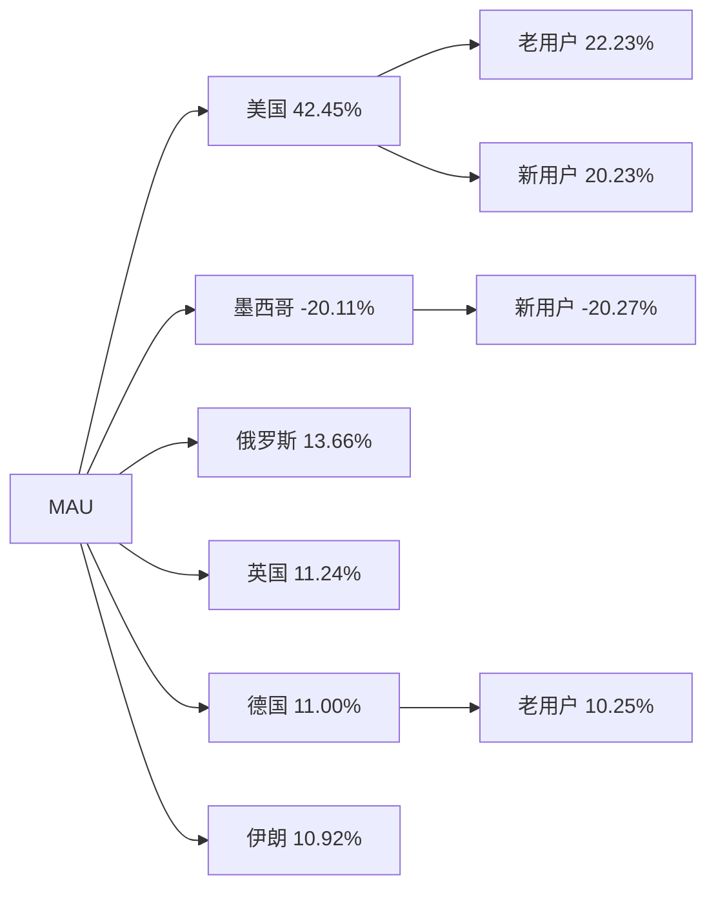
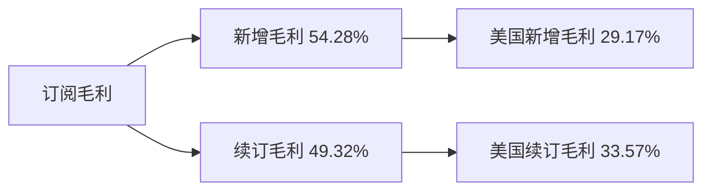
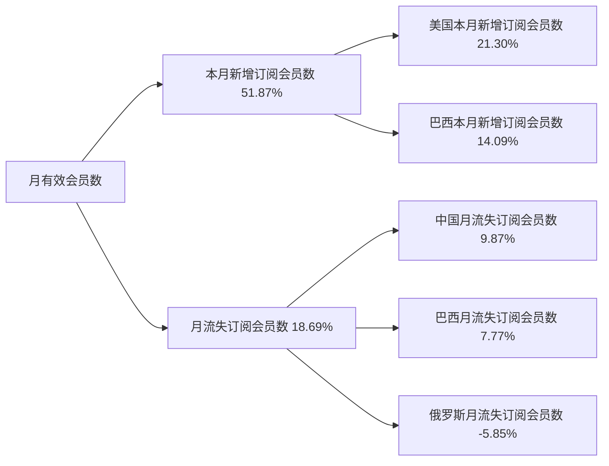

# 月报（2026-05-01 至 2026-05-31）

---

# 一、总结

!summary1_str!

## MAU

!dau_summary_str!整体MAU为601.59万，**环比上涨4.17%**（577.51万 → 601.59万, +24.07万），**同比下跌9.60%**。!dau_summary_end!其中：

> - **美国**MAU环比+10.07%（贡献42%），推测受母亲节窗口及北美春季修图活跃带动；
> - **巴西**MAU环比+0.23%（贡献2%）横盘，体量最大但增长停滞，需持续观测渠道沉淀；
> - **墨西哥**MAU环比-25.66%（贡献-20%），推测4月低质渠道冲量停投后自然回落；
> - **俄罗斯**、**英国**、**德国**分别环比+10.48%、+8.35%、+16.32%（贡献14%、11%、11%），欧洲多国同步走强，推测与Relight热点及节日后活跃修复有关；

## 订阅收入

!revenue_summary_str!订阅毛利（剔除退款）为$400.29万，**环比上涨11.40%**（$359.33万 → $400.29万, +$40.76万），**同比上涨10.78%**。!revenue_summary_end!其中：

> - **新增毛利**环比+12.08%（贡献54%），推测受5月母亲节窗口及北美修图活跃带动当月新增转化；
> - **美国**订阅毛利环比同向回暖（贡献62%），新增与续订双升支撑订阅毛利突破$400万；
> - **巴西**订阅毛利环比同向上涨（贡献9%），推测5月拉美修图需求回暖带动。

## 月有效会员数

整体月有效会员数为160.53万，**环比上涨1.14%**（158.72万 → 160.53万, +1.81万），**同比上涨9.60%**。其中：

> - **本月新增订阅会员数**环比+11.89%（贡献52%），推测受5月母亲节及北美订阅转化窗口带动；**月流失订阅会员数**环比-4.59%（贡献19%），流失回落形成正向支撑；
> - 新增维度**美国**环比+14.01%（贡献21%）、**巴西**环比+11.48%（贡献14%）为主要贡献国；流失回落侧**中国**、**巴西**分别贡献10%、8%。

!summary1_end!
---
# 二、下钻和归因

## MAU

!summary2_str!
现象：整体MAU环比+4.17%（5,775,135 --> 6,015,857, 240,722）

> 下钻总结：主要由于**美国**环比+10.07%造成，贡献42.45%；**墨西哥**环比-25.66%反向拖累（贡献-20.11%）；**俄罗斯**、**英国**、**德国**贡献13.66%、11.24%、11.00%
>
!summary2_end!
!logic_lib_str!
> 知识库命中事件：
>
> - **2026年母亲节**（5/10），出处：wiki `entities/mark-mothers-day-20260509` + `concepts/airbrush-holiday-calendar`，命中原因：5月第二周日与5月整月重叠，事件描述：marks 标注 DAU/活跃次留，与美国 MAU 新用户环比+31.29% 方向一致
> - **5月增长月会复盘**，出处：wiki `sources/20260616-may-growth-review`，命中原因：分析周期=2026年5月，事件描述：美国+10.1%、英国+8.3%、墨西哥-25.7%（渠道缩量）、巴西+0.2%横盘；定性为节日季节性+局部热点反弹
> - **Relight 东欧新增**（5/21），出处：wiki `entities/mark-relight-eastern-europe-20260521`，命中原因：德国/乌克兰/哈萨克斯坦等 MAU 同步上涨，事件描述：marks 标注 DNU/新增次留，与 MAU 侧德国+16.32%、乌克兰+24.26% 方向一致
>
!logic_lib_end!
!logic_train_str!
> 逻辑链：
>
> 导致上升
> - 母亲节窗口 + 北美修图活跃 --> 美国新/老用户 MAU 双升 --> 整体 MAU 上涨
> - Relight 热点 --> 东欧/德语区新增与活跃修复 --> 德国/俄罗斯/英国 MAU 贡献
>
> 阻止上升
> - 墨西哥4月低质渠道停投 --> 新用户 MAU 大幅回落（-53.33%） --> 整体 MAU 涨幅被部分抵消
!logic_train_end!
!trend_str!
| 指标 | 2025-06 | 2025-07 | 2025-08 | 2025-09 | 2025-10 | 2025-11 | 2025-12 | 2026-01 | 2026-02 | 2026-03 | 2026-04 | 2026-05 |
|-------|-------|-------|-------|-------|-------|-------|-------|-------|-------|-------|-------|-------|
| **整体 MAU** | 6,695,240 | 6,705,712 | 6,641,065 | 6,387,049 | 8,079,475 | 6,225,213 | 6,745,811 | 6,478,965 | 5,607,951 | 5,788,814 | 5,775,135 | 6,015,857 |
| **美国 MAU** | 1,230,033 | 1,237,858 | 1,211,146 | 1,160,367 | 1,498,396 | 1,111,728 | 1,131,830 | 1,004,557 | 937,796 | 1,006,176 | 1,014,368 | 1,116,564 |
| **巴西 MAU** | 2,256,518 | 2,249,503 | 2,241,479 | 2,285,321 | 2,937,189 | 2,324,168 | 2,713,738 | 2,777,279 | 2,281,495 | 2,275,058 | 2,194,269 | 2,199,388 |
| **英国 MAU** | 375,040 | 379,700 | 366,243 | 333,509 | 423,465 | 320,955 | 352,259 | 310,149 | 294,324 | 321,686 | 324,145 | 351,199 |
!trend_end!
**维度下钻**
!tree_str!

!tree_end!

---

## 订阅毛利

!summary2_str!
现象：订阅毛利（剔除退款，$）环比+11.40%（3,593,301.99 --> 4,002,914.10, 409,612.12）

> 下钻总结：**新增毛利**环比+12.08%贡献54.28%为主要拉动；**美国新增毛利**环比+13.66%贡献29.17%；续订毛利环比+10.17%同步上涨，美国续订毛利树中贡献33.57%
>
!summary2_end!
!logic_lib_str!
> 知识库命中事件：
>
> - **5月增长月会复盘**，出处：wiki `sources/20260616-may-growth-review`，命中原因：5月订阅毛利 OKR 完成度96.65%接近达标，事件描述：新增与续订双升支撑大盘+11.40%
> - **2026年母亲节**（5/10），出处：wiki `concepts/airbrush-holiday-calendar`，命中原因：5月节日窗口与北美订阅转化改善时间重合，事件描述：历史同类节日常带动修图与订阅尝试（无订阅 marks 直接标注，作辅助解释）
>
!logic_lib_end!
!logic_train_str!
> 逻辑链：
>
> 导致上升
> - 5月北美/拉美修图需求回暖 --> 新增毛利月合计上涨（贡献54.28%） --> 订阅毛利上涨
> - 美国续订毛利环比+12.82% --> 续订盘稳固 --> 订阅毛利上涨
!logic_train_end!
!trend_str!
| 指标 | 2025-06 | 2025-07 | 2025-08 | 2025-09 | 2025-10 | 2025-11 | 2025-12 | 2026-01 | 2026-02 | 2026-03 | 2026-04 | 2026-05 |
|-------|-------|-------|-------|-------|-------|-------|-------|-------|-------|-------|-------|-------|
| **订阅毛利（剔除退款，$）** | 3,435,567.07 | 3,998,519.62 | 3,967,339.15 | 3,654,574.49 | 3,685,427.32 | 3,656,423.52 | 3,923,846.69 | 3,884,464.89 | 3,339,299.38 | 3,655,952.81 | 3,593,301.99 | 4,002,914.10 |
| **新增毛利** | 1,711,628.62 | 1,770,760.90 | 1,789,837.93 | 1,471,209.24 | 1,508,020.62 | 1,632,842.19 | 1,783,295.66 | 1,950,293.99 | 1,569,201.84 | 1,845,293.85 | 1,841,108.38 | 2,063,439.84 |
| **续订毛利** | 1,940,105.36 | 2,457,173.54 | 2,416,249.35 | 2,380,741.84 | 2,388,014.33 | 2,221,220.40 | 2,334,814.46 | 2,178,779.90 | 1,986,517.58 | 2,040,613.64 | 1,985,529.02 | 2,187,551.31 |
!trend_end!
**维度下钻**
!tree_str!

!tree_end!

---

## 月有效会员数

!summary2_str!
现象：整体月有效会员数环比+1.14%（1,587,190 --> 1,605,332, 18,142）

> 下钻总结：按存量拆解 **本月有效 = 上月有效 + 本月新增 - 月流失**，**本月新增订阅会员数**环比+11.89%贡献51.87%、**月流失订阅会员数**环比-4.59%贡献18.69%（流失下降利好整体）双轨拉动。新增侧**美国**贡献21.30%、**巴西**贡献14.09%；流失侧**中国**流失大幅回落贡献9.87%，**俄罗斯**流失环比+77.22%反向拖累（贡献-5.85%）
>
!summary2_end!
!logic_lib_str!
> 知识库命中事件：
>
> - **5月增长月会复盘**，出处：wiki `sources/20260616-may-growth-review`，命中原因：5月 MAU/会员结构讨论与有效会员微涨方向一致，事件描述：巴西体量最大但增长停滞，会员侧新增回升、流失回落支撑微涨
> - **2026年母亲节**（5/10），出处：wiki `entities/mark-mothers-day-20260509`，命中原因：5月节日窗口与北美活跃/订阅转化时间重合，事件描述：与美国新增会员贡献21.30%方向部分一致（辅助解释）
> - 无有效会员数直接 marks，出处：wiki `sources/beidou-marks-merged`，命中原因：5月 marks 未单独标注月有效会员数指标。事件描述：
>
!logic_lib_end!
!logic_train_str!
> 逻辑链：
>
> 导致上升
> - 北美/拉美新增会员回升（美国+14.01%） --> 本月新增有效会员上涨 --> 整体月有效会员上涨
> - 月流失会员回落（-4.59%） --> 净增量扩大 --> 整体月有效会员上涨
>
> 阻止上升
> - 俄罗斯月流失会员大幅上升（+77.22%） --> 流失盘拖累 --> 部分抵消新增贡献
!logic_train_end!
!trend_str!
| 指标 | 2025-06 | 2025-07 | 2025-08 | 2025-09 | 2025-10 | 2025-11 | 2025-12 | 2026-01 | 2026-02 | 2026-03 | 2026-04 | 2026-05 |
|-------|-------|-------|-------|-------|-------|-------|-------|-------|-------|-------|-------|-------|
| **整体月有效会员数** | 1,485,829 | 1,511,737 | 1,530,362 | 1,540,338 | 1,549,082 | 1,557,217 | 1,584,924 | 1,595,387 | 1,570,164 | 1,581,632 | 1,587,190 | 1,605,332 |
| **上月有效会员数** | — | 1,485,829 | 1,511,737 | 1,530,362 | 1,540,338 | 1,549,082 | 1,557,217 | 1,584,924 | 1,595,387 | 1,570,164 | 1,581,632 | 1,587,190 |
| **本月新增订阅会员数** | 87,411 | 93,952 | 94,657 | 84,662 | 84,855 | 90,064 | 103,001 | 95,273 | 72,558 | 85,684 | 79,125 | 88,536 |
| **月流失订阅会员数** | 66,017 | 66,447 | 75,039 | 75,052 | 76,738 | 81,311 | 79,570 | 94,513 | 104,769 | 74,174 | 73,805 | 70,415 |
!trend_end!
**维度下钻**
!tree_str!

!tree_end!

---

# 三、异常指标检测

| 指标 | 2025-10 | 2025-11 | 2025-12 | 2026-01 | 2026-02 | 2026-03 | 2026-04 | 2026-05 | 月环比变化 | 指标状态 | 异常说明 |
|-------|-------|-------|-------|-------|-------|-------|-------|-------|-------|-------|-------|
| !dau_data_str!**整体 MAU**!dau_data_end! | 8,079,475 | 6,225,213 | 6,745,811 | 6,478,965 | 5,607,951 | 5,788,814 | 5,775,135 | 6,015,857 | +4.17% | 🟢 | - |
| !revenue_data_str!**订阅毛利（剔除退款，$）**!revenue_data_end! | 3,685,427.32 | 3,656,423.52 | 3,923,846.69 | 3,884,464.89 | 3,339,299.38 | 3,655,952.81 | 3,593,301.99 | 4,002,914.10 | +11.40% | 🟢 | - |
| **新增毛利** | 1,508,020.62 | 1,632,842.19 | 1,783,295.66 | 1,950,293.99 | 1,569,201.84 | 1,845,293.85 | 1,841,108.38 | 2,063,439.84 | +12.08% | 🟢 | - |
| **续订毛利** | 2,388,014.33 | 2,221,220.40 | 2,334,814.46 | 2,178,779.90 | 1,986,517.58 | 2,040,613.64 | 1,985,529.02 | 2,187,551.31 | +10.17% | 🟢 | - |
| **整体月有效会员数** | 1,549,082 | 1,557,217 | 1,584,924 | 1,595,387 | 1,570,164 | 1,581,632 | 1,587,190 | 1,605,332 | +1.14% | ⚫ | - |

*说明：环比增长超过3%为🟢增长(绿色)，环比变化在0~3%(不含0%，含3%)为⚫稳定(黑色)，环比变化在0~-3%(含0%，不含-3%)为🟡稳定(黄色)，环比下跌超过3%(含-3%)为🔴异常(红色)。最低值判断基于当前源数据可用的最近最多14月历史。*
