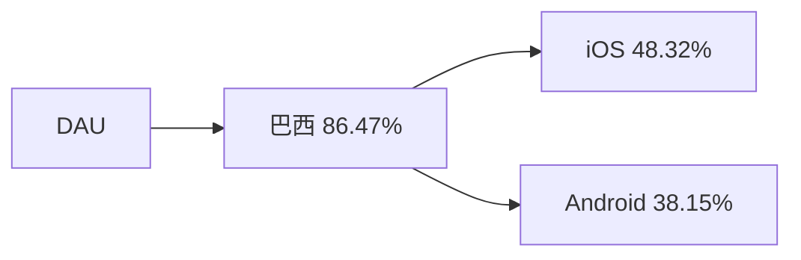
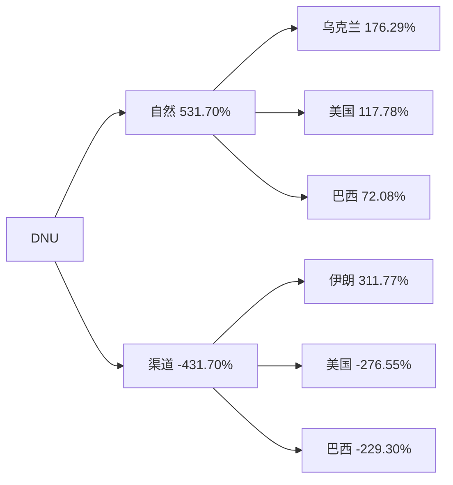
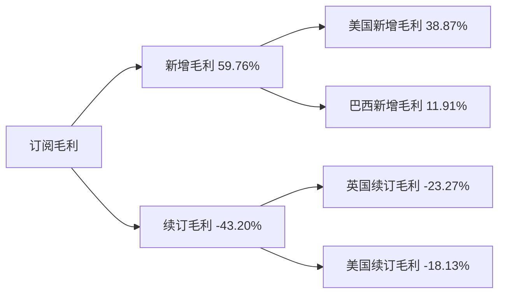
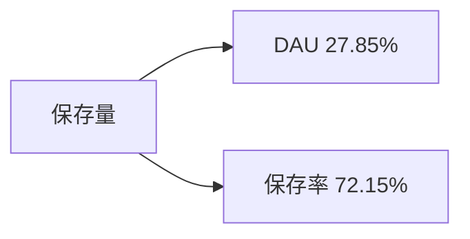

# 周报（2026-06-22 至 2026-06-28）

---

# 一、总结

!summary1_str!

## DAU

!dau_summary_str!日均DAU环比+1.03%（72.33万 --> 73.07万, +0.74万），属正常波动。!dau_summary_end!其中：

> - 巴西DAU环比+2.10%（29.35万 --> 29.97万, +0.62万）（贡献86%）拉动最大，6/24圣约翰节为六月节正日，节日修图需求带动巴西活跃回升。

## DNU

DNU环比+0.39%（4.23万 --> 4.24万, +166），属正常波动。其中：

> - 自然DNU环比+3.52%（2.51万 --> 2.60万, +884），其中乌克兰自然DNU环比+92.68%（316 --> 609, +293）、美国自然DNU环比+5.39%（3,633 --> 3,828, +196）拉动，乌克兰未找到有明显带动的功能；
> - 渠道DNU环比-4.18%（1.72万 --> 1.64万, -718）形成拖累，其中美国渠道DNU环比-14.99%（3,067 --> 2,607, -460）、巴西渠道DNU环比-4.22%（9,045 --> 8,664, -381）回落，主要受低效渠道关停及渠道成本上涨影响。

## 订阅收入

!revenue_summary_str!日均订阅毛利环比-3.56%（$13.02万 --> $12.56万, -$0.46万），跌幅偏大。!revenue_summary_end!其中：

> - 新增毛利环比-4.10%（贡献60%）为主要拖累，其中美国新增毛利环比-5.68%（贡献39%）、巴西新增毛利环比-6.14%（贡献12%）同步走弱，巴西受六月节前段及中段窗口后转化回落影响，美国延续6月中下旬新增转化走弱；
> - 续订毛利环比+2.74%（贡献43%）反向提拉，其中英国续订毛利环比+13.10%、美国续订毛利环比+2.09%；去年同期整体订阅毛利周环比+2.96%，本周续订增幅与同期方向及幅度接近，判断以自然波动为主。

## 活跃次留

整体活跃次留环比-0.90%（32.54% --> 32.25%, -0.29pp），属正常波动。

## 新增次留

整体新增次留环比-0.05%（14.24% --> 14.23%, -0.01pp），属正常波动。

## 保存量

整体保存量环比+3.73%（48.38万 --> 50.18万, +1.81万），涨幅偏大。其中：

> - 保存率环比+2.68%（贡献72%）为主要拉动，DAU环比+1.03%（贡献28%）同步贡献。

!summary1_end!
---
# 二、下钻和归因

## DAU

!summary2_str!
现象：整体DAU环比1.03%（723,297 --> 730,722, 7,425）

> 下钻总结：巴西老用户DAU环比+2.31%拉动最大（贡献86.47%）
>
!summary2_end!
!logic_lib_str!
> 知识库命中事件：
>
> - 出处：知识库，São João 圣约翰节（6/24），命中原因：wk26分析周（0622～0628）包含六月节正日6/24，业务双周会记录巴西DAU受该节日带动环比上涨。事件描述：
> - 出处：知识库，Festa Junina 六月节窗口，命中原因：wk24含6/12巴西情人节、6/13圣安东尼节及6/14起高峰，wk25中段回落，wk26圣约翰节节点活跃修复。事件描述：
>
!logic_lib_end!
!logic_train_str!
> 逻辑链：
>
> - 6/24圣约翰节修图需求上升 --> 巴西老用户iOS与Android活跃同步增长 --> 巴西DAU上涨 --> 整体DAU微涨
!logic_train_end!
!dau_trend_str!
| 指标 | wk19 0504-0510 | wk20 0511-0517 | wk21 0518-0524 | wk22 0525-0531 | wk23 0601-0607 | wk24 0608-0614 | wk25 0615-0621 | wk26 0622-0628 | 环比波动 |
|-------|-------|-------|-------|-------|-------|-------|-------|-------|-------|
| **整体 DAU** | 714,276 | 719,006 | 695,294 | 732,984 | 718,559 | 740,301 | 723,297 | 730,722 | +1.03% |
| **美国 DAU** | 117,158 | 126,352 | 118,272 | 122,715 | 120,225 | 118,053 | 119,412 | 118,224 | -0.99% |
| **巴西 DAU** | 297,997 | 296,822 | 283,995 | 283,371 | 289,581 | 312,204 | 293,527 | 299,686 | +2.10% |
| **英国 DAU** | 37,149 | 35,301 | 36,503 | 44,735 | 37,360 | 37,506 | 39,787 | 41,304 | +3.81% |
| **iOS DAU** | 525,761 | 529,665 | 514,133 | 542,980 | 532,381 | 549,575 | 537,941 | 541,510 | +0.66% |
| **Android DAU** | 188,515 | 189,342 | 181,160 | 190,004 | 186,179 | 190,726 | 185,356 | 189,212 | +2.08% |
!dau_trend_end!
**维度下钻**
!tree_str!

!tree_end!

---

## DNU

!summary2_str!
现象：整体DNU环比0.39%（42,277 --> 42,444, 166）

> 下钻总结：自然DNU环比+3.52%，乌克兰自然DNU环比+92.68%（316 --> 609, +293）、美国自然DNU环比+5.39%（3,633 --> 3,828, +196）拉动；渠道DNU环比-4.18%形成拖累，美国渠道环比-14.99%（3,067 --> 2,607, -460）、巴西渠道环比-4.22%（9,045 --> 8,664, -381）回落，伊朗渠道环比+478.13%（108 --> 627, +518）部分对冲
>
!summary2_end!
!logic_lib_str!
> 知识库命中事件：
>
> - 出处：知识库，业务双周会记录渠道端关停低效渠道、渠道成本上涨，与本周渠道DNU下跌方向一致命中原因：。事件描述：
> - 出处：知识库，乌克兰自然DNU未命中同期节日、投放或产品变动知识命中原因：。事件描述：
>
!logic_lib_end!
!logic_train_str!
> 逻辑链：
>
> - 乌克兰、美国自然新增上涨 --> 自然DNU上行
> - 乌克兰功能进入UV三门槛无合格项 --> 不作功能归因
> - 低效渠道关停及成本上涨 --> 美国、巴西渠道DNU回落 --> 拖累整体DNU
!logic_train_end!
!trend_str!
| 指标 | wk19 0504-0510 | wk20 0511-0517 | wk21 0518-0524 | wk22 0525-0531 | wk23 0601-0607 | wk24 0608-0614 | wk25 0615-0621 | wk26 0622-0628 | 环比波动 |
|-------|-------|-------|-------|-------|-------|-------|-------|-------|-------|
| **整体 DNU** | 37,300 | 39,508 | 42,419 | 47,334 | 45,928 | 44,210 | 42,277 | 42,444 | +0.39% |
| **渠道 DNU** | 13,482 | 16,095 | 16,875 | 18,274 | 18,954 | 17,285 | 17,168 | 16,450 | -4.18% |
| **自然 DNU** | 23,819 | 23,413 | 25,544 | 29,060 | 26,974 | 26,925 | 25,110 | 25,994 | +3.52% |
!trend_end!
**维度下钻**
!tree_str!

!tree_end!

**乌克兰自然 DNU · New×Organic 图片编辑进入 UV 功能对比**（OCI `10015706`/`90628`；近 4 周周 SUM；按进入人数 Top10）

| 功能 | wk23 0601-0607 | wk24 0608-0614 | wk25 0615-0621 | wk26 0622-0628 | 绝对值波动 | 环比波动 |
|-------|-------|-------|-------|-------|-------|-------|
| Filters | 975 | 1,431 | 911 | 1,230 | +319 | +35.0% |
| Relight | 782 | 1,267 | 779 | 848 | +69 | +8.9% |
| Magic | 616 | 705 | 596 | 576 | -20 | -3.4% |
| Face | 597 | 607 | 541 | 460 | -81 | -15.0% |
| AI Retouch | 557 | 602 | 535 | 478 | -57 | -10.7% |
| AI Image | 330 | 421 | 245 | 496 | +251 | +102.4% |
| Effects | 320 | 563 | 303 | 469 | +166 | +54.8% |
| Preset | 298 | 540 | 311 | 436 | +125 | +40.2% |
| Hair | 305 | 347 | 307 | 347 | +40 | +13.0% |
| Makeup | 332 | 325 | 331 | 261 | -70 | -21.1% |

说明：候选需同时满足环比 Top1～2、Δ Top1～2、且至少 2 天进入人数进当日 Top1～3。AI Image是环比Top1与Δ Top2的唯一交集，但周内仅6/22一天进入人数位列当日Top3，不满足至少2天日级Top3门槛；Filters虽为Δ Top1且日级常居Top1，但环比仅第5。无功能同时满足三门槛，故未找到有明显带动的功能。绝对值波动=本周−上周。

---

## 订阅毛利

!summary2_str!
现象：日均订阅毛利（剔除退款，$）环比-3.56%（130,205.77 --> 125,573.21, -4,632.56）

> 下钻总结：新增毛利环比-4.10%为主要拖累（贡献59.76%），美国新增毛利环比-5.68%为最大负向项；续订毛利环比+2.74%反向提拉（贡献43.20%）
>
!summary2_end!
!logic_lib_str!
> 知识库命中事件：
>
> - 出处：知识库，巴西六月节前段及中段窗口后转化回落，命中原因：wk24的6/12巴西情人节、6/13圣安东尼节及随后六月节中段窗口结束后，试用转化及新增入账回落。事件描述：
> - 出处：知识库，业务双周会记录美国、巴西新增毛利下跌，是本周订阅毛利的主要拖累项命中原因：。事件描述：
>
> 去年同期对照：
>
> - 出处：知识库，2025年0615～0621整体订阅毛利合计$777,437，0622～0628合计$800,482，周环比+2.96%；本周续订毛利环比+2.74%，方向及幅度接近，未发现额外事件，判断以自然波动为主命中原因：。事件描述：
>
!logic_lib_end!
!logic_train_str!
> 逻辑链：
>
> - 六月节前段及中段窗口结束 --> 巴西新增转化回落 --> 巴西新增毛利下跌
> - 美国新增转化延续走弱 --> 美国新增毛利下跌 --> 新增毛利拖累整体订阅毛利
> - 英国、美国续订毛利上涨 --> 部分抵消新增毛利下跌
!logic_train_end!
!revenue_trend_str!
| 指标 | wk19 0504-0510 | wk20 0511-0517 | wk21 0518-0524 | wk22 0525-0531 | wk23 0601-0607 | wk24 0608-0614 | wk25 0615-0621 | wk26 0622-0628 | 环比波动 |
|-------|-------|-------|-------|-------|-------|-------|-------|-------|-------|
| **日均订阅毛利** | 122,018 | 129,602 | 131,975 | 130,155 | 132,158 | 128,979 | 130,206 | 125,573 | -3.56% |
| **新增毛利** | 62,843 | 66,411 | 66,666 | 68,767 | 69,907 | 68,773 | 67,471 | 64,702 | -4.10% |
| **续订毛利** | 66,979 | 71,372 | 73,733 | 69,323 | 71,267 | 69,562 | 72,915 | 74,916 | +2.74% |
!revenue_trend_end!
**维度下钻**
!tree_str!

!tree_end!

---

## 保存量

!summary2_str!
现象：整体保存量环比3.73%（483,750 --> 501,817, 18,067）

> 下钻总结：保存率环比+2.68%为主要拉动（贡献72.15%），DAU环比+1.03%同步贡献（贡献27.85%）
>
!summary2_end!
!logic_train_str!
> 逻辑链：
>
> - 保存率回升 --> 整体保存量上行
> - DAU微涨 --> 保存量进一步增长
!logic_train_end!
!trend_str!
| 指标 | wk19 0504-0510 | wk20 0511-0517 | wk21 0518-0524 | wk22 0525-0531 | wk23 0601-0607 | wk24 0608-0614 | wk25 0615-0621 | wk26 0622-0628 | 环比波动 |
|-------|-------|-------|-------|-------|-------|-------|-------|-------|-------|
| **整体保存量** | 493,486 | 489,753 | 476,680 | 503,309 | 492,739 | 450,476 | 483,750 | 501,817 | +3.73% |
| **整体保存率** | 69.09% | 68.12% | 68.56% | 68.67% | 68.57% | 60.85% | 66.88% | 68.67% | +2.68% |
!trend_end!
**关联下钻**
!tree_str!

!tree_end!

---

# 三、异常指标检测

| 指标 | wk21 0518-0524 | wk22 0525-0531 | wk23 0601-0607 | wk24 0608-0614 | wk25 0615-0621 | wk26 0622-0628 | 周环比变化 | 指标状态 | 异常说明 |
|-------|-------|-------|-------|-------|-------|-------|-------|-------|-------|
| !dau_data_str!**整体DAU**!dau_data_end! | 695,294 | 732,984 | 718,559 | 740,301 | 723,297 | 730,722 | +1.03% | ⚫ | - |
| **整体DNU** | 42,419 | 47,334 | 45,928 | 44,210 | 42,277 | 42,444 | +0.39% | ⚫ | - |
| !revenue_data_str!**日均订阅毛利（剔除退款，$）**!revenue_data_end! | 131,975 | 130,155 | 132,158 | 128,979 | 130,206 | 125,573 | -3.56% | 🔴 | 达近6周最低值 |
| **新增毛利** | 66,666 | 68,767 | 69,907 | 68,773 | 67,471 | 64,702 | -4.10% | 🔴 | 连续4周下跌且达近6周最低值 |
| **续订毛利** | 73,733 | 69,323 | 71,267 | 69,562 | 72,915 | 74,916 | +2.74% | ⚫ | - |
| **整体活跃次留** | 31.97% | 32.15% | 31.74% | 32.53% | 32.54% | 32.25% | -0.90% | 🟡 | 下跌，需关注 |
| **整体新增次留** | 13.69% | 13.82% | 13.41% | 14.42% | 14.24% | 14.23% | -0.05% | 🟡 | 连续3周下跌 |
| **整体保存量** | 476,680 | 503,309 | 492,739 | 450,476 | 483,750 | 501,817 | +3.73% | 🟢 | - |

*说明：环比增长超过3%为🟢增长，环比变化在0~3%（不含0%，含3%）为⚫稳定，环比变化在0~-3%（含0%，不含-3%）为🟡稳定，环比下跌超过3%（含-3%）为🔴异常。*
