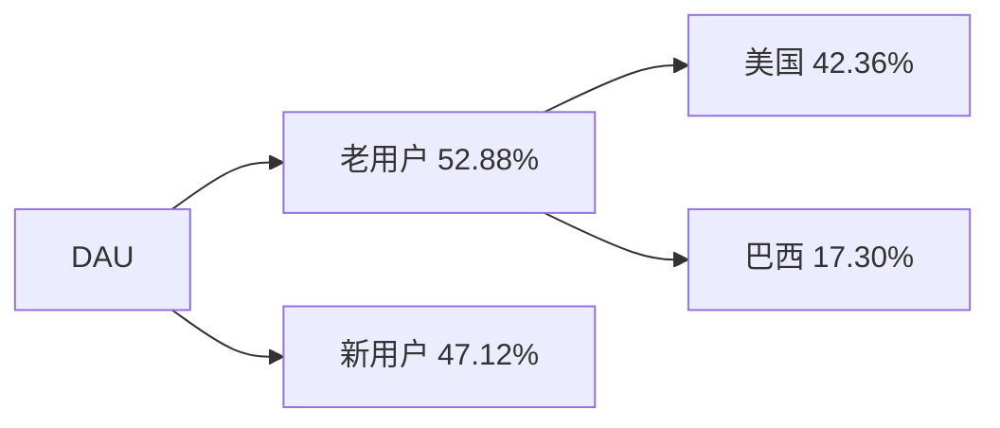
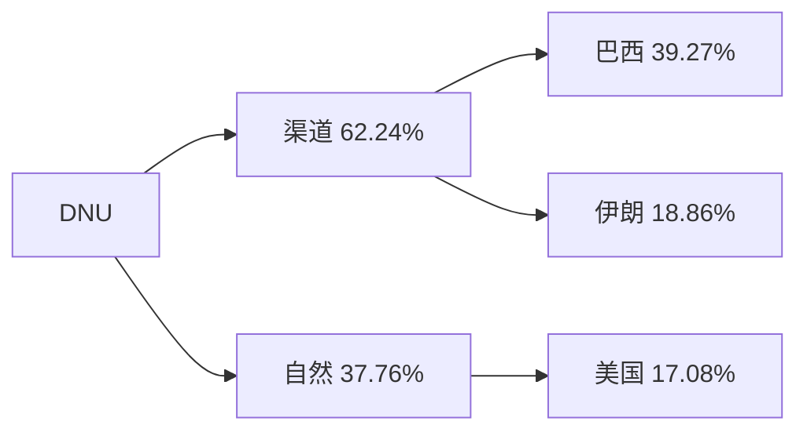
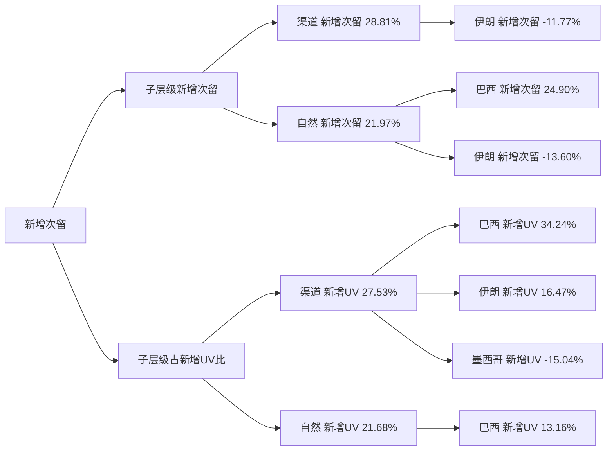
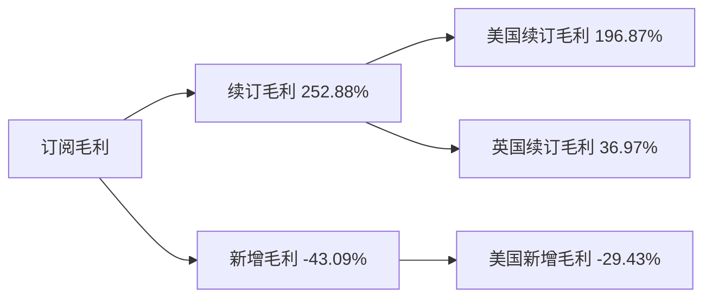
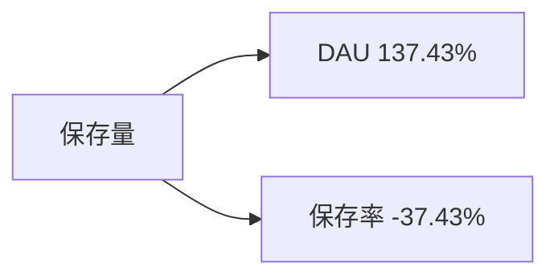

# 周报（2026-07-06 至 2026-07-12）

---

# 一、总结

!summary1_str!

## DAU

!dau_summary_str!日均DAU为72.32万，**环比-2.45%**（74.14万 --> 72.32万, -1.82万）。!dau_summary_end!其中：

> - 老用户DAU环比-1.39%（贡献53%），其中美国老用户DAU环比-6.36%（12.10万 --> 11.33万, -0.77万）（贡献42%），推测为**7/4独立日节后首周**出行修图需求自然回落；
> - 新用户DAU环比-17.47%（贡献47%），与本周**DNU大幅回落**同步。

## DNU

DNU为4.04万，**环比-17.47%**（4.90万 --> 4.04万, -8,561），**达近8周最低**。其中：

> - 渠道DNU环比-27.90%（1.91万 --> 1.38万, -5,329）（贡献62%），其中巴西渠道DNU环比-38.87%（8,651 --> 5,288, -3,362）（贡献39%），受**六月节/圣彼得节后退潮**及**巴西补量 campaign 陆续关停**拖累；
> - 自然DNU环比-10.81%（2.99万 --> 2.67万, -3,232）（贡献38%），其中美国自然DNU环比-25.52%（5,732 --> 4,269, -1,463）（贡献17%），独立日出行季与 Relight 美国 KOL（6.26–7.5）窗口结束后回落。

## 订阅收入

!revenue_summary_str!日均订阅毛利$13.67万，**环比-1.88%**（$13.93万 --> $13.67万, -$0.26万）。!revenue_summary_end!其中：

> - 续订毛利环比-7.69%（$8.63万 --> $7.97万, -$0.66万）（贡献253%），其中美国续订毛利环比-10.71%（$4.82万 --> $4.31万, -$0.52万）（贡献197%），去年同期美国订阅毛利环比-10.95%；
> - 新增毛利环比+1.69%（$6.69万 --> $6.80万, +$0.11万）（贡献-43%），反向提拉部分跌幅，推测含**wk27 独立日窗口试用转化滞后**入账。

## 活跃次留

整体活跃次留32.05%，**环比-0.83%**（32.32% --> 32.05%, -0.27pp），属正常波动。

## 新增次留

整体新增次留14.16%，**环比+3.98%**（13.62% --> 14.16%, +0.54pp）。其中：

> - 渠道新增次留环比+3.94%（10.19% --> 10.59%, +0.40pp）（贡献29%），叠加渠道新增UV环比-27.90%带来的结构抬升（贡献28%），巴西补量收缩及伊朗 Google BR 误触脉冲关停后低留存量回落，整体新增次留被结构改善拉动；
> - 自然新增次留环比+1.23%（15.81% --> 16.00%, +0.19pp）（贡献22%），其中巴西自然新增次留环比+6.36%（贡献25%），**六月节收尾后**自然新增质量回升。

## 保存量

整体保存量49.69万，**环比-1.79%**（50.59万 --> 49.69万, -0.91万），主要由**DAU下滑**带动，保存率微涨形成反向提拉。

!summary1_end!
---
# 二、下钻和归因

## DAU

!summary2_str!
现象：整体DAU环比-2.45%（741,352 --> 723,184, -18,168）

> 下钻总结：老用户DAU环比-1.39%贡献52.88%，其中美国环比-6.36%（12.10万 --> 11.33万, -0.77万）贡献42.36%为主要拖累，属7/4独立日节后首周回落；新用户DAU环比-17.47%贡献47.12%，与DNU回落同步
>
!summary2_end!
!logic_lib_str!
> 知识库命中事件：
>
> - 美国独立日（7/4），出处：知识库，命中原因：wk27含独立日推高美国DAU，本周为节后首周，美国老用户DAU回落与出行修图窗口结束一致，事件描述：美国独立日（7/4），关联度：强
> - 巴西圣彼得节/Festa Junina收尾，出处：知识库，命中原因：6/29收尾后巴西侧持续偏弱，老用户巴西DAU继续小幅阴跌，事件描述：巴西圣彼得节/Festa Junina收尾，关联度：中（贡献约17%，非本周主拖累）
>
!logic_lib_end!
!logic_train_str!
> 逻辑链：
> 导致下降
> - 7/4独立日节后首周 --> 美国老用户DAU回落 --> 整体DAU下跌
> - 渠道/自然投放回落（巴西补量收缩、伊朗误触关停等） --> DNU大跌 --> 新用户DAU同步下行 --> 整体DAU下跌
>
> 阻止下降
> - 英国老用户DAU微涨 --> 部分抵消DAU跌幅
!logic_train_end!
!dau_trend_str!
| 指标 | wk21 0518-0524 | wk22 0525-0531 | wk23 0601-0607 | wk24 0608-0614 | wk25 0615-0621 | wk26 0622-0628 | wk27 0629-0705 | wk28 0706-0712 | 环比波动 |
|-------|-------|-------|-------|-------|-------|-------|-------|-------|-------|
| **整体 DAU** | 695,294 | 732,984 | 718,559 | 740,301 | 723,297 | 730,722 | 741,352 | 723,184 | -2.45% |
| **美国 DAU** | 118,272 | 122,715 | 120,225 | 118,053 | 119,412 | 118,224 | 129,044 | 119,653 | -7.28% |
| **巴西 DAU** | 283,995 | 283,371 | 289,581 | 312,204 | 293,527 | 299,686 | 293,987 | 287,140 | -2.33% |
| **英国 DAU** | 36,503 | 44,735 | 37,360 | 37,506 | 39,787 | 41,304 | 41,316 | 41,806 | +1.18% |
| **iOS DAU** | 514,133 | 542,980 | 532,381 | 549,575 | 537,941 | 541,510 | 544,888 | 536,400 | -1.56% |
| **Android DAU** | 181,160 | 190,004 | 186,179 | 190,726 | 185,356 | 189,212 | 196,464 | 186,784 | -4.93% |
!dau_trend_end!
**维度下钻**
!tree_str!

!tree_end!

---

## DNU

!summary2_str!
现象：整体DNU环比-17.47%（49,009 --> 40,448, -8,561）

> 下钻总结：渠道环比-27.90%贡献62.24%，巴西渠道环比-38.87%（8,651 --> 5,288, -3,362）贡献39.27%为最大拖累，伊朗渠道环比-62.08%（2,601 --> 986, -1,615）贡献18.86%同步回落；自然环比-10.81%贡献37.76%，美国自然环比-25.52%（5,732 --> 4,269, -1,463）贡献17.08%拉动下跌
>
!summary2_end!
!logic_lib_str!
> 知识库命中事件：
>
> - 巴西六月节/圣彼得节后退潮 + 巴西补量 campaign 陆续关停，出处：知识库，命中原因：六月节收尾后巴西渠道新增大幅回落，且业务确认补量 campaign 留存差将陆续关停，与巴西渠道DNU大跌同向，事件描述：巴西六月节/圣彼得节后退潮 + 巴西补量 campaign 陆续关停，关联度：强
> - Google BR campaign 误触伊朗 VPN（7/3关停），出处：知识库，命中原因：wk27 Google BR 投放误触使用巴西节点 VPN 的伊朗用户推高伊朗渠道DNU，周五（7/3）关停后本周脉冲回调，事件描述：Google BR campaign 误触伊朗 VPN（7/3关停），关联度：强
> - 美国独立日（7/4），出处：知识库，命中原因：wk27美国自然DNU受独立日出行季拉动冲高，本周为节后首周自然回落，事件描述：美国独立日（7/4），关联度：强
> - Relight 美国 KOL（6.26–7.5），出处：知识库，命中原因：KOL 窗口已于7/5结束，本周美国自然DNU回落与窗口收束一致，但不宜再作当期主拉动，事件描述：Relight 美国 KOL（6.26–7.5），关联度：中（窗口结束后回落，非新增主因）
>
!logic_lib_end!
!logic_train_str!
> 逻辑链：
> 导致下降
> - 六月节后退潮 + 巴西补量 campaign 陆续关停 --> 巴西渠道DNU大跌 --> 渠道DNU走弱 --> 整体DNU下跌
> - Google BR 误触伊朗 VPN 于7/3关停 --> 伊朗渠道DNU脉冲回调 --> 渠道DNU走弱 --> 整体DNU下跌
> - 7/4独立日节后首周 + Relight 美国KOL窗口结束 --> 美国自然DNU回落 --> 自然DNU走弱 --> 整体DNU下跌
>
> 阻止下降
> - 墨西哥渠道DNU上涨 --> 部分抵消渠道DNU跌幅
!logic_train_end!
!trend_str!
| 指标 | wk21 0518-0524 | wk22 0525-0531 | wk23 0601-0607 | wk24 0608-0614 | wk25 0615-0621 | wk26 0622-0628 | wk27 0629-0705 | wk28 0706-0712 | 环比波动 |
|-------|-------|-------|-------|-------|-------|-------|-------|-------|-------|
| **整体 DNU** | 42,419 | 47,334 | 45,928 | 44,210 | 42,277 | 42,444 | 49,009 | 40,448 | -17.47% |
| **渠道 DNU** | 16,875 | 18,274 | 18,954 | 17,285 | 17,168 | 16,450 | 19,098 | 13,769 | -27.90% |
| **自然 DNU** | 25,544 | 29,060 | 26,974 | 26,925 | 25,110 | 25,994 | 29,912 | 26,679 | -10.81% |
!trend_end!
**维度下钻**
!tree_str!

!tree_end!

---

## 新增次留

!summary2_str!
现象：整体新增次留环比+3.98%（13.62% --> 14.16%, +0.54pp）

> 下钻总结：渠道新增次留环比+3.94%贡献28.81%，渠道新增UV环比-27.90%结构贡献27.53%（巴西补量收缩、伊朗 Google BR 误触关停后低留存脉冲量回落）；自然新增次留环比+1.23%贡献21.97%，巴西自然新增次留环比+6.36%贡献24.90%同步抬升
>
!summary2_end!
!logic_lib_str!
> 知识库命中事件：
>
> - Google BR 误触伊朗 VPN 关停 + 巴西补量 campaign 陆续关停，出处：知识库，命中原因：本周渠道DNU大幅回落，低留存新增占比下降，与新增次留结构抬升同向，事件描述：Google BR 误触伊朗 VPN 关停 + 巴西补量 campaign 陆续关停，关联度：强
> - 巴西Festa Junina/圣彼得节收尾，出处：知识库，命中原因：节日窗口结束后自然新增质量修复，巴西自然新增次留回升，事件描述：巴西Festa Junina/圣彼得节收尾，关联度：中
>
!logic_lib_end!
!logic_train_str!
> 逻辑链：
> 导致上升
> - 渠道新增UV回落（巴西补量收缩 / 伊朗误触关停） --> 新增结构优化 --> 新增次留上涨
> - 渠道/自然新增次留率回升 --> 新增次留上涨
> - 巴西自然新增次留回升 --> 自然侧抬升 --> 新增次留上涨
!logic_train_end!
!trend_str!
| 指标 | wk21 0518-0524 | wk22 0525-0531 | wk23 0601-0607 | wk24 0608-0614 | wk25 0615-0621 | wk26 0622-0628 | wk27 0629-0705 | wk28 0706-0712 | 环比波动 |
|-------|-------|-------|-------|-------|-------|-------|-------|-------|-------|
| **整体新增次留** | 13.69% | 13.82% | 13.41% | 14.42% | 14.24% | 14.23% | 13.62% | 14.16% | +3.98% |
| **渠道新增次留** | 9.24% | 9.55% | 9.56% | 10.60% | 10.70% | 11.09% | 10.19% | 10.59% | +3.94% |
| **自然新增次留** | 16.62% | 16.50% | 16.11% | 16.87% | 16.65% | 16.22% | 15.81% | 16.00% | +1.23% |
!trend_end!
**关联下钻**
!tree_str!

!tree_end!

---

## 订阅毛利

!summary2_str!
现象：日均订阅毛利（剔除退款，$）环比-1.88%（139,307.20 --> 136,684.47, -2,622.73）

> 下钻总结：续订毛利环比-7.69%贡献252.88%，美国续订毛利环比-10.71%贡献196.87%为主要拖累，去年同期美国订阅毛利环比-10.95%（与今年美国续订环比差距约0.24pp）；英国续订毛利环比-9.36%贡献36.97%同步走弱；新增毛利环比+1.69%贡献-43.09%反向提拉
>
!summary2_end!
!logic_lib_str!
> 知识库命中事件：
>
> - 去年同期订阅毛利对照，出处：知识库，命中原因：美国续订环比-10.71%与去年同期美国订阅毛利周环比-10.95%同向且幅度接近，事件描述：去年同期订阅毛利对照，关联度：中
> - wk27独立日窗口试用转化滞后，出处：知识库，命中原因：**滞后转化**——新增毛利本周仍小幅上涨，符合7天试用路径入账滞后，事件描述：wk27独立日窗口试用转化滞后，关联度：强
>
!logic_lib_end!
!logic_train_str!
> 逻辑链：
> 导致下降
> - 美国续订毛利回落（与去年同期订阅毛利周环比接近） --> 续订毛利下跌 --> 日均订阅毛利下跌
> - 英国续订毛利同步走弱 --> 续订毛利下跌 --> 日均订阅毛利下跌
>
> 阻止下降
> - wk27独立日试用转化滞后入账 --> 本周新增毛利微涨 --> 部分抵消订阅毛利跌幅
!logic_train_end!
!revenue_trend_str!
| 指标 | wk21 0518-0524 | wk22 0525-0531 | wk23 0601-0607 | wk24 0608-0614 | wk25 0615-0621 | wk26 0622-0628 | wk27 0629-0705 | wk28 0706-0712 | 环比波动 |
|-------|-------|-------|-------|-------|-------|-------|-------|-------|-------|
| **日均订阅毛利** | 131,975 | 130,155 | 132,158 | 128,979 | 130,206 | 125,573 | 139,307 | 136,684 | -1.88% |
| **新增毛利** | 66,666 | 68,767 | 69,907 | 68,773 | 67,469 | 64,676 | 66,919 | 68,050 | +1.69% |
| **续订毛利** | 73,733 | 69,323 | 71,267 | 69,557 | 72,909 | 74,886 | 86,298 | 79,666 | -7.69% |
!revenue_trend_end!
**维度下钻**
!tree_str!

!tree_end!

---

## 保存量

!summary2_str!
现象：整体保存量环比-1.79%（505,917 --> 496,865, -9,052）

> 下钻总结：DAU环比-2.45%贡献137.43%为保存量下跌主因；保存率环比+0.68%贡献-37.43%反向提拉
>
!summary2_end!
!logic_lib_str!
> 知识库命中事件：
>
> - 美国独立日窗口结束 / 巴西六月节后退潮，出处：知识库，命中原因：DAU下行带动保存量走弱，与本周核心市场活跃回落一致，事件描述：美国独立日窗口结束 / 巴西六月节后退潮，关联度：中（经DAU间接传导）
>
!logic_lib_end!
!logic_train_str!
> 逻辑链：
> 导致下降
> - DAU下跌 --> 保存量同步下行
>
> 阻止下降
> - 保存率微涨 --> 部分抵消保存量跌幅
!logic_train_end!
!trend_str!
| 指标 | wk21 0518-0524 | wk22 0525-0531 | wk23 0601-0607 | wk24 0608-0614 | wk25 0615-0621 | wk26 0622-0628 | wk27 0629-0705 | wk28 0706-0712 | 环比波动 |
|-------|-------|-------|-------|-------|-------|-------|-------|-------|-------|
| **整体保存量** | 476,680 | 503,309 | 492,739 | 450,476 | 483,750 | 501,817 | 505,917 | 496,865 | -1.79% |
| **整体保存率** | 68.56% | 68.67% | 68.57% | 60.85% | 66.88% | 68.67% | 68.24% | 68.71% | +0.68% |
!trend_end!
**关联下钻**
!tree_str!

!tree_end!

**功能保存率 Top5（\|环比\|>3%，按 pp 绝对值）**

| 功能 | wk25 | wk26 | wk27 | wk28 | 环比波动 |
|-------|-------|-------|-------|-------|-------|
| Relight保存率 | 5.86% | 5.92% | 5.94% | 6.42% | +0.49pp |
| Clean Skin保存率 | 0.00% | 0.00% | 0.00% | 0.12% | +0.12pp |
| AI Image保存率 | 0.50% | 0.50% | 0.47% | 0.43% | -0.03pp |

---

# 三、异常指标检测

| 指标 | wk21 0518-0524 | wk22 0525-0531 | wk23 0601-0607 | wk24 0608-0614 | wk25 0615-0621 | wk26 0622-0628 | wk27 0629-0705 | wk28 0706-0712 | 周环比变化 | 指标状态 | 异常说明 |
|-------|-------|-------|-------|-------|-------|-------|-------|-------|-------|-------|-------|
| !dau_data_str!**整体DAU**!dau_data_end! | 695,294 | 732,984 | 718,559 | 740,301 | 723,297 | 730,722 | 741,352 | 723,184 | -2.45% | 🟡 | 整体DAU下跌，需关注 |
| **整体DNU** | 42,419 | 47,334 | 45,928 | 44,210 | 42,277 | 42,444 | 49,009 | 40,448 | -17.47% | 🔴 | 整体DNU达近8周最低值 |
| !revenue_data_str!**日均订阅毛利（剔除退款，$）**!revenue_data_end! | 131,975 | 130,155 | 132,158 | 128,979 | 130,206 | 125,573 | 139,307 | 136,684 | -1.88% | 🟡 | 日均订阅毛利（剔除退款，$）下跌，需关注 |
| **新增毛利** | 66,666 | 68,767 | 69,907 | 68,773 | 67,469 | 64,676 | 66,919 | 68,050 | +1.69% | ⚫ | - |
| **续订毛利** | 73,733 | 69,323 | 71,267 | 69,557 | 72,909 | 74,886 | 86,298 | 79,666 | -7.69% | 🔴 | 续订毛利大幅下跌，需重点关注 |
| **整体活跃次留** | 31.97% | 32.15% | 31.74% | 32.53% | 32.54% | 32.25% | 32.32% | 32.05% | -0.83% | 🟡 | 整体活跃次留下跌，需关注 |
| **整体新增次留** | 13.69% | 13.82% | 13.41% | 14.42% | 14.24% | 14.23% | 13.62% | 14.16% | +3.98% | 🟢 | - |
| **整体保存量** | 476,680 | 503,309 | 492,739 | 450,476 | 483,750 | 501,817 | 505,917 | 496,865 | -1.79% | 🟡 | 整体保存量下跌，需关注 |

*说明：环比增长超过3%为🟢增长(绿色)，环比变化在0~3%(不含0%，含3%)为⚫稳定(黑色)，环比变化在0~-3%(含0%，不含-3%)为🟡稳定(黄色)，环比下跌超过3%(含-3%)为🔴异常(红色)。最低值判断基于当前源数据可用的最近最多52周历史。*
