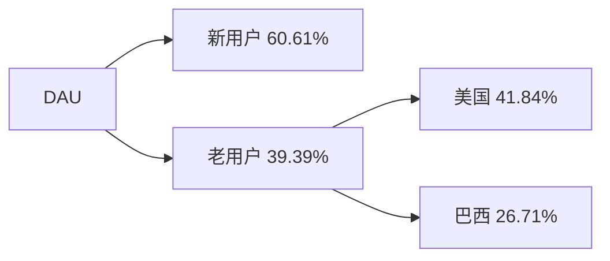
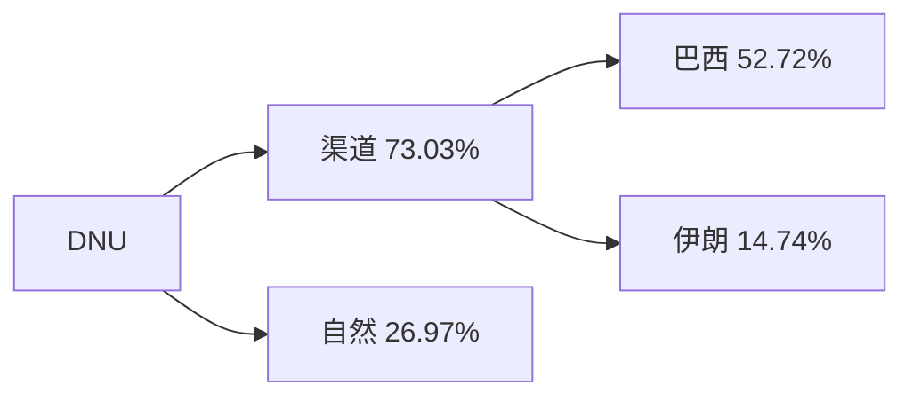
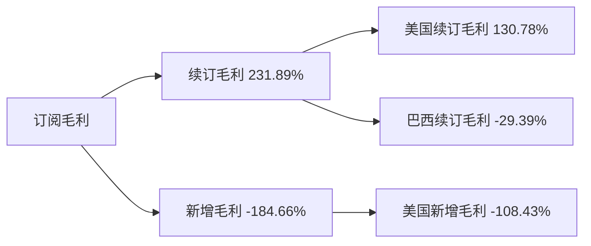
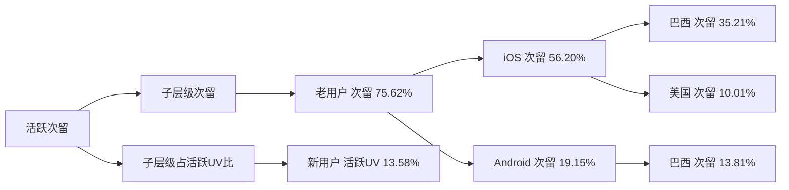
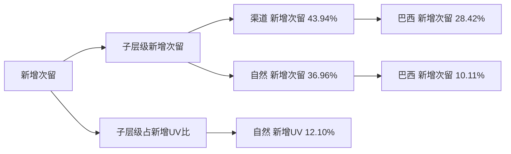

# 周报（2026-07-13 至 2026-07-19）

---

# 一、总结

!summary1_str!

## DAU

!dau_summary_str!日均DAU为71.31万，**环比-1.39%**（72.32万 --> 71.31万, -1.01万），**连续3周下跌且达近8周最低**。!dau_summary_end!其中：

> - 新用户DAU环比-15.08%（4.04万 --> 3.44万, -6,098）（贡献61%），与本周**DNU继续大跌**同步；
> - 老用户DAU环比-0.58%（68.27万 --> 67.88万, -0.40万）（贡献39%），其中美国老用户DAU环比-3.72%（11.33万 --> 10.91万, -0.42万）（贡献42%），推测为**7/4独立日节后第二周**出行修图需求继续退潮；巴西老用户DAU环比-0.97%（27.58万 --> 27.31万, -0.27万）（贡献27%），受**六月节/圣彼得节后退潮**及**巴西补量 campaign 关停**影响偏弱。

## DNU

DNU为3.44万，**环比-15.08%**（4.04万 --> 3.44万, -6,098），**连续3周下跌且达近8周最低**。其中：

> - 渠道DNU环比-32.34%（1.38万 --> 0.93万, -4,453）（贡献73%），其中巴西渠道DNU环比-60.79%（5,288 --> 2,073, -3,215）（贡献53%），主因**7/14起巴西补量 campaign 陆续关停**，并叠加六月节后投放收缩；
> - 自然DNU环比-6.16%（2.67万 --> 2.50万, -1,645）（贡献27%），其中伊朗自然DNU环比-44.35%（1,071 --> 596, -475）（贡献8%）、美国自然DNU环比-11.10%（4,269 --> 3,796, -474）（贡献8%），分别受**误触关停后曝光回落**与**独立日出行季继续退潮**拖累。

## 订阅收入

!revenue_summary_str!日均订阅毛利$13.97万，**环比+2.21%**（$13.67万 --> $13.97万, +$0.30万）。!revenue_summary_end!其中：

> - 续订毛利环比+8.64%（$8.10万 --> $8.80万, +$0.70万）（贡献232%），其中美国续订毛利环比+9.08%（$4.35万 --> $4.74万, +$0.39万）（贡献131%），去年同期美国订阅毛利环比+6.85%；
> - 新增毛利环比-8.06%（$6.91万 --> $6.36万, -$0.56万）（贡献-185%）拖累部分涨幅，其中美国新增毛利环比-10.38%（贡献-108%），推测**wk27 独立日试用转化滞后入账消退**，并叠加本周**DNU大跌**压缩新增池。

## 活跃次留

整体活跃次留32.98%，**环比+2.91%**（32.05% --> 32.98%, +0.93pp）。其中：

> - 老用户次留环比+2.26%（33.11% --> 33.86%, +0.75pp）（贡献76%），其中巴西老用户次留抬升明显（iOS 环比+3.29%、贡献35%），老用户回访质量回升带动整体活跃次留；
> - 新用户活跃UV环比-15.08%带来结构抬升（贡献14%），低次留新用户占比下降进一步支撑整体活跃次留。

## 新增次留

整体新增次留15.71%，**环比+10.96%**（14.16% --> 15.71%, +1.55pp）。其中：

> - 渠道新增次留环比+18.92%（10.59% --> 12.59%, +2.00pp）（贡献44%），其中巴西渠道新增次留环比+35.28%（9.56% --> 12.93%, +3.37pp）（贡献28%），**巴西补量陆续关停**后低留存补量收缩、剩余渠道新增质量回升；
> - 自然新增次留环比+5.43%（16.00% --> 16.87%, +0.87pp）（贡献37%），自然侧新增质量同步修复。

## 保存量

整体保存量49.41万，**环比-0.56%**（49.69万 --> 49.41万, -0.28万），属正常波动。

!summary1_end!
---
# 二、下钻和归因

## DAU

!summary2_str!
现象：整体DAU环比-1.39%（723,184 --> 713,123, -10,061）

> 下钻总结：新用户DAU环比-15.08%（贡献60.61%），与DNU大跌同步；老用户侧美国环比-3.72%（11.33万 --> 10.91万, -0.42万）（贡献41.84%），属7/4独立日节后第二周继续退潮；巴西环比-0.97%（贡献26.71%），受六月节后退潮与巴西补量关停影响。
>
!summary2_end!
!logic_lib_str!
> 知识库命中事件：
>
> - 美国独立日（7/4），出处：知识库，命中原因：本周为节后第二周，美国老用户DAU继续回落与出行修图窗口退潮一致，事件描述：美国独立日（7/4），关联度：中（强度弱于上周节后首周）
> - 巴西补量 campaign 陆续关停（7/14），出处：知识库，命中原因：分析周覆盖关停窗口，经巴西渠道DNU收缩传导至新用户DAU，事件描述：巴西补量 campaign 陆续关停（7/14），关联度：强
> - 巴西圣彼得节/六月节收尾（6/29），出处：知识库，命中原因：节后两周+巴西老用户仍偏弱，事件描述：巴西圣彼得节/六月节收尾（6/29），关联度：中（辅因，弱于补量关停）
>
!logic_lib_end!
!logic_train_str!
> 逻辑链：
> 导致下降
> - 7/14巴西补量陆续关停 + 独立日/六月节后余波 --> DNU大跌 --> 新用户DAU同步下行 --> 整体DAU下跌
> - 7/4独立日节后第二周 --> 美国老用户DAU继续回落 --> 整体DAU下跌
>
> 阻止下降
> - 部分欧洲老用户小幅上涨 --> 反向提拉部分跌幅
!logic_train_end!
!dau_trend_str!
| 指标 | wk22 0525-0531 | wk23 0601-0607 | wk24 0608-0614 | wk25 0615-0621 | wk26 0622-0628 | wk27 0629-0705 | wk28 0706-0712 | wk29 0713-0719 | 环比波动 |
|-------|-------|-------|-------|-------|-------|-------|-------|-------|-------|
| 整体 DAU | 732,984 | 718,559 | 740,301 | 723,297 | 730,722 | 741,352 | 723,184 | 713,123 | -1.39% |
| 美国 DAU | 122,715 | 120,225 | 118,053 | 119,412 | 118,224 | 129,044 | 119,653 | 114,901 | -3.97% |
| 巴西 DAU | 283,371 | 289,581 | 312,204 | 293,527 | 299,686 | 293,987 | 287,140 | 280,767 | -2.22% |
| 英国 DAU | 44,735 | 37,360 | 37,506 | 39,787 | 41,304 | 41,316 | 41,806 | 41,662 | -0.34% |
| iOS DAU | 542,980 | 532,381 | 549,575 | 537,941 | 541,510 | 544,888 | 536,400 | 535,057 | -0.25% |
| Android DAU | 190,004 | 186,179 | 190,726 | 185,356 | 189,212 | 196,464 | 186,784 | 178,067 | -4.67% |
!dau_trend_end!
**维度下钻**
!tree_str!

!tree_end!

---

## DNU

!summary2_str!
现象：整体DNU环比-15.08%（40,448 --> 34,350, -6,098）

> 下钻总结：渠道环比-32.34%（贡献73.03%），其中巴西渠道环比-60.79%（5,288 --> 2,073, -3,215）贡献52.72%，主因7/14起巴西补量 campaign 陆续关停；伊朗渠道环比-91.15%（986 --> 87, -899）贡献14.74%，为Google BR误触关停后尾声。自然环比-6.16%（贡献26.97%），美国/伊朗/巴西自然分别环比-11.10%（4,269 --> 3,796, -474）、-44.35%（1,071 --> 596, -475）、-7.80%（6,043 --> 5,572, -472），对应独立日退潮、误触关停后曝光回落与巴西侧收缩。
>
!summary2_end!
!logic_lib_str!
> 知识库命中事件：
>
> - 巴西补量 campaign 陆续关停（7/14），出处：知识库，命中原因：分析周含关停节点，巴西渠道DNU大幅下跌且贡献过半，事件描述：巴西补量 campaign 陆续关停（7/14），关联度：强
> - Google BR campaign 误触伊朗 VPN（7/3关停），出处：知识库，命中原因：关停后伊朗渠道脉冲尾声继续回落，事件描述：Google BR campaign 误触伊朗 VPN（7/3关停），关联度：中
> - 美国独立日（7/4），出处：知识库，命中原因：节后第二周美国自然DNU继续走弱，事件描述：美国独立日（7/4），关联度：中
> - 巴西圣彼得节/六月节收尾（6/29），出处：知识库，命中原因：与补量关停叠加解释巴西侧偏弱，事件描述：巴西圣彼得节/六月节收尾（6/29），关联度：中（辅因）
>
!logic_lib_end!
!logic_train_str!
> 逻辑链：
> 导致下降
> - 7/14巴西补量陆续关停 --> 巴西渠道DNU大跌 --> 整体DNU下跌
> - 伊朗误触关停尾声 --> 伊朗渠道/自然DNU回落 --> 整体DNU下跌
> - 独立日出行季继续退潮 --> 美国自然DNU走弱 --> 整体DNU下跌
>
> 阻止下降
> - 西班牙等渠道小幅放量 --> 反向提拉部分跌幅
!logic_train_end!
!trend_str!
| 指标 | wk22 0525-0531 | wk23 0601-0607 | wk24 0608-0614 | wk25 0615-0621 | wk26 0622-0628 | wk27 0629-0705 | wk28 0706-0712 | wk29 0713-0719 | 环比波动 |
|-------|-------|-------|-------|-------|-------|-------|-------|-------|-------|
| 整体 DNU | 47,334 | 45,928 | 44,210 | 42,277 | 42,444 | 49,009 | 40,448 | 34,350 | -15.08% |
| 渠道 DNU | 18,274 | 18,954 | 17,285 | 17,168 | 16,450 | 19,098 | 13,769 | 9,315 | -32.34% |
| 自然 DNU | 29,060 | 26,974 | 26,925 | 25,110 | 25,994 | 29,912 | 26,679 | 25,035 | -6.16% |
!trend_end!
**维度下钻**
!tree_str!

!tree_end!

---

## 订阅毛利

!summary2_str!
现象：日均订阅毛利（剔除退款，$）环比+2.21%（136,684 --> 139,703, +3,018）

> 下钻总结：续订毛利环比+8.64%（贡献231.89%），其中美国续订环比+9.08%（贡献130.78%）拉动，与去年同期美国订阅毛利周环比+6.85%同向；新增毛利环比-8.06%（贡献-184.66%）拖累，美国新增环比-10.38%（贡献-108.43%），与wk27独立日试用转化滞后消退及本周DNU大跌一致。
>
!summary2_end!
!logic_lib_str!
> 知识库命中事件：
>
> - 美国独立日（7/4）试用转化滞后消退，出处：知识库，命中原因：wk27窗口后新增入账在wk28已部分兑现，本周新增毛利回落与滞后路径结束一致，事件描述：美国独立日（7/4）试用转化滞后消退，关联度：中
> - DNU大跌（巴西补量关停等），出处：知识库，命中原因：新增池收缩压制新增毛利，事件描述：DNU大跌（巴西补量关停等），关联度：中
> - 去年同期订阅毛利对照，出处：知识库，命中原因：美国续订环比+9.08%与去年同期美国订阅毛利周环比+6.85%同向且差值约2.23pp，事件描述：去年同期订阅毛利对照，关联度：中
>
!logic_lib_end!
!logic_train_str!
> 逻辑链：
> 导致上升
> - 美国续订毛利回升（接近去年同期节奏） --> 续订盘拉动 --> 整体订阅毛利上涨
>
> 阻止上升
> - wk27独立日试用转化滞后消退 + 本周DNU大跌 --> 新增毛利下跌 --> 部分抵消订阅毛利涨幅
!logic_train_end!
!revenue_trend_str!
| 指标 | wk22 0525-0531 | wk23 0601-0607 | wk24 0608-0614 | wk25 0615-0621 | wk26 0622-0628 | wk27 0629-0705 | wk28 0706-0712 | wk29 0713-0719 | 环比波动 |
|-------|-------|-------|-------|-------|-------|-------|-------|-------|-------|
| 日均订阅毛利 | 130,155 | 132,158 | 128,979 | 130,206 | 125,573 | 139,307 | 136,684 | 139,703 | +2.21% |
| 新增毛利 | 68,767 | 69,907 | 68,773 | 67,471 | 64,711 | 67,374 | 69,149 | 63,576 | -8.06% |
| 续订毛利 | 69,323 | 71,267 | 69,562 | 72,917 | 74,933 | 86,802 | 81,000 | 87,999 | +8.64% |
!revenue_trend_end!
**维度下钻**
!tree_str!

!tree_end!

---

## 活跃次留

!summary2_str!
现象：整体活跃次留环比+2.91%（32.05% --> 32.98%, +0.93pp）

> 下钻总结：老用户次留环比+2.26%（贡献75.62%）为主因，其中巴西iOS老用户次留环比+3.29%（贡献35.21%）、巴西Android老用户次留环比+3.81%（贡献13.81%）共同抬升；新用户活跃UV环比-15.08%结构贡献13.58%，低次留新用户占比下降亦支撑整体活跃次留。
>
!summary2_end!
!logic_lib_str!
> 知识库命中事件：
>
> - 巴西补量 campaign 陆续关停（7/14），出处：知识库，命中原因：关停后低质量新增收缩，老用户结构占比相对抬升，与活跃次留回升同向，事件描述：巴西补量 campaign 陆续关停（7/14），关联度：中
>
!logic_lib_end!
!logic_train_str!
> 逻辑链：
> 导致上升
> - 巴西老用户次留回升 --> 老用户次留抬升 --> 整体活跃次留上涨
> - 新用户UV回落（DNU大跌） --> 活跃结构优化 --> 整体活跃次留上涨
!logic_train_end!
!trend_str!
| 指标 | wk22 0525-0531 | wk23 0601-0607 | wk24 0608-0614 | wk25 0615-0621 | wk26 0622-0628 | wk27 0629-0705 | wk28 0706-0712 | wk29 0713-0719 | 环比波动 |
|-------|-------|-------|-------|-------|-------|-------|-------|-------|-------|
| 整体活跃次留 | 32.15% | 31.74% | 32.53% | 32.54% | 32.25% | 32.32% | 32.05% | 32.98% | +2.91% |
| 美国活跃次留 | 30.07% | 29.73% | 30.56% | 30.90% | 29.93% | 31.48% | 29.84% | 30.50% | +2.21% |
| 巴西活跃次留 | 33.90% | 33.89% | 34.79% | 34.60% | 34.50% | 34.62% | 34.22% | 35.75% | +4.47% |
| 英国活跃次留 | 33.34% | 31.32% | 32.77% | 33.08% | 32.88% | 32.40% | 33.15% | 33.18% | +0.09% |
!trend_end!
**关联下钻**
!tree_str!

!tree_end!

---

## 新增次留

!summary2_str!
现象：整体新增次留环比+10.96%（14.16% --> 15.71%, +1.55pp）

> 下钻总结：渠道新增次留环比+18.92%（贡献43.94%），其中巴西渠道新增次留环比+35.28%（贡献28.42%）拉动最大；自然新增次留环比+5.43%（贡献36.96%），巴西自然新增次留环比+6.05%（贡献10.11%）同步抬升。渠道/自然新增UV回落带来结构贡献，低留存补量与误触脉冲量退出后整体新增次留明显改善。
>
!summary2_end!
!logic_lib_str!
> 知识库命中事件：
>
> - 巴西补量 campaign 陆续关停（7/14），出处：知识库，命中原因：补量留存较差，关停后巴西渠道新增质量回升且低留存量退出，与渠道新增次留大涨同向，事件描述：巴西补量 campaign 陆续关停（7/14），关联度：强
> - Google BR campaign 误触伊朗 VPN（7/3关停），出处：知识库，命中原因：误触脉冲尾声继续出清，低留存渠道新增占比下降，事件描述：Google BR campaign 误触伊朗 VPN（7/3关停），关联度：中
>
!logic_lib_end!
!logic_train_str!
> 逻辑链：
> 导致上升
> - 7/14巴西补量陆续关停 --> 巴西渠道新增次留大涨 + 低留存量退出 --> 整体新增次留上涨
> - 渠道/自然新增次留率回升 --> 新增次留上涨
> - 伊朗误触关停尾声 --> 低留存渠道结构继续优化 --> 新增次留上涨
!logic_train_end!
!trend_str!
| 指标 | wk22 0525-0531 | wk23 0601-0607 | wk24 0608-0614 | wk25 0615-0621 | wk26 0622-0628 | wk27 0629-0705 | wk28 0706-0712 | wk29 0713-0719 | 环比波动 |
|-------|-------|-------|-------|-------|-------|-------|-------|-------|-------|
| 整体新增次留 | 13.82% | 13.41% | 14.42% | 14.24% | 14.23% | 13.62% | 14.16% | 15.71% | +10.96% |
| 渠道新增次留 | 9.55% | 9.56% | 10.60% | 10.70% | 11.09% | 10.19% | 10.59% | 12.59% | +18.92% |
| 自然新增次留 | 16.50% | 16.11% | 16.87% | 16.65% | 16.22% | 15.81% | 16.00% | 16.87% | +5.43% |
!trend_end!
**关联下钻**
!tree_str!

!tree_end!

---

# 三、异常指标检测

| 指标 | wk22 0525-0531 | wk23 0601-0607 | wk24 0608-0614 | wk25 0615-0621 | wk26 0622-0628 | wk27 0629-0705 | wk28 0706-0712 | wk29 0713-0719 | 周环比变化 | 指标状态 | 异常说明 |
|-------|-------|-------|-------|-------|-------|-------|-------|-------|-------|-------|-------|
| !dau_data_str!**整体DAU**!dau_data_end! | 732,984 | 718,559 | 740,301 | 723,297 | 730,722 | 741,352 | 723,184 | 713,123 | -1.39% | 🟡 | 整体DAU连续3周下跌且达近8周最低值 |
| **整体DNU** | 47,334 | 45,928 | 44,210 | 42,277 | 42,444 | 49,009 | 40,448 | 34,350 | -15.08% | 🔴 | 整体DNU连续3周下跌且达近8周最低值 |
| !revenue_data_str!**日均订阅毛利（剔除退款，$）**!revenue_data_end! | 130,155 | 132,158 | 128,979 | 130,206 | 125,573 | 139,307 | 136,684 | 139,703 | +2.21% | ⚫ | - |
| **新增毛利** | 68,767 | 69,907 | 68,773 | 67,471 | 64,711 | 67,374 | 69,149 | 63,576 | -8.06% | 🔴 | 新增毛利达近8周最低值 |
| **续订毛利** | 69,323 | 71,267 | 69,562 | 72,917 | 74,933 | 86,802 | 81,000 | 87,999 | +8.64% | 🟢 | - |
| **整体活跃次留** | 32.15% | 31.74% | 32.53% | 32.54% | 32.25% | 32.32% | 32.05% | 32.98% | +2.91% | ⚫ | - |
| **整体新增次留** | 13.82% | 13.41% | 14.42% | 14.24% | 14.23% | 13.62% | 14.16% | 15.71% | +10.96% | 🟢 | - |
| **整体保存量** | 503,309 | 492,739 | 450,476 | 483,750 | 501,817 | 505,917 | 496,865 | 494,107 | -0.56% | 🟡 | 整体保存量连续3周下跌 |

*说明：环比增长超过3%为🟢增长(绿色)，环比变化在0~3%(不含0%，含3%)为⚫稳定(黑色)，环比变化在0~-3%(含0%，不含-3%)为🟡稳定(黄色)，环比下跌超过3%(含-3%)为🔴异常(红色)。最低值判断基于当前源数据可用的最近最多52周历史。*
