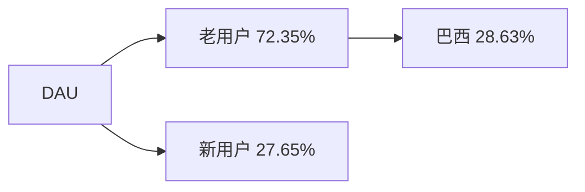
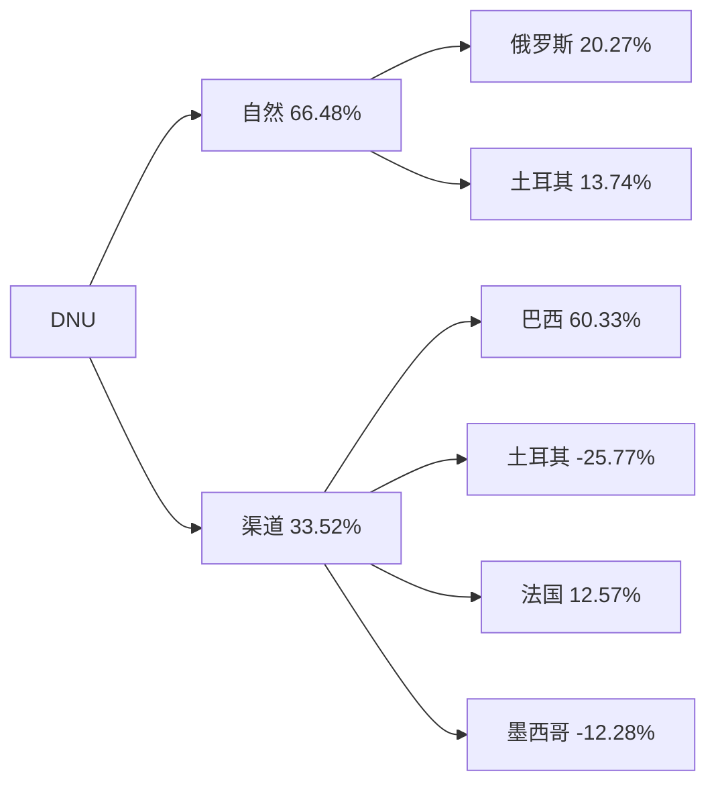
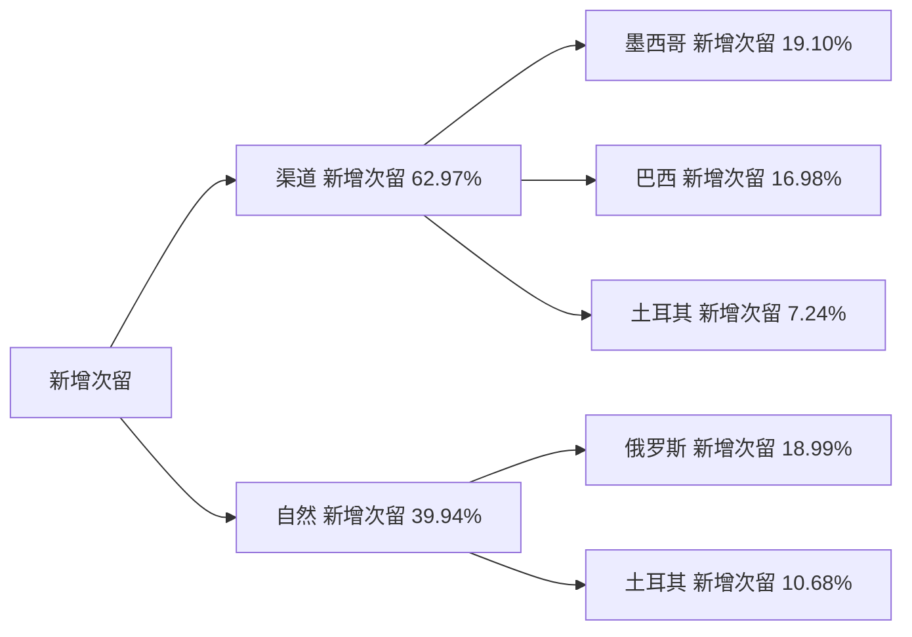
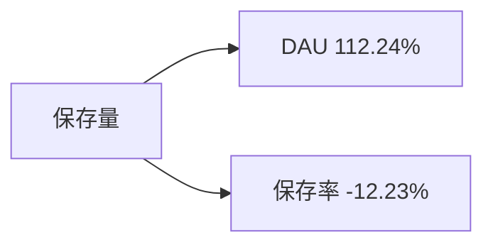

# 周报（2026-07-27 至 2026-08-02）

---

# 一、总结

!summary1_str!

## DAU

!dau_summary_str!日均DAU为72.7万，环比+1.44%（71.7万 --> 72.7万, +1.04万）。!dau_summary_end!其中：

> - 老用户DAU环比+1.10%（68.1万 --> 68.9万, +0.75万）（贡献72%），多国老用户普遍走强，其中巴西老用户DAU环比+1.08%（27.5万 --> 27.8万, +0.30万）（贡献29%）拉动居前，原因待查；
> - 新用户DAU环比+8.13%（3.52万 --> 3.81万, +2,863）（贡献28%），与本周DNU上涨同步抬升。

## DNU

DNU为3.81万，环比+8.13%（3.52万 --> 3.81万, +2,863）。其中：

> - 自然DNU环比+7.36%（2.59万 --> 2.78万, +1,903）（贡献66%），其中俄罗斯自然DNU环比+33.11%（1,752 --> 2,332, +580）（贡献20%）、土耳其自然DNU环比+53.31%（738 --> 1,131, +393）（贡献14%）拉动，俄、土同因，推测由于Relight功能带动；
> - 渠道DNU环比+10.29%（0.93万 --> 1.03万, +960）（贡献34%），其中**巴西渠道DNU**环比+70.78%（2,440 --> 4,167, +1,727）（贡献60%）为主要拉动，属前序巴墨补量关停后的低基数回升（原因待查/未见新投放标注）；土耳其渠道DNU环比-50.97%（1,447 --> 710, -738）（贡献-26%）拖累部分涨幅。

## 订阅收入

!revenue_summary_str!日均订阅毛利$14.0万，环比-0.74%（$14.1万 --> $14.0万, -$0.10万），属正常波动。!revenue_summary_end!

## 活跃次留

整体活跃次留33.06%，环比-0.18%（33.12% --> 33.06%, -0.06pp），属正常波动。

## 新增次留

整体新增次留16.72%，环比+3.87%（16.10% --> 16.72%, +0.62pp）。其中：

> - 渠道新增次留环比+11.62%（12.74% --> 14.22%, +1.48pp）（贡献63%），墨西哥、巴西、土耳其渠道次留上涨居前；
> - 自然新增次留环比+1.96%（17.31% --> 17.65%, +0.34pp）（贡献40%），俄罗斯、土耳其自然新增次留上涨贡献居前（与本周俄、土自然DNU及Relight进入抬升部分同向）。

## 保存量

整体保存量50.3万，环比+1.29%（49.7万 --> 50.3万, +0.64万），主要由DAU上涨带动（贡献112%）；保存率环比-0.16%（69.31% --> 69.20%, -0.11pp）（贡献-12%）小幅拖累。

!summary1_end!
---
# 二、下钻和归因

## DAU

!summary2_str!
现象：整体DAU环比+1.44%（716,673 --> 727,028, +10,355）

> 下钻总结：老用户环比+1.10%（贡献72.35%），多国老用户普遍走强，其中巴西环比+1.08%（275,161 --> 278,126, +2,965）（贡献28.63%）贡献居前，巴西iOS/Android同向上涨；新用户环比+8.13%（贡献27.65%），与DNU上涨同步。
>
!summary2_end!
!logic_train_str!
> 逻辑链：
> 导致上升
> - 老用户普遍走强（巴西贡献居前） --> 老用户DAU上涨 --> 整体DAU上涨
> - DNU上涨 --> 新用户DAU同步抬升 --> 整体DAU上涨
!logic_train_end!
!dau_trend_str!
| 指标 | wk24 0608-0614 | wk25 0615-0621 | wk26 0622-0628 | wk27 0629-0705 | wk28 0706-0712 | wk29 0713-0719 | wk30 0720-0726 | wk31 0727-0802 | 环比波动 |
|-------|-------|-------|-------|-------|-------|-------|-------|-------|-------|
| 整体 DAU | 740,301 | 723,297 | 730,722 | 741,352 | 723,184 | 713,123 | 716,673 | 727,028 | +1.44% |
| 美国 DAU | 118,053 | 119,412 | 118,224 | 129,044 | 119,653 | 114,901 | 115,517 | 116,464 | +0.82% |
| 巴西 DAU | 312,204 | 293,527 | 299,686 | 293,987 | 287,140 | 280,767 | 283,644 | 288,435 | +1.69% |
| 英国 DAU | 37,506 | 39,787 | 41,304 | 41,316 | 41,806 | 41,662 | 40,950 | 40,806 | -0.35% |
| iOS DAU | 549,575 | 537,941 | 541,510 | 544,888 | 536,400 | 535,057 | 539,337 | 548,557 | +1.71% |
| Android DAU | 190,726 | 185,356 | 189,212 | 196,464 | 186,784 | 178,067 | 177,336 | 178,471 | +0.64% |
!dau_trend_end!
**维度下钻**
!tree_str!

!tree_end!

---

## DNU

!summary2_str!
现象：整体DNU环比+8.13%（35,198 --> 38,061, +2,863）

> 下钻总结：自然环比+7.36%（贡献66.48%），俄罗斯自然环比+33.11%（1,752 --> 2,332, +580）（贡献20.27%）、土耳其自然环比+53.31%（738 --> 1,131, +393）（贡献13.74%）贡献居前，俄、土同因，推测由于Relight功能带动；渠道环比+10.29%（贡献33.52%），其中巴西渠道环比+70.78%（2,440 --> 4,167, +1,727）（贡献60.33%）为主要拉动（前序补量关停后低基数回升，未见新投放标注），墨西哥渠道环比-24.82%（1,416 --> 1,064, -352）（贡献-12.28%）与巴墨补量关停一致。
>
!summary2_end!
!logic_lib_str!
> 知识库命中事件：
>
> - 巴墨补量 campaign 陆续关停（marks 20260708），出处：知识库，命中原因：分析周仍处关停后窗口，墨西哥渠道DNU继续回落与标注一致；巴西渠道本周大幅回升更偏低基数修复而非新投放，事件描述：巴墨补量 campaign 陆续关停（marks 20260708），关联度：中（墨西哥渠道）/ 弱（巴西渠道回升）
>
!logic_lib_end!
!logic_train_str!
> 逻辑链：
> 导致上升
> - Relight进入UV抬升 --> 俄罗斯/土耳其自然DNU上涨 --> 自然DNU上涨 --> 整体DNU上涨
> - 巴西渠道DNU低基数回升 --> 渠道DNU上涨 --> 整体DNU上涨
>
> 阻止上升
> - 土耳其渠道回落 + 墨西哥渠道受补量关停拖累 --> 部分抵消渠道涨幅
!logic_train_end!
!trend_str!
| 指标 | wk24 0608-0614 | wk25 0615-0621 | wk26 0622-0628 | wk27 0629-0705 | wk28 0706-0712 | wk29 0713-0719 | wk30 0720-0726 | wk31 0727-0802 | 环比波动 |
|-------|-------|-------|-------|-------|-------|-------|-------|-------|-------|
| 整体 DNU | 44,210 | 42,277 | 42,444 | 49,009 | 40,448 | 34,350 | 35,198 | 38,061 | +8.13% |
| 渠道 DNU | 17,285 | 17,168 | 16,450 | 19,098 | 13,769 | 9,315 | 9,325 | 10,285 | +10.29% |
| 自然 DNU | 26,925 | 25,110 | 25,994 | 29,912 | 26,679 | 25,035 | 25,872 | 27,775 | +7.36% |
!trend_end!
**维度下钻**
!tree_str!

!tree_end!

**俄罗斯自然 DNU · New×Organic 图片编辑进入 UV 功能对比**（OCI `10015706`/`90628`；近 4 周周 SUM；按进入人数 Top10）

| 功能 | wk28 0706-0712 | wk29 0713-0719 | wk30 0720-0726 | wk31 0727-0802 | 绝对值波动 | 环比波动 |
|-------|-------|-------|-------|-------|-------|-------|
| Filters | 4,305 | 4,294 | 3,993 | 6,041 | +2,048 | +51.3% |
| Relight | 3,308 | 3,539 | 3,250 | 5,946 | +2,696 | +83.0% |
| Face | 3,242 | 3,039 | 2,861 | 3,206 | +345 | +12.1% |
| Magic | 2,932 | 2,769 | 2,750 | 2,999 | +249 | +9.1% |
| AI Retouch | 2,918 | 2,699 | 2,725 | 2,851 | +126 | +4.6% |
| Makeup | 1,766 | 1,598 | 1,522 | 1,713 | +191 | +12.5% |
| Hair | 1,581 | 1,509 | 1,263 | 1,464 | +201 | +15.9% |
| Effects | 1,221 | 1,228 | 908 | 1,254 | +346 | +38.1% |
| Glowup | 1,148 | 1,018 | 1,017 | 1,153 | +136 | +13.4% |
| Eraser | 1,121 | 1,084 | 1,025 | 1,138 | +113 | +11.0% |

Relight 上周 3,250 → 本周 5,946（Δ+2,696，环比+83.0%），分析周内多日进入人数居日级 Top1～3；Filters Δ亦大但相对涨幅低于 Relight。绝对值波动=本周−上周。

**土耳其自然 DNU · New×Organic 图片编辑进入 UV 功能对比**（OCI `10015706`/`90628`；近 4 周周 SUM；按进入人数 Top10）

| 功能 | wk28 0706-0712 | wk29 0713-0719 | wk30 0720-0726 | wk31 0727-0802 | 绝对值波动 | 环比波动 |
|-------|-------|-------|-------|-------|-------|-------|
| Relight | 1,193 | 1,301 | 1,383 | 4,025 | +2,642 | +191.0% |
| Filters | 1,388 | 1,571 | 1,555 | 2,973 | +1,418 | +91.2% |
| Face | 1,559 | 1,609 | 1,622 | 2,043 | +421 | +26.0% |
| AI Retouch | 1,255 | 1,262 | 1,297 | 1,650 | +353 | +27.2% |
| Magic | 1,111 | 1,139 | 1,125 | 1,504 | +379 | +33.7% |
| Makeup | 904 | 896 | 966 | 1,320 | +354 | +36.6% |
| Hair | 891 | 839 | 764 | 736 | -28 | -3.7% |
| Smooth | 583 | 616 | 569 | 730 | +161 | +28.3% |
| Reshape | 561 | 582 | 564 | 728 | +164 | +29.1% |
| Hair Dye | 819 | 770 | 685 | 604 | -81 | -11.8% |

Relight 上周 1,383 → 本周 4,025（Δ+2,642，环比+191.0%），分析周内多日进入人数居日级 Top1～3；Filters Δ亦大但相对涨幅低于 Relight。绝对值波动=本周−上周。

---

## 活跃次留

!summary2_str!
现象：整体活跃次留环比-0.18%（33.12% --> 33.06%, -0.06pp）

> 下钻总结：整体波动在 ±1% 以内，老用户次留微跌、新用户次留上涨相互抵消，属正常波动。
!summary2_end!
!trend_str!
| 指标 | wk24 0608-0614 | wk25 0615-0621 | wk26 0622-0628 | wk27 0629-0705 | wk28 0706-0712 | wk29 0713-0719 | wk30 0720-0726 | wk31 0727-0802 | 环比波动 |
|-------|-------|-------|-------|-------|-------|-------|-------|-------|-------|
| 整体活跃次留 | 32.53% | 32.54% | 32.25% | 32.32% | 32.05% | 32.98% | 33.12% | 33.06% | -0.18% |
| 美国活跃次留 | 30.56% | 30.90% | 29.93% | 31.48% | 29.84% | 30.50% | 30.85% | 30.49% | -1.17% |
| 巴西活跃次留 | 34.79% | 34.60% | 34.50% | 34.62% | 34.22% | 35.75% | 35.79% | 35.56% | -0.64% |
| 英国活跃次留 | 32.77% | 33.08% | 32.88% | 32.40% | 33.15% | 33.18% | 32.97% | 33.30% | +1.00% |
!trend_end!

---

## 新增次留

!summary2_str!
现象：整体新增次留环比+3.87%（16.10% --> 16.72%, +0.62pp）

> 下钻总结：渠道新增次留环比+11.62%（贡献62.97%），墨西哥（+22.37%）、巴西（+11.59%）、土耳其（+10.26%）渠道次留上涨居前，与本周渠道DNU结构（巴、墨、土）部分同向；自然新增次留环比+1.96%（贡献39.94%），俄罗斯（+12.64%）、土耳其（+19.13%）自然次留上涨贡献，与俄、土自然DNU及Relight进入抬升部分同向。
>
!summary2_end!
!logic_train_str!
> 逻辑链：
> 导致上升
> - 墨西哥/巴西/土耳其渠道次留上涨 --> 渠道新增次留上涨 --> 整体新增次留上涨
> - 俄罗斯/土耳其自然次留上涨 --> 自然新增次留上涨 --> 整体新增次留上涨
>
> 阻止上升
> - 美国渠道新增次留回落（-3.85%）--> 部分抵消渠道侧涨幅
!logic_train_end!
!trend_str!
| 指标 | wk24 0608-0614 | wk25 0615-0621 | wk26 0622-0628 | wk27 0629-0705 | wk28 0706-0712 | wk29 0713-0719 | wk30 0720-0726 | wk31 0727-0802 | 环比波动 |
|-------|-------|-------|-------|-------|-------|-------|-------|-------|-------|
| 整体新增次留 | 14.42% | 14.24% | 14.23% | 13.62% | 14.16% | 15.71% | 16.10% | 16.72% | +3.87% |
| 渠道新增次留 | 10.60% | 10.70% | 11.09% | 10.19% | 10.59% | 12.59% | 12.74% | 14.22% | +11.62% |
| 自然新增次留 | 16.87% | 16.65% | 16.22% | 15.81% | 16.00% | 16.87% | 17.31% | 17.65% | +1.96% |
!trend_end!
**维度下钻**
!tree_str!

!tree_end!

---

## 保存量

!summary2_str!
现象：整体保存量环比+1.29%（496,735 --> 503,124, +6,390）

> 下钻总结：关联下钻显示DAU环比+1.44%（贡献112.24%）为保存量上涨主因；保存率环比-0.16%（69.31% --> 69.20%, -0.11pp）（贡献-12.23%）小幅拖累。
>
!summary2_end!
!logic_train_str!
> 逻辑链：
> 导致上升
> - DAU上涨 --> 保存量上涨
>
> 阻止上升
> - 保存率微降 --> 拖累部分保存量涨幅
!logic_train_end!
!trend_str!
| 指标 | wk24 0608-0614 | wk25 0615-0621 | wk26 0622-0628 | wk27 0629-0705 | wk28 0706-0712 | wk29 0713-0719 | wk30 0720-0726 | wk31 0727-0802 | 环比波动 |
|-------|-------|-------|-------|-------|-------|-------|-------|-------|-------|
| 整体保存量 | 450,476 | 483,750 | 501,817 | 505,917 | 496,865 | 494,107 | 496,735 | 503,124 | +1.29% |
| 整体保存率 | 60.85% | 66.88% | 68.67% | 68.24% | 68.71% | 69.29% | 69.31% | 69.20% | -0.16% |
!trend_end!
**关联下钻**
!tree_str!

!tree_end!

**功能保存率 Top5**（\|环比\|>3%，按 wow 绝对值 pp 降序；近 4 周）

| 功能 | wk28 0706-0712 | wk29 0713-0719 | wk30 0720-0726 | wk31 0727-0802 | 环比波动 |
|-------|-------|-------|-------|-------|-------|
| Relight | 6.42% | 7.14% | 7.58% | 8.14% | +7.49% |
| Redness Fix | 0.00% | 0.00% | 0.03% | 0.22% | +693.74% |
| Clean Skin | 0.12% | 1.04% | 1.85% | 1.96% | +5.81% |
| Concealer | 1.06% | 0.97% | 0.88% | 0.83% | -5.32% |
| Plump | 0.65% | 0.65% | 0.64% | 0.61% | -3.91% |

---

# 三、异常指标检测

| 指标 | wk24 0608-0614 | wk25 0615-0621 | wk26 0622-0628 | wk27 0629-0705 | wk28 0706-0712 | wk29 0713-0719 | wk30 0720-0726 | wk31 0727-0802 | 周环比变化 | 指标状态 | 异常说明 |
|-------|-------|-------|-------|-------|-------|-------|-------|-------|-------|-------|-------|
| !dau_data_str!**整体DAU**!dau_data_end! | 740,301 | 723,297 | 730,722 | 741,352 | 723,184 | 713,123 | 716,673 | 727,028 | +1.44% | ⚫ | - |
| **整体DNU** | 44,210 | 42,277 | 42,444 | 49,009 | 40,448 | 34,350 | 35,198 | 38,061 | +8.13% | 🟢 | - |
| !revenue_data_str!**日均订阅毛利（剔除退款，$）**!revenue_data_end! | 128,979 | 130,206 | 125,573 | 139,307 | 136,684 | 139,703 | 141,211 | 140,167 | -0.74% | 🟡 | 日均订阅毛利（剔除退款，$）下跌，需关注 |
| **新增毛利** | 68,773 | 67,471 | 64,711 | 67,382 | 69,493 | 64,619 | 65,535 | 69,978 | +6.78% | 🟢 | - |
| **续订毛利** | 69,562 | 72,917 | 74,934 | 86,816 | 81,371 | 89,620 | 89,236 | 82,129 | -7.96% | 🔴 | 续订毛利连续3周下跌 |
| **整体活跃次留** | 32.53% | 32.54% | 32.25% | 32.32% | 32.05% | 32.98% | 33.12% | 33.06% | -0.18% | 🟡 | 整体活跃次留下跌，需关注 |
| **整体新增次留** | 14.42% | 14.24% | 14.23% | 13.62% | 14.16% | 15.71% | 16.10% | 16.72% | +3.87% | 🟢 | - |
| **整体保存量** | 450,476 | 483,750 | 501,817 | 505,917 | 496,865 | 494,107 | 496,735 | 503,124 | +1.29% | ⚫ | - |

*说明：环比增长超过3%为🟢增长(绿色)，环比变化在0~3%(不含0%，含3%)为⚫稳定(黑色)，环比变化在0~-3%(含0%，不含-3%)为🟡稳定(黄色)，环比下跌超过3%(含-3%)为🔴异常(红色)。最低值判断基于当前源数据可用的最近最多52周历史。*
