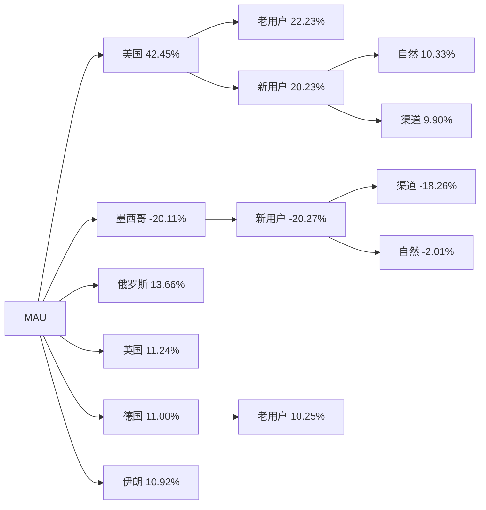
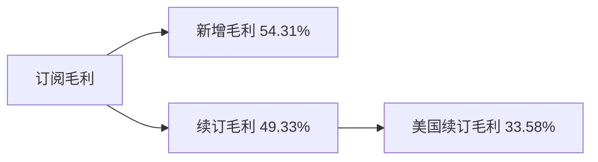
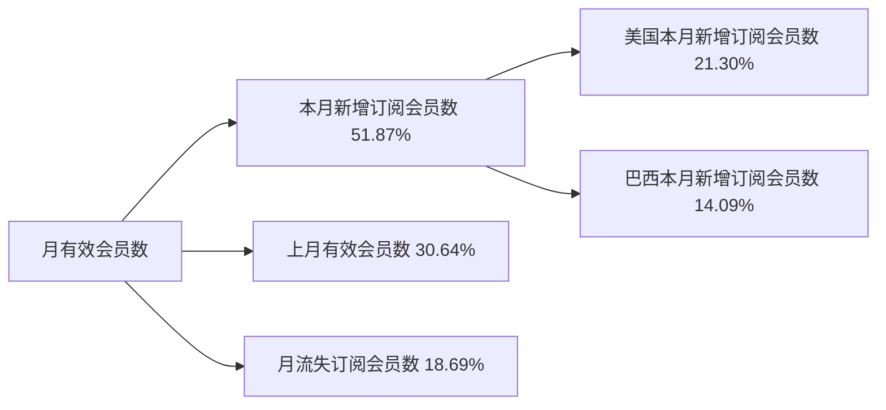

# 月报（2026-05-01 至 2026-05-31）

---

# 一、总结

!summary1_str!

## MAU

!dau_summary_str!整体MAU为601.59万，环比上涨4.17%（577.51万 → 601.59万, +24.07万），同比下跌11.63%。!dau_summary_end!其中：

> - 整体上涨主要受美国拉动（贡献42%），墨西哥反向拖累（贡献-20%）；与去年同月环比（+2.16%）同向，今年涨幅更大，推测受**母亲节**窗口带动北美活跃；
> - 美国环比+10.07%，主要因老用户环比+6.23%（对该国贡献52%）、新用户环比+31.29%（对该国贡献48%）双升；英国环比+8.35%，主要因老用户环比+7.90%（对该国贡献83%）拉动；巴西环比+0.23%，属正常波动；
> - 墨西哥环比-25.66%（贡献-20%），主要因新用户环比-53.33%（对该国贡献约99%）回落，推测受**墨西哥4月低质渠道停投后回落**影响。

## 订阅收入

!revenue_summary_str!订阅毛利为$400.29万，环比上涨11.40%（$359.33万 → $400.29万, +$40.96万），同比上涨10.78%。!revenue_summary_end!其中：

> - **新增毛利**环比+12.08%（贡献54%），续订毛利环比+10.18%（贡献49%）同向拉动；与去年同月环比（订阅毛利+10.54%、新增毛利+12.43%）幅度相近，属季节性回暖，推测受母亲节窗口及北美修图需求带动当月新增转化；其中美国新增毛利环比+13.66%（贡献29%）、美国续订毛利环比+12.82%（贡献34%）支撑订阅毛利突破$400万。

## 月有效会员数

整体月有效会员数为160.53万，环比上涨1.14%（158.72万 → 160.53万, +1.81万），同比上涨9.60%。其中：

> - 本月新增订阅会员数8.85万、环比+11.89%（贡献52%），月流失7.04万、环比-4.59%（贡献19%）流失回落形成正向支撑，本月净新增1.81万较上月0.53万上升；净新增走强与新增毛利同向，推测受母亲节窗口及北美订阅转化带动。

## 业务重要举措

> - **4/27上线**：激励广告策略调整（Acne）；实验组 A 一年累计订阅毛利约 +$70.6w（订阅+广告约 +$47.2w）
> - **5/20上线**：Makeup 付费密度降低；实验组 Makeup 打勾 uv 渗透上涨 0.44%（保存/订阅无负向）

!summary1_end!
---
# 二、下钻和归因

## MAU

!summary2_str!
现象：整体MAU环比+4.17%（5,775,135 --> 6,015,857, 240,722）

> 下钻总结：主要由于美国环比+10.07%造成，贡献42%；墨西哥环比-25.66%反向拖累（贡献-20%）
>
!summary2_end!
!logic_lib_str!
> 知识库命中事件：
>
> - 2026年母亲节（5/10），出处：wiki `entities/mark-mothers-day-20260509` + `concepts/airbrush-holiday-calendar`，命中原因：美/巴 5 月第 2 周日与分析月重叠，事件描述：marks 标注 DAU/活跃次留，与美国 MAU 新用户环比+31.29%、老用户环比+6.23% 方向一致；与去年同月环比（+2.16%）同向、今年更强
> - 5月增长月会复盘，出处：wiki `sources/20260616-may-growth-review`，命中原因：分析周期=2026年5月，事件描述：美国+10.1%、英国+8.3%、墨西哥-25.7%（渠道缩量）、巴西+0.2%横盘；定性为节日季节性+局部热点反弹、非结构性回升
> - Relight 东欧新增（5/21），出处：wiki `entities/mark-relight-eastern-europe-20260521`，命中原因：德国/乌克兰/哈萨克斯坦等同步上涨，事件描述：marks 标注 DNU/新增次留；树中德国贡献11%、伊朗等为辅因，下钻总结未达 >30% 点名门槛
> - 伊朗网络逐步恢复（5/26起），出处：wiki `entities/iran-network-recovery-20260526`，命中原因：分析月末网络恢复与伊朗 MAU 环比+1111.71%（贡献11%）时间重合，作背景说明。事件描述：
>
!logic_lib_end!
!logic_train_str!
> 逻辑链：
>
> 导致上升
> - 母亲节窗口 + 北美修图活跃 --> 美国新/老用户 MAU 双升 --> 整体 MAU 上涨
> - Relight 热点 --> 东欧/德语区新增与活跃修复 --> 德国等贡献抬升（辅因）
>
> 阻止上升
> - 墨西哥4月低质渠道停投 --> 新用户 MAU 大幅回落（-53.33%） --> 整体 MAU 涨幅被部分抵消
!logic_train_end!
!dau_trend_str!
| 指标 | 2025-06 | 2025-07 | 2025-08 | 2025-09 | 2025-10 | 2025-11 | 2025-12 | 2026-01 | 2026-02 | 2026-03 | 2026-04 | 2026-05 |
|-------|-------|-------|-------|-------|-------|-------|-------|-------|-------|-------|-------|-------|
| **整体 MAU** | 6,695,240 | 6,705,712 | 6,641,065 | 6,387,049 | 8,079,475 | 6,225,213 | 6,745,811 | 6,478,965 | 5,607,951 | 5,788,814 | 5,775,135 | 6,015,857 |
| **美国 MAU** | 1,230,033 | 1,237,858 | 1,211,146 | 1,160,367 | 1,498,396 | 1,111,728 | 1,131,830 | 1,004,557 | 937,796 | 1,006,176 | 1,014,368 | 1,116,564 |
| **巴西 MAU** | 2,256,518 | 2,249,503 | 2,241,479 | 2,285,321 | 2,937,189 | 2,324,168 | 2,713,738 | 2,777,279 | 2,281,495 | 2,275,058 | 2,194,269 | 2,199,388 |
| **英国 MAU** | 375,040 | 379,700 | 366,243 | 333,509 | 423,465 | 320,955 | 352,259 | 310,149 | 294,324 | 321,686 | 324,145 | 351,199 |
!dau_trend_end!
**维度下钻**
!tree_str!

!tree_end!

---

## 订阅毛利

!summary2_str!
现象：订阅毛利（剔除退款，$）环比+11.40%（3,593,301.99 --> 4,002,914.10, 409,612.12）

> 下钻总结：新增毛利环比+12.08%贡献54%为主要拉动；续订毛利环比+10.18%贡献49%同步上涨，其中美国续订毛利环比+12.82%贡献34%
>
!summary2_end!
!logic_lib_str!
> 知识库命中事件：
>
> - 5月增长月会复盘，出处：wiki `sources/20260616-may-growth-review`，命中原因：5月订阅毛利 OKR 完成度96.65%接近达标，事件描述：新增与续订双升支撑大盘+11.40%
> - 2026年母亲节（5/10），出处：wiki `concepts/airbrush-holiday-calendar`，命中原因：节日窗口与北美订阅转化改善时间重合；去年同月环比订阅毛利+10.54%、新增+12.43%与今年幅度相近，属季节性回暖。事件描述：
> - 激励广告策略调整（Acne，4/27上线），出处：实验汇总 / 双周会，命中原因：窗口内明显正向实验，事件描述：实验组 A 一年累计订阅约 +$70.6w——阻止下降/支撑新增（辅因）
>
!logic_lib_end!
!logic_train_str!
> 逻辑链：
>
> 导致上升
> - 母亲节窗口 + 北美/拉美修图需求回暖 --> 新增毛利月合计上涨（贡献54%） --> 订阅毛利上涨
> - 美国续订毛利环比+12.82%（贡献34%） --> 续订盘稳固 --> 订阅毛利上涨
> - 与去年同月环比幅度相近（+10.54%） --> 季节性回暖确认
>
> 阻止下降
> - 激励广告 Acne 实验组 A（一年约 +$70.6w） --> 订阅转化提升 --> 部分支撑新增盘
!logic_train_end!
!revenue_trend_str!
| 指标 | 2025-06 | 2025-07 | 2025-08 | 2025-09 | 2025-10 | 2025-11 | 2025-12 | 2026-01 | 2026-02 | 2026-03 | 2026-04 | 2026-05 |
|-------|-------|-------|-------|-------|-------|-------|-------|-------|-------|-------|-------|-------|
| **订阅毛利（剔除退款，$）** | 3,435,567.07 | 3,998,519.62 | 3,967,339.15 | 3,654,574.49 | 3,685,427.32 | 3,656,423.52 | 3,923,846.69 | 3,884,464.89 | 3,339,299.38 | 3,655,952.81 | 3,593,301.99 | 4,002,914.10 |
| **新增毛利** | 1,711,628.62 | 1,770,760.90 | 1,789,837.93 | 1,471,209.24 | 1,508,020.62 | 1,632,842.19 | 1,783,295.66 | 1,950,293.99 | 1,569,201.84 | 1,845,293.85 | 1,841,108.38 | 2,063,548.86 |
| **续订毛利** | 1,940,105.36 | 2,457,173.54 | 2,416,249.35 | 2,380,741.84 | 2,388,014.33 | 2,221,220.40 | 2,334,814.46 | 2,178,779.90 | 1,986,517.58 | 2,040,613.64 | 1,985,529.02 | 2,187,606.83 |
!revenue_trend_end!
**维度下钻**
!tree_str!

!tree_end!

---

## 月有效会员数

!summary2_str!
现象：整体月有效会员数环比+1.14%（1,587,190 --> 1,605,332, 18,142）

> 下钻总结：本月新增订阅会员数环比+11.89%贡献52%为主要拉动；上月有效会员数环比+0.35%贡献31%；月流失订阅会员数环比-4.59%贡献19%（流失下降利好整体）。净新增1.81万较上月0.53万上升，与新增毛利同向
>
!summary2_end!
!logic_lib_str!
> 知识库命中事件：
>
> - 2026年母亲节（5/10），出处：wiki `concepts/airbrush-holiday-calendar`，命中原因：与本月新增订阅会员环比+11.89%、新增毛利同向，事件描述：节日窗口带动订阅尝试
> - 5月增长月会复盘，出处：wiki `sources/20260616-may-growth-review`，命中原因：覆盖分析月，事件描述：北美节日相关活跃与订阅转化改善，可与净新增走强对照
>
!logic_lib_end!
!logic_train_str!
> 逻辑链：
>
> 导致上涨
> - 母亲节窗口 --> 本月新增订阅会员环比+11.89%（贡献52%） --> 整体月有效会员数上涨
> - 月流失环比-4.59%（贡献19%） --> 流失回落 --> 净新增扩大
> - 上月有效会员数环比+0.35%（贡献31%） --> 存量基数支撑
!logic_train_end!
!trend_str!
| 指标 | 2025-06 | 2025-07 | 2025-08 | 2025-09 | 2025-10 | 2025-11 | 2025-12 | 2026-01 | 2026-02 | 2026-03 | 2026-04 | 2026-05 |
|-------|-------|-------|-------|-------|-------|-------|-------|-------|-------|-------|-------|-------|
| **整体月有效会员数** | 1,485,829 | 1,511,737 | 1,530,362 | 1,540,338 | 1,549,082 | 1,557,217 | 1,584,924 | 1,595,387 | 1,570,164 | 1,581,632 | 1,587,190 | 1,605,332 |
| **本月新增订阅会员数** | 87,411 | 93,952 | 94,657 | 84,662 | 84,855 | 90,064 | 103,001 | 95,273 | 72,558 | 85,684 | 79,125 | 88,536 |
| **月流失订阅会员数** | 66,017 | 66,447 | 75,039 | 75,052 | 76,738 | 81,311 | 79,570 | 94,513 | 104,769 | 74,174 | 73,805 | 70,415 |
| **留存订阅会员数** | 1,405,741 | 1,426,705 | 1,445,618 | 1,465,223 | 1,473,147 | 1,476,691 | 1,487,185 | 1,495,673 | 1,486,177 | 1,496,199 | 1,508,078 | 1,516,788 |
!trend_end!
**维度下钻**
!tree_str!

!tree_end!

---

## 业务举措

### 路径 A（实验 / 有分析的功能类）

| 上线日期 | 需求概述 | 数据表现 | 是否入选 |
|-------|-------|-------|-------|
| 4/24 | 取消支付挽留优惠价格调整 AB | 年挽留一年累积实验组 A −$6.5w / B −$16.5w | 否 |
| 4/24 | 编辑器下载按钮 AAB | 未找到对应的实验分析 | 否 |
| 4/24 | 新手引导流程优化 AB | 留存/整体保存·订阅不可信，Magic 保存单点上涨未带动整体 | 否 |
| 4/24 | 安装包体积优化 AB | Android 整体保存渗透可信下降约 0.4%～0.6% | 否 |
| 4/24 | 保分页 Camera 按钮调整为推荐位 | 整体编辑器保存/订阅/留存无显著影响 | 否 |
| 4/24 | 功能不打勾小问券 | 整体无显著影响，Plump 打勾/保存显著下降 2% | 否 |
| 4/24 | 智能修图模式 1 期 | 整体留存不可信，smart 使用转化不如 classic | 否 |
| 4/27 | 激励广告策略调整（Acne） | 实验组 A 一年累计订阅毛利约 +$70.6w，订阅+广告约 +$47.2w | 是 |
| 5/7 | Face 限免福利（特定人群） | iOS 订阅率显著下降约 10%，建议回对照 | 否 |
| 5/7 | iOS 增加订阅页主动曝光 | 新用户留存显著下降，ARPU 无显著上涨，建议回对照 | 否 |
| 5/7 | Filter 默认值优化＆本地记忆 | 双端结论分裂，非整体明显正向 | 否 |
| 5/20 | 订阅横幅改造 AB | 进入订阅页渗透上涨，ARPU 无显著上涨 | 否 |
| 5/20 | 订阅策略接入用户分层能力 AB | 重新实验后留存/订阅/ARPU 均无显著变化 | 否 |
| 5/20 | Makeup 付费密度降低 | 实验组 Makeup 打勾 uv 渗透上涨 0.44%（保存/订阅无负向） | 是 |
| 5/20 | Reshape 新增 Body 引导 | 整体保存/留存/订阅无显著变化，Body 进入 +12%、保存 +4% | 否 |

### 路径 B

路径 B：窗口内功能类、实验汇总/双周会无对齐分析 → 进入保存率+进入渗透率补取数。总结门槛：规则1 保存率相对变动 >5% 且渗透率相对变动 >-3%；规则2 保存率相对变动 >-3% 且渗透率相对变动 >10%。本月路径 B 无入选总结项。

| 上线日期 | 需求概述 | 二级功能 | 进入渗透率变化 | 进入渗透率相对变动 | 进入保存率变化 | 进入保存率相对变动 | 是否达到总结入选门槛 |
|-------|-------|-------|-------|-------|-------|-------|-------|
| 4/24 | Magic 新增多人识别 | Magic | 24.4%→24.8% | +1.5% | 63.4%→62.4% | -1.5% | 否 |
| 4/24 | 评分弹窗优化 | - | - | - | - | - | 未提取到功能 |
| 4/24 | 首页 project 弹窗删除 | - | - | - | - | - | 未提取到功能 |
| 4/24 | 接入视频中台一期 | - | - | - | - | - | 未提取到功能 |
| 5/7 | Hair 新增增发量 Pro | Hair | 8.6%→8.7% | +0.5% | 30.1%→29.6% | -1.7% | 否 |
| 5/7 | Face 新增小项（鼻/下巴等） | Face | 24.2%→24.5% | +1.1% | 44.5%→46.2% | +3.8% | 否 |
| 5/7 | Retouch 线上效果新增滑杆 | AI Retouch | 14.8%→14.9% | +0.3% | 33.3%→34.0% | +2.2% | 否 |
| 5/7 | 首页 Repair 入口替换为新增强算法 | AI Repair | 4.4%→7.3% | +65.2% | 37.8%→26.9% | -28.9% | 否 |
| 5/7 | enhance 按钮去除 tips | - | - | - | - | - | 未提取到功能 |
| 5/20 | Retouch 新增多族裔效果 | AI Retouch | 14.9%→15.0% | +0.4% | 33.9%→35.5% | +4.8% | 否 |
| 5/20 | Tattoo 新增纹身分割 | AI Tattoo | 0.7%→0.8% | +5.0% | 7.1%→6.9% | -2.6% | 否 |

---

# 三、异常指标检测

| 指标 | 2025-10 | 2025-11 | 2025-12 | 2026-01 | 2026-02 | 2026-03 | 2026-04 | 2026-05 | 月环比变化 | 指标状态 | 异常说明 |
|-------|-------|-------|-------|-------|-------|-------|-------|-------|-------|-------|-------|
| !dau_data_str!**整体 MAU**!dau_data_end! | 8,079,475 | 6,225,213 | 6,745,811 | 6,478,965 | 5,607,951 | 5,788,814 | 5,775,135 | 6,015,857 | +4.17% | 🟢 | - |
| !revenue_data_str!**订阅毛利（剔除退款，$）**!revenue_data_end! | 3,685,427 | 3,656,424 | 3,923,847 | 3,884,465 | 3,339,299 | 3,655,953 | 3,593,302 | 4,002,914 | +11.40% | 🟢 | - |
| **新增毛利** | 1,508,021 | 1,632,842 | 1,783,296 | 1,950,294 | 1,569,202 | 1,845,294 | 1,841,108 | 2,063,549 | +12.08% | 🟢 | - |
| **续订毛利** | 2,388,014 | 2,221,220 | 2,334,814 | 2,178,780 | 1,986,518 | 2,040,614 | 1,985,529 | 2,187,607 | +10.18% | 🟢 | - |
| **整体月有效会员数** | 1,549,082 | 1,557,217 | 1,584,924 | 1,595,387 | 1,570,164 | 1,581,632 | 1,587,190 | 1,605,332 | +1.14% | ⚫ | - |

*说明：环比增长超过3%为🟢增长(绿色)，环比变化在0~3%(不含0%，含3%)为⚫稳定(黑色)，环比变化在0~-3%(含0%，不含-3%)为🟡稳定(黄色)，环比下跌超过3%(含-3%)为🔴异常(红色)。最低值判断基于当前源数据可用的最近最多14月历史。*
