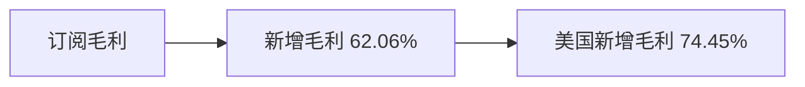
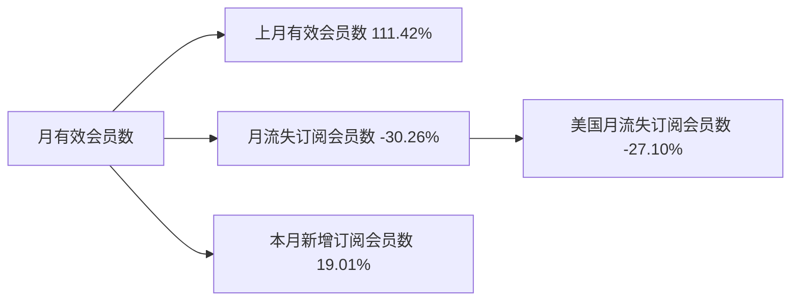

# 月报（2026-06-01 至 2026-06-30）

---

# 一、总结

!summary1_str!

## MAU

!dau_summary_str!整体MAU为601.19万，**环比下跌0.07%**（601.59万 → 601.19万, -0.39万），**同比下跌10.21%**。!dau_summary_end!其中：

> - 整体微跌属正常波动，多国涨跌对冲；
> - 美国环比-0.21%，属正常波动；英国环比+5.04%，主要因**渠道新用户**环比+62.49%（对该国贡献43%）、老用户环比+2.08%（对该国贡献36%）拉动，推测受**6/18起英国TikTok投放加码**与**6/21英国父亲节**窗口带动；巴西环比-1.00%，主要因渠道新用户环比-3.51%（对该国贡献45%）、老用户环比-0.61%（对该国贡献47%）拖累，推测受**关停部分效率低的渠道**影响；
> - 伊朗环比+211.66%（2.87万 --> 8.93万）活跃冲高，主要因**5/26起伊朗网络逐步恢复**带动回升；德国环比+15.71%（18.88万 --> 21.85万），主要因老用户环比+12.46%（对该国贡献68%）拉动，推测受**Relight 欧洲 6 月小幅余温**影响；土耳其环比+19.56%（12.46万 --> 14.90万），主要因**渠道新用户**环比+31.42%（对该国贡献51%）跟涨，反向提拉明显。

## 订阅收入

!revenue_summary_str!订阅毛利（剔除退款）为$394.61万，**环比下跌1.42%**（$400.29万 → $394.61万, -$5.69万），**同比上涨14.86%**。!revenue_summary_end!其中：

> - **新增毛利**环比-1.71%（贡献62%）是订阅毛利回落主因，其中**美国新增毛利**环比-4.26%（贡献74%）拖累新增盘，推测5月节日窗口后转化自然回落、6月北美修图需求季节性走弱，与去年同月环比（美国新增-14.67%、整体新增-7.37%）同向，今年跌幅更缓；Onboarding、Face 等正向举措部分对冲，未能扭转美国新增走弱。

## 月有效会员数

整体月有效会员数为162.16万，**环比上涨1.01%**（160.53万 → 162.16万, +1.63万），**同比上涨9.14%**。其中：

> - 本月新增订阅会员数9.16万、环比+3.50%（贡献19%），月流失7.53万、环比+7.00%（贡献-30%）拖累加大，本月净新增1.63万较上月1.81万**下降**；净新增走弱与新增毛利回落一致，推测节日窗口后转化放缓；其中**美国月流失**环比+16.97%（贡献-27%）放大流失压力。

## 业务重要举措

> - **5/20上线**：Makeup 付费密度降低；实验组 Makeup 打勾 uv 渗透上涨 0.44%（保存/订阅无负向）
> - **6/8上线**：Onboarding 订阅页改版，突出 $0 试用信息以提升订阅转化；实验组一年累积订阅毛利增量约 $26w
> - **6/8上线**：Relight 接入法线打光并替换旧 2D AR 素材；实验组A Relight 保存渗透可信上涨 0.89%，整体保存渗透可信上涨 0.38%
> - **6/17上线**：Face 子项排序调整；实验组A 通过 Face 订阅成功 uv 转化可信上涨 6%，整体订阅成功 uv 转化可信上涨 4.63%
> - **6/17上线**：Hair 新增多人识别；Hair 进入保存率上涨 6.2%（30.6%→32.5%）
> - **6/17上线**：Hair loading 组件统一；Hair 进入保存率上涨 6.2%（30.6%→32.5%）

!summary1_end!
---
# 二、下钻和归因

## MAU

!summary2_str!
现象：整体MAU环比-0.07%（6,015,857 --> 6,011,938, -3,919）

> 下钻总结：环比绝对值不足1%，属正常波动，无需下钻归因。总结侧反向提拉中，伊朗MAU与**5/26起伊朗网络逐步恢复**时间重合；英国渠道新用户与老用户过线贡献，推测受**6/18起英国TikTok投放加码**与**6/21父亲节**带动；德国以老用户（对该国贡献68%）为主，推测受**Relight 欧洲 6 月小幅余温**影响；土耳其无外部事件主因，在渠道新/自然新/老用户三支中取**渠道新用户**（对该国贡献51%）作结构说明。巴西相对上月微跌主因是渠道新用户与老用户同向下行，推测受**关停部分效率低的渠道**影响；**不宜**用分析月内六月节解释下跌（六月节默认解释上涨，周报节后回落仅为月内回日常水位）。
!summary2_end!
!dau_trend_str!
| 指标 | 2025-07 | 2025-08 | 2025-09 | 2025-10 | 2025-11 | 2025-12 | 2026-01 | 2026-02 | 2026-03 | 2026-04 | 2026-05 | 2026-06 |
|-------|-------|-------|-------|-------|-------|-------|-------|-------|-------|-------|-------|-------|
| **整体 MAU** | 6,705,712 | 6,641,065 | 6,387,049 | 8,079,475 | 6,225,213 | 6,745,811 | 6,478,965 | 5,607,951 | 5,788,814 | 5,775,135 | 6,015,857 | 6,011,938 |
| **美国 MAU** | 1,237,858 | 1,211,146 | 1,160,367 | 1,498,396 | 1,111,728 | 1,131,830 | 1,004,557 | 937,796 | 1,006,176 | 1,014,368 | 1,116,564 | 1,114,219 |
| **巴西 MAU** | 2,249,503 | 2,241,479 | 2,285,321 | 2,937,189 | 2,324,168 | 2,713,738 | 2,777,279 | 2,281,495 | 2,275,058 | 2,194,269 | 2,199,388 | 2,177,429 |
| **英国 MAU** | 379,700 | 366,243 | 333,509 | 423,465 | 320,955 | 352,259 | 310,149 | 294,324 | 321,686 | 324,145 | 351,199 | 368,912 |
!dau_trend_end!

---

## 订阅毛利

!summary2_str!
现象：订阅毛利（剔除退款，$）环比-1.42%（4,002,914.10 --> 3,946,054.91, -56,859.20）

> 下钻总结：**新增毛利**环比-1.71%（贡献62.06%）为主要拖累，其中**美国新增毛利**环比-4.26%（贡献74.45%）占新增回落主体；相对去年同月环比（整体新增-7.37%、美国新增-14.67%）同向走弱，今年跌幅更缓，推测节日窗口后回落与季节性因素。Onboarding 实验组（一年约+$26w）、Face 实验组A 等正向实验部分对冲，但未能扭转美国新增走弱。
>
!summary2_end!
!logic_lib_str!
> 知识库命中事件：
>
> - **6/30 业务双周会**，出处：wiki `sources/20260630-biweekly-sync`，命中原因：覆盖分析月末，事件描述：美国新增毛利周度持续下滑、推测6月下旬修图需求淡季；巴西新增毛利周度六月节后回落（**仅周度窗口**，巴西整月新增毛利实际环比+3.75%，**勿**外推为巴西月环比下跌）。「进入6月后美国新增持续走弱」与月度美国新增-4.26%方向一致，可作佐证，关联度：中
> - **6/16 业务双周会**，出处：raw `20260616日 业务双周会数据同步`，命中原因：覆盖6月上旬；Makeup 付费密度（pageId=622565821）与版本 V8.9.0 需求链接对齐且正向（实验组打勾渗透+0.44%），事件描述：英国新增周度回落因上期含5/25假日窗口——属月内周度对比，**不宜**外推为整月英国新增主因，关联度：弱
> - **去年同月环比参照**，出处：`raw_data/bookings.csv`，命中原因：季节性佐证，事件描述：2025-06 相对 2025-05 整体新增-7.37%、美国新增-14.67%，与今年同向，关联度：中
> - **Onboarding 订阅页优化**（V8.10.0，6/8上线，pageId=691207138），出处：实验汇总序号44，命中原因：版本号/实验全称对齐且明显正向，事件描述：实验组一年累积订阅毛利约+$26w——**阻止下降**，关联度：中（对冲辅因，非下跌主因）
> - **Face 子项排序**（V8.11.0，6/17上线，pageId=698128692），出处：实验汇总序号40，命中原因：需求页与「Face子项排序调整」对齐，事件描述：实验组A Face/整体订阅成功 uv 转化 +6%/+4.63%——**阻止下降**，关联度：中（对冲辅因）
> - **Relight 美意马新增**（6/2），出处：wiki `entities/mark-relight-us-it-my-20260602`，命中原因：分析月内 marks，事件描述：偏活跃/DNU，与美国新增毛利回落方向相反，**订阅侧解释力弱**，关联度：弱
>
!logic_lib_end!
!logic_train_str!
> 逻辑链：
>
> 导致下降
> - 5月节日窗口后新增转化自然回落 --> 新增毛利环比-1.71%（贡献62%） --> 订阅毛利下跌
> - 美国新增毛利环比-4.26%（贡献74%） --> 北美新增盘走弱 --> 订阅毛利下跌
> - 6月修图需求季节性走弱（去年同月环比整体新增-7.37%、美国-14.67%，同向） --> 新增盘承压 --> 订阅毛利下跌
>
> 阻止下降
> - Onboarding 实验组（一年约+$26w） --> 整体订阅率提升 --> 部分对冲新增回落
> - Face 实验组A（订阅成功 uv 转化提升） --> 订阅转化改善 --> 部分对冲新增回落
> - 巴西新增毛利环比+3.75%（贡献-17%） --> 拉美新增盘微升 --> 部分对冲整体下滑（二章保留，总结因|贡献|≤30%不点名）
!logic_train_end!
!revenue_trend_str!
| 指标 | 2025-07 | 2025-08 | 2025-09 | 2025-10 | 2025-11 | 2025-12 | 2026-01 | 2026-02 | 2026-03 | 2026-04 | 2026-05 | 2026-06 |
|-------|-------|-------|-------|-------|-------|-------|-------|-------|-------|-------|-------|-------|
| **订阅毛利（剔除退款，$）** | 3,998,519.62 | 3,967,339.15 | 3,654,574.49 | 3,685,427.32 | 3,656,423.52 | 3,923,846.69 | 3,884,464.89 | 3,339,299.38 | 3,655,952.81 | 3,593,301.99 | 4,002,914.10 | 3,946,054.91 |
| **新增毛利** | 1,770,760.90 | 1,789,837.93 | 1,471,209.24 | 1,508,020.62 | 1,632,842.19 | 1,783,295.66 | 1,950,293.99 | 1,569,201.84 | 1,845,293.85 | 1,841,108.38 | 2,063,548.86 | 2,028,264.43 |
| **续订毛利** | 2,457,173.54 | 2,416,249.36 | 2,380,741.84 | 2,388,014.33 | 2,221,220.40 | 2,334,814.46 | 2,178,779.90 | 1,986,517.58 | 2,040,613.64 | 1,985,529.02 | 2,187,606.83 | 2,181,345.79 |
!revenue_trend_end!
**维度下钻**
!tree_str!

!tree_end!

---

## 月有效会员数

!summary2_str!
现象：整体月有效会员数环比1.01%（1,605,332 --> 1,621,614, 16,282）

> 下钻总结：**上月有效会员数**环比+1.14%（贡献111.42%）构成有效会员上涨主基数；**月流失订阅会员数**环比+7.00%（贡献-30.26%）为主要对冲，其中**美国月流失**环比+16.97%（贡献-27.10%）放大流失压力；**本月新增订阅会员数**环比+3.50%（贡献19.01%）拉动净增。
>
!summary2_end!
!logic_lib_str!
> 知识库命中事件：
>
> - **6/30 业务双周会**，出处：wiki `sources/20260630-biweekly-sync`，命中原因：覆盖分析月末，事件描述：美国新增走弱与净新增放缓、流失压力方向可对照；渠道侧「关停部分效率低的渠道」与巴西渠道新用户下行同向可作佐证；周度窗口在月内，作佐证而非唯一主因，关联度：中
> - **Onboarding 订阅页优化**（6/8），出处：wiki `sources/onboarding-subscribe-page-ab-v810`，命中原因：分析月内正向订阅实验，事件描述：订阅率显著上涨，与本月新增会员环比+3.50%方向可对照（净新增仍因流失加大而走弱），关联度：中
> - **V8.10.0 / V8.11.0 版本上线**（6/8、6/17），出处：wiki `sources/2026-versions-index`，命中原因：分析月内发版，事件描述：订阅策略实验并行，或影响新增与流失结构，关联度：弱（机制推测，量级难独立验证）
>
!logic_lib_end!
!logic_train_str!
> 逻辑链：
>
> 导致上涨
> - 上月有效会员数环比+1.14%（贡献111%） --> 有效会员存量基数扩大 --> 整体月有效会员数上涨
> - 本月新增订阅会员数环比+3.50%（贡献19%） --> 有效会员净增
> - Onboarding 订阅页优化 --> 订阅转化提升 --> 支撑本月新增会员上涨
>
> 阻止上涨
> - 月流失订阅会员数环比+7.00%（贡献-30%） --> 对冲净增
> - 美国月流失环比+16.97%（贡献-27%） --> 北美流失放大 --> 有效会员净增放缓
!logic_train_end!
!trend_str!
| 指标 | 2025-07 | 2025-08 | 2025-09 | 2025-10 | 2025-11 | 2025-12 | 2026-01 | 2026-02 | 2026-03 | 2026-04 | 2026-05 | 2026-06 |
|-------|-------|-------|-------|-------|-------|-------|-------|-------|-------|-------|-------|-------|
| **整体月有效会员数** | 1,511,737 | 1,530,362 | 1,540,338 | 1,549,082 | 1,557,217 | 1,584,924 | 1,595,387 | 1,570,164 | 1,581,632 | 1,587,190 | 1,605,332 | 1,621,614 |
| **本月新增订阅会员数** | 93,952 | 94,657 | 84,662 | 84,855 | 90,064 | 103,001 | 95,273 | 72,558 | 85,684 | 79,125 | 88,536 | 91,632 |
| **月流失订阅会员数** | 66,447 | 75,039 | 75,052 | 76,738 | 81,311 | 79,570 | 94,513 | 104,769 | 74,174 | 73,805 | 70,415 | 75,342 |
| **留存订阅会员数** | 1,426,705 | 1,445,618 | 1,465,223 | 1,473,147 | 1,476,691 | 1,487,185 | 1,495,673 | 1,486,177 | 1,496,199 | 1,508,078 | 1,516,788 | 1,529,982 |
!trend_end!
**维度下钻**
!tree_str!

!tree_end!

---

## 业务举措

### 路径 A（实验 / 有分析的功能类）

| 上线日期 | 需求概述 | 数据表现 | 是否入选 |
|-------|-------|-------|-------|
| 5/20 | Makeup 付费密度降低 | 实验组 Makeup 打勾 uv 渗透上涨 0.44%（保存/订阅无负向） | 是 |
| 5/20 | 订阅策略接入用户分层能力 | 重新实验后留存率、订阅率、ARPU均无显著变化 | 否 |
| 5/20 | 订阅横幅改造 | 留存率与ARPU均无显著变化（Face/Reshape进入订阅页渗透上涨但未带动ARPU） | 否 |
| 5/20 | Reshape 新增 Body 引导 | 整体保存率/留存率/订阅率无显著变化，Body 进入率显著上涨 12%、保存率显著上涨 4% | 否 |
| 6/8 | Onboarding 订阅页改版，突出 $0 试用信息以提升订阅转化 | 实验组一年累积订阅毛利增量约 $26w | 是 |
| 6/8 | AI Retouch 缩略图替换 | 整体指标无可信变化（Android AI Retouch 保存渗透可信下降 2.21%） | 否 |
| 6/8 | Relight 接入法线打光并替换旧 2D AR 素材 | 实验组A Relight 保存渗透可信上涨 0.89%，整体保存渗透可信上涨 0.38% | 是 |
| 6/17 | Face 子项排序调整 | 实验组A 通过 Face 订阅成功 uv 转化可信上涨 6%，整体订阅成功 uv 转化可信上涨 4.63% | 是 |
| 6/17 | 激励广告策略调整 2 期（Skin Tone） | 订阅率显著上涨、预估一年累积订阅毛利增量约 $49w～$105w，但 ARPU 可信性仍观察中 | 否 |
| 6/17 | 精细化分层优惠——已过期会员 | 未找到对应的实验分析 | 否 |
| 6/17 | 安卓用户分层优惠不展示季卡 | 未找到对应的实验分析 | 否 |

### 路径 B

路径 B：窗口内功能类、实验汇总/双周会无对齐分析 → 进入保存率+进入渗透率补取数。总结门槛：规则1 保存率相对变动 >5% 且渗透率相对变动 >-3%；规则2 保存率相对变动 >-3% 且渗透率相对变动 >10%。本月路径 B 入选总结 2 条（Hair 新多人识别、Hair loading 组件统一，均规则1；二者共用 Hair 二级功能日历窗口口径）。

| 上线日期 | 需求概述 | 二级功能 | 进入渗透率变化 | 进入渗透率相对变动 | 进入保存率变化 | 进入保存率相对变动 | 是否达到总结入选门槛 |
|-------|-------|-------|-------|-------|-------|-------|-------|
| 5/20 | Retouch 新增多族裔效果 | AI Retouch | 14.9%→15.0% | +0.4% | 33.9%→35.5% | +4.8% | 否 |
| 5/20 | Tattoo 新增纹身分割 | AI Tattoo | 0.7%→0.8% | +5.0% | 7.1%→6.9% | -2.6% | 否 |
| 6/8 | 局部妆支持 AI 能力 | Makeup | 16.5%→15.1% | -8.1% | 60.6%→62.4% | +3.0% | 否 |
| 6/8 | Video 新增抖动修复 | Video | - | - | - | - | 未从看板拉取到对应功能（Video功能） |
| 6/8 | 接入视频中台二期 | - | - | - | - | - | 未提取到功能 |
| 6/8 | New 角标/小红点展示逻辑优化 | - | - | - | - | - | 未提取到功能 |
| 6/17 | Hair 新增多人识别 | Hair | 8.1%→8.5% | +5.0% | 30.6%→32.5% | +6.2% | 是（规则1） |
| 6/17 | Hair loading 组件统一 | Hair | 8.1%→8.5% | +5.0% | 30.6%→32.5% | +6.2% | 是（规则1） |
| 6/17 | Teeth 新增去牙渍 | Teeth | 6.4%→6.9% | +8.4% | 82.3%→79.4% | -3.6% | 否 |
| 6/17 | Retouch&Face 新增 3D 骨相还原 | Face | 21.8%→23.9% | +9.7% | 47.4%→46.4% | -2.1% | 否 |
| 6/17 | Face 新增提拉 Pro | Face | 21.8%→23.9% | +9.7% | 47.4%→46.4% | -2.1% | 否 |
| 6/17 | Repair 支持批量 | AI Repair | 4.1%→4.4% | +8.9% | 39.8%→38.3% | -3.9% | 否 |
| 6/17 | 端内 icon 字体化改造 | - | - | - | - | - | 未提取到功能 |

---

# 三、异常指标检测

| 指标 | 2025-11 | 2025-12 | 2026-01 | 2026-02 | 2026-03 | 2026-04 | 2026-05 | 2026-06 | 月环比变化 | 指标状态 | 异常说明 |
|-------|-------|-------|-------|-------|-------|-------|-------|-------|-------|-------|-------|
| !dau_data_str!**整体 MAU**!dau_data_end! | 6,225,213 | 6,745,811 | 6,478,965 | 5,607,951 | 5,788,814 | 5,775,135 | 6,015,857 | 6,011,938 | -0.07% | 🟡 | 整体 MAU下跌，需关注 |
| !revenue_data_str!**订阅毛利（剔除退款，$）**!revenue_data_end! | 3,656,424 | 3,923,847 | 3,884,465 | 3,339,299 | 3,655,953 | 3,593,302 | 4,002,914 | 3,946,055 | -1.42% | 🟡 | 订阅毛利（剔除退款，$）下跌，需关注 |
| **新增毛利** | 1,632,842 | 1,783,296 | 1,950,294 | 1,569,202 | 1,845,294 | 1,841,108 | 2,063,549 | 2,028,264 | -1.71% | 🟡 | 新增毛利下跌，需关注 |
| **续订毛利** | 2,221,220 | 2,334,814 | 2,178,780 | 1,986,518 | 2,040,614 | 1,985,529 | 2,187,607 | 2,181,346 | -0.29% | 🟡 | 续订毛利下跌，需关注 |
| **整体月有效会员数** | 1,557,217 | 1,584,924 | 1,595,387 | 1,570,164 | 1,581,632 | 1,587,190 | 1,605,332 | 1,621,614 | +1.01% | ⚫ | - |

*说明：环比增长超过3%为🟢增长(绿色)，环比变化在0~3%(不含0%，含3%)为⚫稳定(黑色)，环比变化在0~-3%(含0%，不含-3%)为🟡稳定(黄色)，环比下跌超过3%(含-3%)为🔴异常(红色)。最低值判断基于当前源数据可用的最近最多14月历史。*
