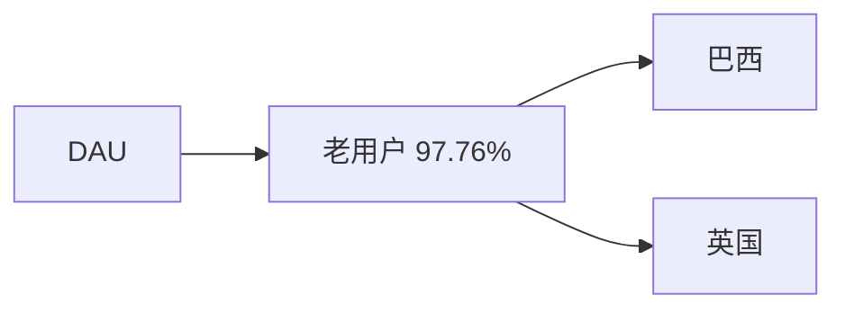
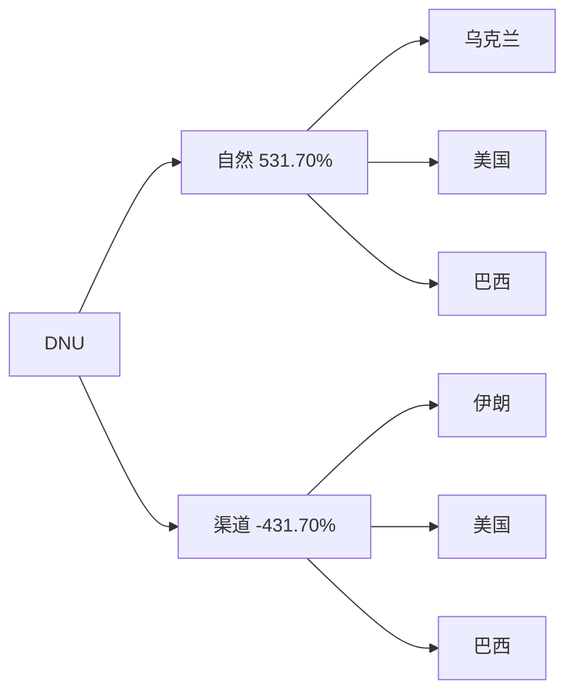
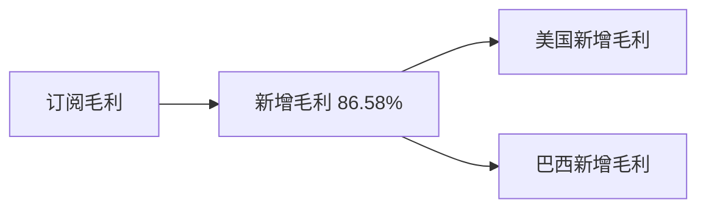
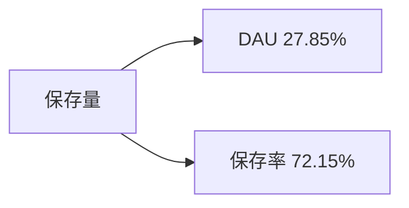

# 周报（2026-06-22 至 2026-06-28）

---

# 一、总结

!summary1_str!

## DAU

!dau_summary_str!日均DAU环比+1.03%（72.3万 --> 73.1万, +0.74万），属正常范围波动。!dau_summary_end!其中：

> - 老用户DAU环比+1.07%（贡献98%）为主因，巴西老用户环比+2.31%（贡献86%）拉动最大，推测wk25 Festa Junina（六月节）窗口回落后巴西活跃自然修复，由29.4万回升至30.0万。

## DNU

DNU环比+0.39%（4.23万 --> 4.24万, +166），属正常波动。其中：

> - 自然DNU环比+3.52%（2.51万 --> 2.60万, +884），乌克兰自然环比+92.68%、美国自然环比+5.39%拉动明显；
> - 渠道DNU环比-4.18%（1.72万 --> 1.64万, -718），美国渠道环比-14.99%、巴西渠道环比-4.22%回落，伊朗渠道环比+478.13%部分对冲。

## 订阅收入

!revenue_summary_str!日均订阅毛利环比-3.56%（$13.02万 --> $12.56万, -$0.46万），跌幅偏大。!revenue_summary_end!其中：

> - 新增毛利环比-6.02%（贡献87%）为主要拖累，美国新增毛利环比-6.40%（贡献43%）回落明显，连续4周下跌且达近8周最低，推测6月下旬暑期出行前修图需求淡季、新增转化走弱。

## 活跃次留

整体活跃次留环比-17.34%（32.54% --> 26.90%, -5.64pp）。6/28次留尚未完全，待后续更新。

## 新增次留

整体新增次留环比-17.85%（14.24% --> 11.70%, -2.54pp）。6/28次留尚未完全，待后续更新。

## 保存量

整体保存量环比+3.73%（48.4万 --> 50.2万, +1.81万），涨幅偏大。其中：

> - 保存率环比+2.68%（贡献72%）为主要拉动，DAU环比+1.03%（贡献28%）同步贡献。

!summary1_end!
---
# 二、下钻和归因

## DAU

!summary2_str!
现象：整体DAU环比1.03%（723,297 --> 730,722, 7,425）

> 下钻总结：老用户环比+1.07%为主因（贡献97.76%），巴西环比+2.31%拉动最大（贡献86.47%）
>
!summary2_end!
!logic_lib_str!
> 知识库命中事件：
>
> - 出处：知识库，Festa Junina（巴西六月节），命中原因：6月整月节日窗口，wk25巴西DAU由31.2万回落至29.4万后，wk26修复至30.0万，与节日后自然恢复节奏一致。事件描述：
>
!logic_lib_end!
!logic_train_str!
> 逻辑链：
>
> - Festa Junina wk25冲高后回落结束 --> 巴西老用户活跃修复 --> 整体DAU微涨
!logic_train_end!
!trend_str!
| 指标 | wk23 0601-0607 | wk24 0608-0614 | wk25 0615-0621 | wk26 0622-0628 | 环比波动 |
|-------|-------|-------|-------|-------|-------|
| **整体 DAU** | 718,559 | 740,301 | 723,297 | 730,722 | +1.03% |
| **美国 DAU** | 120,225 | 118,053 | 119,412 | 118,224 | -0.99% |
| **巴西 DAU** | 289,581 | 312,204 | 293,527 | 299,686 | +2.10% |
| **英国 DAU** | 37,360 | 37,506 | 39,787 | 41,304 | +3.81% |
| **iOS DAU** | 532,381 | 549,575 | 537,941 | 541,510 | +0.66% |
| **Android DAU** | 186,179 | 190,726 | 185,356 | 189,212 | +2.08% |
!trend_end!
**维度下钻**
!tree_str!

!tree_end!

---

## DNU

!summary2_str!
现象：整体DNU环比0.39%（42,277 --> 42,444, 166）

> 下钻总结：自然环比+3.52%，乌克兰（环比+92.68%）、美国（环比+5.39%）拉动；渠道环比-4.18%，美国（环比-14.99%）、巴西（环比-4.22%）回落，伊朗（环比+478.13%）部分对冲
>
!summary2_end!
!logic_lib_str!
> 知识库命中事件：
>
> - 出处：知识库，乌克兰自然新增波动，命中原因：本周自然侧乌克兰环比+92.68%，基数较小、单国拉动明显，暂未见对应 marks/节日标注。事件描述：
> - 出处：知识库，美巴渠道新增回落，命中原因：与渠道 DNU 连续走弱方向一致，事件描述：美国/巴西渠道 DNU 环比-14.99%/-4.22%
>
!logic_lib_end!
!logic_train_str!
> 逻辑链：
>
> - 乌克兰/美国自然新增普涨 --> 自然DNU上涨
> - 美国/巴西渠道新增回落 --> 渠道DNU下跌
!logic_train_end!
!trend_str!
| 指标 | wk23 0601-0607 | wk24 0608-0614 | wk25 0615-0621 | wk26 0622-0628 | 环比波动 |
|-------|-------|-------|-------|-------|-------|
| **整体 DNU** | 45,928 | 44,210 | 42,277 | 42,444 | +0.39% |
| **渠道 DNU** | 18,954 | 17,285 | 17,168 | 16,450 | -4.18% |
| **自然 DNU** | 26,974 | 26,925 | 25,110 | 25,994 | +3.52% |
!trend_end!
**维度下钻**
!tree_str!

!tree_end!

---

## 活跃次留

!summary2_str!
现象：整体活跃次留环比-17.34%（32.54% --> 26.90%, -5.64pp）

> 下钻总结：**6/28次留尚未完全，待后续更新**。
!summary2_end!
!trend_str!
| 指标 | wk23 0601-0607 | wk24 0608-0614 | wk25 0615-0621 | wk26 0622-0628 | 环比波动 |
|-------|-------|-------|-------|-------|-------|
| **整体 次留** | 31.74% | 32.53% | 32.54% | 26.90% | -17.34% |
| **美国 次留** | 30.39% | 30.96% | 31.23% | 24.83% | -20.50% |
| **巴西 次留** | 36.82% | 37.64% | 37.40% | 31.13% | -16.77% |
| **英国 次留** | 31.77% | 33.15% | 33.46% | 27.52% | -17.75% |
!trend_end!

---

## 新增次留

!summary2_str!
现象：整体新增次留环比-17.85%（14.24% --> 11.70%, -2.54pp）

> 下钻总结：**6/28次留尚未完全，待后续更新**。
!summary2_end!
!trend_str!
| 指标 | wk23 0601-0607 | wk24 0608-0614 | wk25 0615-0621 | wk26 0622-0628 | 环比波动 |
|-------|-------|-------|-------|-------|-------|
| **整体 新增次留** | 13.41% | 14.42% | 14.24% | 11.70% | -17.85% |
| **渠道 新增次留** | 9.56% | 10.60% | 10.70% | 9.35% | -12.68% |
| **自然 新增次留** | 16.11% | 16.87% | 16.65% | 13.18% | -20.84% |
!trend_end!

---

## 订阅毛利

!summary2_str!
现象：日均订阅毛利（剔除退款，$）环比-3.56%（130,205.77 --> 125,573.21, -4,632.56）

> 下钻总结：新增毛利环比-6.02%拖累明显（贡献86.58%），美国新增毛利（贡献43.48%）为主要负向项
>
!summary2_end!
!logic_lib_str!
> 知识库命中事件：
>
> - 出处：知识库，6月下旬订阅淡季，命中原因：历史同期新增收入普遍走弱，事件描述：毕业季结束、暑期出行前修图需求淡季，与本周新增毛利连续4周下跌方向一致
>
!logic_lib_end!
!logic_train_str!
> 逻辑链：
>
> - 6月下旬修图需求淡季 --> 美国新增毛利回落 --> 订阅毛利下跌
!logic_train_end!
!trend_str!
| 指标 | wk23 0601-0607 | wk24 0608-0614 | wk25 0615-0621 | wk26 0622-0628 | 环比波动 |
|-------|-------|-------|-------|-------|-------|
| **日均订阅毛利** | 132,158 | 128,979 | 130,206 | 125,573 | -3.56% |
| **新增毛利** | 69,820 | 68,661 | 66,619 | 62,609 | -6.02% |
| **续订毛利** | 71,198 | 69,480 | 72,339 | 72,853 | +0.71% |
!trend_end!
**维度下钻**
!tree_str!

!tree_end!

---

## 保存量

!summary2_str!
现象：整体保存量环比3.73%（483,750 --> 501,817, 18,067）

> 下钻总结：保存率环比+2.68%为主要拉动（贡献72.15%）；DAU环比+1.03%贡献27.85%
>
!summary2_end!
!logic_train_str!
> 逻辑链：
>
> - 保存率回升 --> 整体保存量上行
> - DAU微涨 --> 保存量增幅部分被放大
!logic_train_end!
!trend_str!
| 指标 | wk23 0601-0607 | wk24 0608-0614 | wk25 0615-0621 | wk26 0622-0628 | 环比波动 |
|-------|-------|-------|-------|-------|-------|
| **整体 保存量** | 492,739 | 450,476 | 483,750 | 501,817 | +3.73% |
| **整体 保存率** | 68.57% | 60.85% | 66.88% | 68.67% | +2.68% |
!trend_end!
**关联下钻**
!tree_str!

!tree_end!

**功能保存率亮点**（|环比|>3%，按 wow绝对值 Top5，仅作数据罗列，不作产品归因）：

| 功能 | wk23 0601-0607 | wk24 0608-0614 | wk25 0615-0621 | wk26 0622-0628 | 环比波动 |
|-------|-------|-------|-------|-------|-------|
| Smooth | 16.30% | 14.42% | 16.01% | 16.64% | +3.93% |
| Acne | 11.08% | 9.49% | 10.56% | 10.97% | +3.86% |
| Filters | 9.72% | 8.84% | 9.55% | 9.88% | +3.48% |
| Skin Tone | 7.80% | 6.87% | 7.70% | 8.02% | +4.12% |
| Body | 8.46% | 7.68% | 8.58% | 8.86% | +3.28% |

---

# 三、异常指标检测

| 指标 | wk19 0504-0510 | wk20 0511-0517 | wk21 0518-0524 | wk22 0525-0531 | wk23 0601-0607 | wk24 0608-0614 | wk25 0615-0621 | wk26 0622-0628 | 周环比变化 | 指标状态 | 异常说明 |
|-------|-------|-------|-------|-------|-------|-------|-------|-------|-------|-------|-------|
| !dau_data_str!**整体DAU**!dau_data_end! | 714,276 | 719,006 | 695,294 | 732,984 | 718,559 | 740,301 | 723,297 | 730,722 | +1.03% | ⚫ | - |
| **整体DNU** | 37,300 | 39,508 | 42,419 | 47,334 | 45,928 | 44,210 | 42,277 | 42,444 | +0.39% | ⚫ | - |
| !revenue_data_str!**日均订阅毛利（剔除退款，$）**!revenue_data_end! | 122,017.64 | 129,601.57 | 131,974.67 | 130,155.45 | 132,157.57 | 128,979.13 | 130,205.77 | 125,573.21 | -3.56% | 🔴 | 日均订阅毛利（剔除退款，$）跌幅异常，需关注 |
| **新增毛利** | 62,842.78 | 66,411.38 | 66,666.33 | 68,751.39 | 69,819.84 | 68,660.62 | 66,619.48 | 62,608.56 | -6.02% | 🔴 | 新增毛利连续4周下跌且达近8周最低值 |
| **续订毛利** | 66,978.72 | 71,372.00 | 73,733.20 | 69,317.25 | 71,197.91 | 69,480.47 | 72,339.36 | 72,852.84 | +0.71% | ⚫ | - |
| **整体活跃次留** | 32.82% | 30.90% | 31.97% | 32.15% | 31.74% | 32.53% | 32.54% | 26.90% | -17.34% | 🟡 | 6/28次留尚未完全，待后续更新 |
| **整体新增次留** | 13.49% | 12.82% | 13.69% | 13.82% | 13.41% | 14.42% | 14.24% | 11.70% | -17.85% | 🟡 | 6/28次留尚未完全，待后续更新 |
| **整体保存量** | 493,486 | 489,753 | 476,680 | 503,309 | 492,739 | 450,476 | 483,750 | 501,817 | +3.73% | 🟢 | - |

*说明：环比增长超过3%为🟢增长，环比变化在0~3%(不含0%，含3%)为⚫稳定，环比变化在0~-3%(含0%，不含-3%)为🟡稳定，环比下跌超过3%(含-3%)为🔴异常。*
