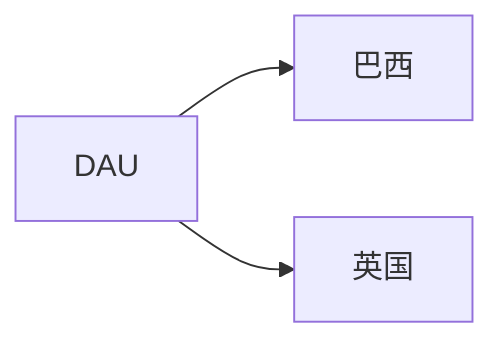
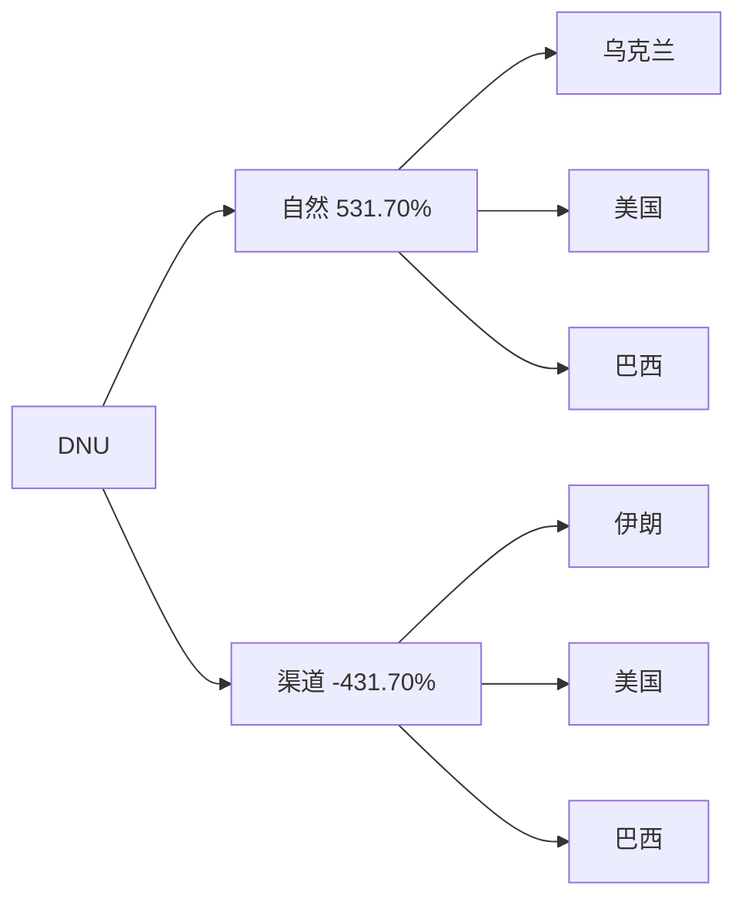
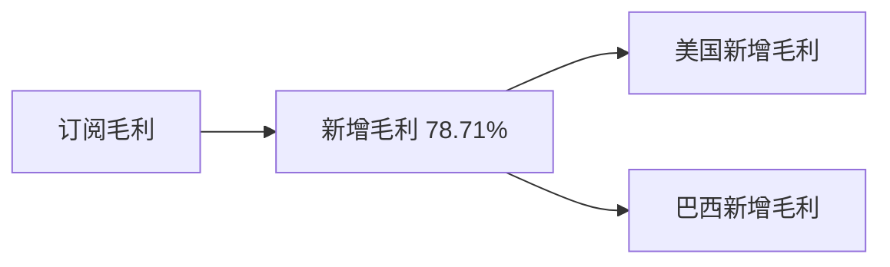
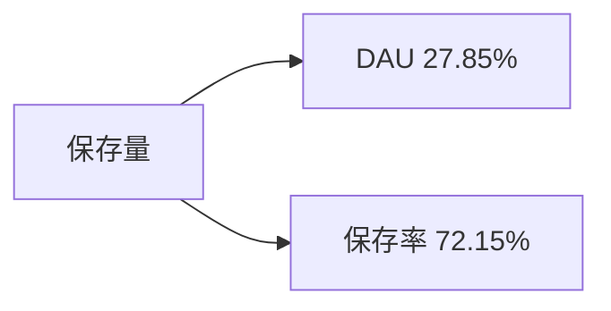

# 周报（2026-06-22 至 2026-06-28）

---

# 一、总结

!summary1_str!

## DAU

!dau_summary_str!日均DAU环比+1.03%（72.33万 --> 73.07万, +0.74万），属正常波动。!dau_summary_end!其中：

> - 巴西DAU环比+2.10%（29.35万 --> 29.97万, +0.62万）（贡献86%）拉动最大，推测wk24（6/12情人节+6/13圣安东尼+6/14起高峰）冲高、wk25六月节中段回落后，wk26逼近6/24圣约翰节巴西活跃修复；
> - 英国DAU环比+3.81%（3.98万 --> 4.13万, +0.15万）（贡献18%）同步上涨，推测夏季出行修图季节性为主。

## DNU

DNU环比+0.39%（4.23万 --> 4.24万, +166），属正常波动。其中：

> - 自然DNU环比+3.52%（2.51万 --> 2.60万, +884），美国自然DNU环比+5.39%（3,633 --> 3,828, +196）、乌克兰自然DNU环比+92.68%（316 --> 609, +293）拉动明显；
> - 渠道DNU环比-4.18%（1.72万 --> 1.64万, -718），美国渠道DNU环比-14.99%（3,067 --> 2,607, -460）、巴西渠道DNU环比-4.22%（9,045 --> 8,664, -381）回落，推测wk24（6/12～6/13）及wk25六月节中段窗口后渠道投放回调。

## 订阅收入

!revenue_summary_str!日均订阅毛利环比-3.56%（$13.02万 --> $12.56万, -$0.46万），跌幅偏大。!revenue_summary_end!其中：

> - 新增毛利环比-5.45%（贡献79%）为主要拖累，美国新增毛利环比-6.36%（贡献43%）、巴西新增毛利环比-8.19%（贡献16%）同步走弱，推测wk24（6/12～6/14）六月节前段促销及wk25（0615～0621）窗口结束后试用转化回落，叠加wk25已显现的美国暑期出行前淡季，本周新增入账延续走弱。

## 活跃次留

整体活跃次留环比-0.90%（32.54% --> 32.25%, -0.29pp），属正常波动。

## 新增次留

整体新增次留环比-0.05%（14.24% --> 14.23%, -0.01pp），属正常波动。

## 保存量

整体保存量环比+3.73%（48.38万 --> 50.18万, +1.81万），涨幅偏大。其中：

> - 保存率环比+2.68%（贡献72%）为主要拉动，DAU环比+1.03%（贡献28%）同步贡献。

!summary1_end!
---
# 二、下钻和归因

## DAU

!summary2_str!
现象：整体DAU环比1.03%（723,297 --> 730,722, 7,425）

> 下钻总结：巴西环比+2.31%拉动最大（贡献86.47%），英国环比+3.58%（贡献18.21%）次之
>
!summary2_end!
!logic_lib_str!
> 知识库命中事件：
>
> - 出处：知识库，São João 圣约翰节（6/24），命中原因：wk26分析周（0622～0628）含六月节正日6/24，巴西DAU由wk25的29.4万修复至30.0万，符合「中段回落后逼近圣约翰节自然修复」节奏。事件描述：
> - 出处：知识库，Festa Junina 六月节窗口，命中原因：wk24（0608～0614）含6/12情人节+6/13圣安东尼+6/14起高峰，巴西DAU冲高31.2万；wk25六月节中段回落至29.4万，与历史双周会口径一致。事件描述：
>
!logic_lib_end!
!logic_train_str!
> 逻辑链：
>
> - wk24（6/12～6/14）六月节前段冲高、wk25中段回落 --> wk26逼近6/24圣约翰节 --> 巴西DAU修复 --> 整体DAU微涨
> - 英国夏季出行季节性 --> 英国DAU上涨
!logic_train_end!
!trend_str!
| 指标 | wk23 0601-0607 | wk24 0608-0614 | wk25 0615-0621 | wk26 0622-0628 | 环比波动 |
|-------|-------|-------|-------|-------|-------|
| **整体 DAU** | 718,559 | 740,301 | 723,297 | 730,722 | +1.03% |
| **美国 DAU** | 120,225 | 118,053 | 119,412 | 118,224 | -0.99% |
| **巴西 DAU** | 289,581 | 312,204 | 293,527 | 299,686 | +2.10% |
| **英国 DAU** | 37,360 | 37,506 | 39,787 | 41,304 | +3.81% |
| **iOS DAU** | 532,381 | 549,575 | 537,941 | 541,510 | +0.66% |
| **Android DAU** | 186,179 | 190,726 | 185,356 | 189,212 | +2.08% |
!trend_end!
**维度下钻**
!tree_str!

!tree_end!

---

## DNU

!summary2_str!
现象：整体DNU环比0.39%（42,277 --> 42,444, 166）

> 下钻总结：自然环比+3.52%，美国自然环比+5.39%（3,633 --> 3,828, +196）、乌克兰自然环比+92.68%（316 --> 609, +293）拉动；渠道环比-4.18%，美国渠道环比-14.99%（3,067 --> 2,607, -460）、巴西渠道环比-4.22%（9,045 --> 8,664, -381）回落，伊朗渠道环比+478.13%（108 --> 627, +518）部分对冲
>
!summary2_end!
!logic_lib_str!
> 知识库命中事件：
>
> - 出处：知识库，Festa Junina 窗口后渠道回调，命中原因：wk24含6/12情人节+6/13圣安东尼，wk25为六月节中段；wk26美巴渠道DNU仍环比-14.99%/-4.22%，与节日前段及中段窗口后投放回落方向一致。事件描述：
>
!logic_lib_end!
!logic_train_str!
> 逻辑链：
>
> - 美国/乌克兰自然新增普涨 --> 自然DNU上涨
> - 6/12～6/13及六月节中段窗口后美巴渠道投放回调 --> 渠道DNU下跌
!logic_train_end!
!trend_str!
| 指标 | wk23 0601-0607 | wk24 0608-0614 | wk25 0615-0621 | wk26 0622-0628 | 环比波动 |
|-------|-------|-------|-------|-------|-------|
| **整体 DNU** | 45,928 | 44,210 | 42,277 | 42,444 | +0.39% |
| **渠道 DNU** | 18,954 | 17,285 | 17,168 | 16,450 | -4.18% |
| **自然 DNU** | 26,974 | 26,925 | 25,110 | 25,994 | +3.52% |
!trend_end!
**维度下钻**
!tree_str!

!tree_end!

---

## 订阅毛利

!summary2_str!
现象：日均订阅毛利（剔除退款，$）环比-3.56%（130,205.77 --> 125,573.21, -4,632.56）

> 下钻总结：新增毛利环比-5.45%拖累明显（贡献78.71%），美国新增毛利（贡献43.25%）为主要负向项
>
!summary2_end!
!logic_lib_str!
> 知识库命中事件：
>
> - 出处：知识库，Festa Junina 前段及中段窗口后转化回落，命中原因：**滞后转化**——wk24（6/12情人节+6/13圣安东尼+6/14起高峰）促销高峰、wk25（0615～0621）六月节中段窗口已在上周兑现，wk26巴西新增毛利环比-8.19%，与试用/直购入账滞后后的回落方向一致。事件描述：
> - 出处：知识库，wk25美国新增毛利走弱延续，命中原因：**上周归因延续**——wk25美国新增毛利已环比回落，wk26美国新增毛利环比-6.36%，推测6月中下旬出行前修图需求淡季及7天试用路径转化放缓。事件描述：
>
!logic_lib_end!
!logic_train_str!
> 逻辑链：
>
> - wk24六月节前段促销高峰 --> wk25窗口结束 --> 本周试用扣费/转化回落 --> 巴西新增毛利下跌 --> 订阅毛利下跌
> - wk25美国新增走弱 --> 本周美国新增毛利延续回落 --> 订阅毛利下跌
!logic_train_end!
!trend_str!
| 指标 | wk23 0601-0607 | wk24 0608-0614 | wk25 0615-0621 | wk26 0622-0628 | 环比波动 |
|-------|-------|-------|-------|-------|-------|
| **日均订阅毛利** | 132,158 | 128,979 | 130,206 | 125,573 | -3.56% |
| **新增毛利** | 69,905 | 68,762 | 66,934 | 63,287 | -5.45% |
| **续订毛利** | 71,253 | 69,548 | 72,518 | 73,407 | +1.22% |
!trend_end!
**维度下钻**
!tree_str!

!tree_end!

---

## 保存量

!summary2_str!
现象：整体保存量环比3.73%（483,750 --> 501,817, 18,067）

> 下钻总结：保存率环比+2.68%为主要拉动（贡献72.15%）；DAU环比+1.03%贡献27.85%
>
!summary2_end!
!logic_train_str!
> 逻辑链：
>
> - 保存率回升 --> 整体保存量上行
> - DAU微涨 --> 保存量增幅部分被放大
!logic_train_end!
!trend_str!
| 指标 | wk23 0601-0607 | wk24 0608-0614 | wk25 0615-0621 | wk26 0622-0628 | 环比波动 |
|-------|-------|-------|-------|-------|-------|
| **整体 保存量** | 492,739 | 450,476 | 483,750 | 501,817 | +3.73% |
| **整体 保存率** | 68.57% | 60.85% | 66.88% | 68.67% | +2.68% |
!trend_end!
**关联下钻**
!tree_str!

!tree_end!

**功能保存率亮点**（|环比|>3%，按 wow绝对值 Top5，仅作数据罗列，不作产品归因）：

| 功能 | wk23 0601-0607 | wk24 0608-0614 | wk25 0615-0621 | wk26 0622-0628 | 环比波动 |
|-------|-------|-------|-------|-------|-------|
| Smooth | 16.30% | 14.42% | 16.01% | 16.64% | +3.93% |
| Acne | 11.08% | 9.49% | 10.56% | 10.97% | +3.86% |
| Filters | 9.72% | 8.84% | 9.55% | 9.88% | +3.48% |
| Skin Tone | 7.80% | 6.87% | 7.70% | 8.02% | +4.12% |
| Body | 8.46% | 7.68% | 8.58% | 8.86% | +3.28% |

---

# 三、异常指标检测

| 指标 | wk19 0504-0510 | wk20 0511-0517 | wk21 0518-0524 | wk22 0525-0531 | wk23 0601-0607 | wk24 0608-0614 | wk25 0615-0621 | wk26 0622-0628 | 周环比变化 | 指标状态 | 异常说明 |
|-------|-------|-------|-------|-------|-------|-------|-------|-------|-------|-------|-------|
| !dau_data_str!**整体DAU**!dau_data_end! | 714,276 | 719,006 | 695,294 | 732,984 | 718,559 | 740,301 | 723,297 | 730,722 | +1.03% | ⚫ | - |
| **整体DNU** | 37,300 | 39,508 | 42,419 | 47,334 | 45,928 | 44,210 | 42,277 | 42,444 | +0.39% | ⚫ | - |
| !revenue_data_str!**日均订阅毛利（剔除退款，$）**!revenue_data_end! | 122,017.64 | 129,601.57 | 131,974.67 | 130,155.45 | 132,157.57 | 128,979.13 | 130,205.77 | 125,573.21 | -3.56% | 🔴 | 日均订阅毛利（剔除退款，$）跌幅异常，需关注 |
| **新增毛利** | 62,842.78 | 66,411.38 | 66,666.33 | 68,766.96 | 69,904.90 | 68,761.69 | 66,933.58 | 63,287.40 | -5.45% | 🔴 | 新增毛利连续4周下跌 |
| **续订毛利** | 66,978.72 | 71,372.00 | 73,733.20 | 69,323.08 | 71,252.54 | 69,548.05 | 72,518.39 | 73,406.68 | +1.22% | ⚫ | - |
| **整体活跃次留** | 32.82% | 30.90% | 31.97% | 32.15% | 31.74% | 32.53% | 32.54% | 32.25% | -0.90% | 🟡 | 整体活跃次留下跌，需关注 |
| **整体新增次留** | 13.49% | 12.82% | 13.69% | 13.82% | 13.41% | 14.42% | 14.24% | 14.23% | -0.05% | 🟡 | 整体新增次留连续3周下跌 |
| **整体保存量** | 493,486 | 489,753 | 476,680 | 503,309 | 492,739 | 450,476 | 483,750 | 501,817 | +3.73% | 🟢 | - |

*说明：环比增长超过3%为🟢增长，环比变化在0~3%(不含0%，含3%)为⚫稳定，环比变化在0~-3%(含0%，不含-3%)为🟡稳定，环比下跌超过3%(含-3%)为🔴异常。*
