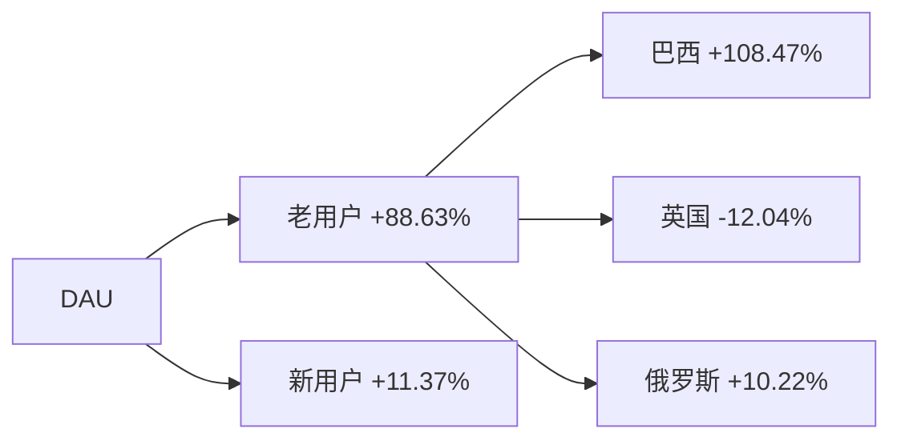
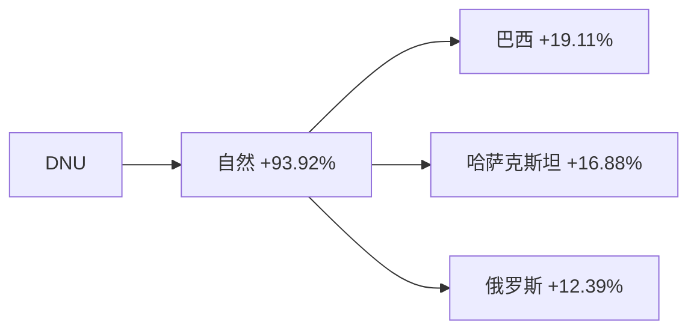
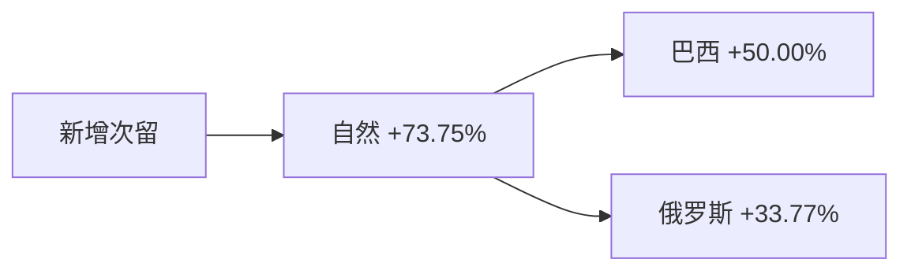
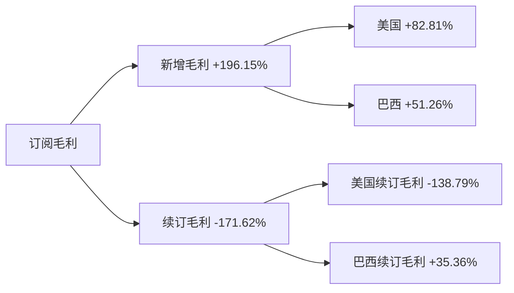
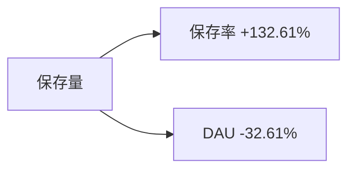

# 周报（2026-06-15 至 2026-06-21）

---

# 一、总结

## DAU

日均DAU为72.3万，环比下跌**2.30%**（74.0万 → 72.3万, -1.7万），属正常范围波动。其中：

> - 老用户DAU环比-2.17%为主因（贡献88.63%），巴西老用户环比-6.22%拖累最大（贡献108.47%），推测2026年6月Festa Junina（六月节）整月活跃窗口在wk24冲高后自然回落，巴西DAU由31.2万回落至29.4万；俄罗斯老用户环比-6.21%（贡献10.22%），推测6/12国庆节后活跃回落。

## DNU

DNU环比下跌**4.37%**（4.42万 → 4.23万, -0.19万），**连续4周下跌**。其中：

> - 自然新增环比-6.74%为主因（贡献93.92%），各国自然新增普遍走弱，巴西（19.11%）、哈萨克斯坦（16.88%）、俄罗斯（12.39%）贡献居前，与DAU侧巴西六月节回落、俄罗斯节后回落同步；
> - 渠道新增环比-0.68%基本持平（贡献6.08%）。

## 订阅收入

日均订阅毛利环比下跌**1.04%**（$12.70万 → $12.57万, -$0.13万），连续3周微跌。其中：

> - 新增毛利环比-3.80%为主因（贡献196.15%），美国、巴西新增毛利回落（贡献82.81%、51.26%），推测6月中下旬毕业季结束、暑期出行前修图需求淡季，与历史同期新增收入走弱模式一致；
> - 续订毛利环比+3.28%反向提拉（贡献-171.62%），美国续订毛利带动（贡献-138.79%）。

## 活跃次留

整体活跃次留环比上涨**0.03%**（32.53% → 32.54%, +0.01pp），属稳定波动。

## 新增次留

整体新增次留环比下跌**1.24%**（14.42% → 14.24%, -0.18pp），属正常范围波动。自然新增次留走弱（贡献73.75%），巴西、俄罗斯贡献居前（50.00%、33.77%），需持续观察。

## 保存量

整体保存量环比上涨**7.39%**（45.0万 → 48.4万, +3.3万），涨幅偏大。其中：

> - 保存率环比+9.91%为主要拉动（贡献132.61%），wk24保存率60.85%为近期低点、本周回升含基数效应；
> - 6/9起上报埋点丢失 marks 提示，保存量/保存率解读须优先核对埋点口径，不宜逐功能绑定产品事件；
> - DAU环比-2.30%形成轻微反向拖累（贡献-32.61%）。

---

# 二、下钻和归因

## DAU

整体DAU环比-2.30%（740,301 --> 723,297, -17,004）

> 下钻总结：主要由于老用户/巴西环比-6.22%造成，贡献108.47%；老用户整体环比-2.17%贡献88.63%
>
> 知识库命中事件：
>
> - Festa Junina（2026-06 整月），命中原因：2026年六月节公历窗口与 wk24～wk25 重合，事件描述：6月整月活跃、wk冲高后常自然回落；wk24巴西DAU 31.2万 → wk25 29.4万
> - 俄罗斯国庆节（2026-06-12），命中原因：节后老用户活跃回落，事件描述：6/12固定节日后俄罗斯 DAU 环比-6.21%（贡献10.22%）
>
> 逻辑链：
>
> - Festa Junina wk24活跃冲高后自然回落 --> 老用户/巴西 DAU下滑 --> 整体DAU微跌
> - 俄罗斯国庆节后活跃回落 --> 俄罗斯老用户 DAU走弱 --> 整体DAU微跌

**维度下钻**

!tree_str!

!tree_end!

| 指标 | wk22 0525-0531 | wk23 0601-0607 | wk24 0608-0614 | wk25 0615-0621 |
| --- | --- | --- | --- | --- |
| **整体 DAU** | 732,984 | 718,559 | 740,301 | 723,297 |
| **美国 DAU** | 122,715 | 120,225 | 118,053 | 119,412 |
| **巴西 DAU** | 283,371 | 289,581 | 312,204 | 293,527 |
| **英国 DAU** | 44,735 | 37,360 | 37,506 | 39,787 |
| **iOS DAU** | 542,980 | 532,381 | 549,575 | 537,941 |
| **Android DAU** | 190,004 | 186,179 | 190,726 | 185,356 |

---

## DNU

整体DNU环比-4.37%（44,210 --> 42,277, -1,933）

> 下钻总结：自然新增环比-6.74%贡献93.92%，各国自然新增普遍走弱，其中巴西（19.11%）、哈萨克斯坦（16.88%）、俄罗斯（12.39%）贡献居前
>
> 知识库命中事件：
>
> - Festa Junina（2026-06）自然新增回落，命中原因：与DAU侧巴西六月节窗口同步，事件描述：巴西自然DNU环比-5.36%（贡献19.11%）
> - 俄罗斯国庆节（2026-06-12）后新增回落，命中原因：节后自然新增走弱，事件描述：俄罗斯自然DNU环比-10.66%（贡献12.39%）
>
> 逻辑链：
>
> - 巴西六月节高峰后自然新增普遍回落 --> 自然DNU下降（贡献93.92%） --> 整体DNU下降
> - 俄罗斯国庆节后自然新增回落 --> 俄罗斯自然DNU走弱 --> 整体DNU下降

**维度下钻**

!tree_str!

!tree_end!

| 指标 | wk22 0525-0531 | wk23 0601-0607 | wk24 0608-0614 | wk25 0615-0621 |
| --- | --- | --- | --- | --- |
| **整体 DNU** | 47,334 | 45,928 | 44,210 | 42,277 |
| **渠道 DNU** | 18,274 | 18,954 | 17,285 | 17,168 |
| **自然 DNU** | 29,060 | 26,974 | 26,925 | 25,110 |

---

## 活跃次留

整体活跃次留环比+0.03%（32.53% --> 32.54%, +0.01%）

> 下钻总结：环比绝对值不足1%，属正常波动，无需下钻归因。

| 指标 | wk22 0525-0531 | wk23 0601-0607 | wk24 0608-0614 | wk25 0615-0621 |
| --- | --- | --- | --- | --- |
| **整体 次留** | 32.15% | 31.74% | 32.53% | 32.54% |
| **美国 次留** | 30.78% | 30.39% | 30.96% | 31.23% |
| **巴西 次留** | 36.88% | 36.82% | 37.64% | 37.40% |
| **英国 次留** | 33.77% | 31.77% | 33.15% | 33.46% |

---

## 新增次留

整体新增次留环比-1.24%（14.42% --> 14.24%, -0.18%）

> 下钻总结：自然新增次留环比-1.29%贡献73.75%；巴西（50.00%）、俄罗斯（33.77%）为主要负向项
>
> 知识库命中事件：
>
> - 巴西/俄罗斯自然新增次留走弱，命中原因：与DAU/DNU侧同国同步走弱，事件描述：本周无留存异常 marks 标注
>
> 逻辑链：
>
> - 巴西/俄罗斯自然新增次留走弱 --> 整体新增次留略降

**关联下钻**

!tree_str!

!tree_end!

| 指标 | wk22 0525-0531 | wk23 0601-0607 | wk24 0608-0614 | wk25 0615-0621 |
| --- | --- | --- | --- | --- |
| **整体 新增次留** | 13.82% | 13.41% | 14.42% | 14.24% |
| **渠道 新增次留** | 13.42% | 12.90% | 13.20% | 13.08% |
| **自然 新增次留** | 14.10% | 13.98% | 14.30% | 14.12% |

---

## 订阅毛利

日均订阅毛利（剔除退款，$）环比-1.04%（126,992.60 --> 125,669.32, -1,323.28）

> 下钻总结：新增毛利环比-3.80%拖累明显（贡献196.15%），美国（82.81%）、巴西（51.26%）新增毛利为主要负向项；续订毛利环比+3.28%反向提拉（贡献-171.62%），美国续订毛利（贡献-138.79%）带动明显
>
> 知识库命中事件：
>
> - 6月中下旬订阅淡季，命中原因：历史同期新增收入普遍走弱，事件描述：毕业季结束、暑期出行前修图需求淡季，与本周美国/巴西新增毛利回落方向一致
> - 本周无订阅毛利相关 marks 标注，命中原因：无直接对应标注
>
> 逻辑链：
>
> - 6月中下旬修图需求淡季 --> 美国/巴西新增毛利回落 --> 订阅毛利微跌
> - 美国续订毛利上涨 --> 部分抵消整体降幅

**维度下钻**

!tree_str!

!tree_end!

| 指标 | wk22 0525-0531 | wk23 0601-0607 | wk24 0608-0614 | wk25 0615-0621 |
| --- | --- | --- | --- | --- |
| **日均订阅毛利** | 130,001 | 131,198 | 126,993 | 125,669 |
| **新增毛利** | 68,751 | 69,798 | 68,314 | 65,719 |
| **续订毛利** | 69,315 | 71,175 | 69,196 | 71,467 |

---

## 保存量

整体保存量环比+7.39%（450,476 --> 483,750, 33,273）

> 下钻总结：保存率环比+9.91%为主要拉动（贡献132.61%）；wk24保存率60.85%为近期低点，本周回升含基数效应；DAU环比-2.30%反向拖累（贡献-32.61%）
>
> 知识库命中事件：
>
> - 上报埋点丢失（20260609），命中原因：时间段重合，事件描述：6/9起保存UV埋点异常，须优先排查口径后再做功能归因
> - 夏季 reshape/body 保存需求（历史参考），命中原因：功能方向相关但本周以埋点口径优先，事件描述：历史6月 reshape/body save UV 有季节性上涨，**本周不作逐功能因果绑定**
>
> 逻辑链：
>
> - wk24保存率低点回升 --> 整体保存率上行 --> 保存量上升（埋点口径待澄清，不宜逐功能归因）
> - DAU环比下跌 --> 保存量增幅部分被抵消

**关联下钻**

!tree_str!

!tree_end!

| 指标 | wk22 0525-0531 | wk23 0601-0607 | wk24 0608-0614 | wk25 0615-0621 |
| --- | --- | --- | --- | --- |
| **整体 保存量** | 503,309 | 492,739 | 450,476 | 483,750 |
| **整体 保存率** | 68.67% | 68.57% | 60.85% | 66.88% |

**功能保存率亮点**（|环比|>5%，按 wow绝对值 Top5，仅作数据罗列，不作产品归因）：

| 功能 | wk22 0525-0531 | wk23 0601-0607 | wk24 0608-0614 | wk25 0615-0621 | 本周环比 |
| --- | --- | --- | --- | --- | --- |
| Smooth | 16.67% | 16.30% | 14.42% | 16.01% | +11.04% |
| Reshape | 18.44% | 18.67% | 17.21% | 18.58% | +7.99% |
| Magic | 15.10% | 15.00% | 13.04% | 14.41% | +10.51% |
| Acne | 11.16% | 11.08% | 9.49% | 10.56% | +11.31% |
| Face | 11.48% | 11.10% | 9.95% | 10.93% | +9.92% |

---

# 三、异常指标检测

| 指标 | wk18 0427-0503 | wk19 0504-0510 | wk20 0511-0517 | wk21 0518-0524 | wk22 0525-0531 | wk23 0601-0607 | wk24 0608-0614 | wk25 0615-0621 | 周环比变化 | 指标状态 | 异常说明 |
|:------|:------:|:------:|:------:|:------:|:------:|:------:|:------:|:------:|:------:|:------:|:------:|
| **整体DAU** | 706,965 | 714,276 | 719,006 | 695,294 | 732,984 | 718,559 | 740,301 | 723,297 | -2.30% | 🟡 | 整体DAU下跌，需关注 |
| **整体DNU** | 39,162 | 37,300 | 39,508 | 42,419 | 47,334 | 45,928 | 44,210 | 42,277 | -4.37% | 🔴 | 整体DNU连续4周下跌 |
| **日均订阅毛利（剔除退款，$）** | 130,109.39 | 122,017.72 | 129,574.66 | 131,951.43 | 130,000.60 | 131,197.60 | 126,992.60 | 125,669.32 | -1.04% | 🟡 | 日均订阅毛利连续3周下跌 |
| **新增毛利** | 62,619.56 | 62,842.78 | 66,411.38 | 66,666.33 | 68,750.95 | 69,797.91 | 68,314.27 | 65,718.62 | -3.80% | 🔴 | 新增毛利连续3周下跌 |
| **续订毛利** | 75,201.65 | 66,978.72 | 71,372.00 | 73,733.20 | 69,314.65 | 71,174.67 | 69,195.78 | 71,466.75 | +3.28% | 🟢 | - |
| **整体活跃次留** | 32.00% | 32.82% | 30.90% | 31.97% | 32.15% | 31.74% | 32.53% | 32.54% | +0.03% | ⚫ | - |
| **整体新增次留** | 13.63% | 13.49% | 12.82% | 13.69% | 13.82% | 13.41% | 14.42% | 14.24% | -1.24% | 🟡 | 整体新增次留下跌，需关注 |
| **整体保存量** | 485,569 | 493,486 | 489,753 | 476,680 | 503,309 | 492,739 | 450,476 | 483,750 | +7.39% | 🟢 | - |

*说明：环比增长超过3%为🟢增长，环比变化在0~3%(不含0%，含3%)为⚫稳定，环比变化在0~-3%(含0%，不含-3%)为🟡稳定，环比下跌超过3%(含-3%)为🔴异常。*
