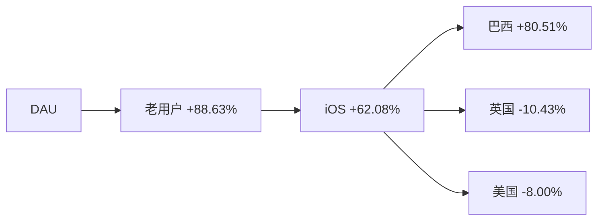
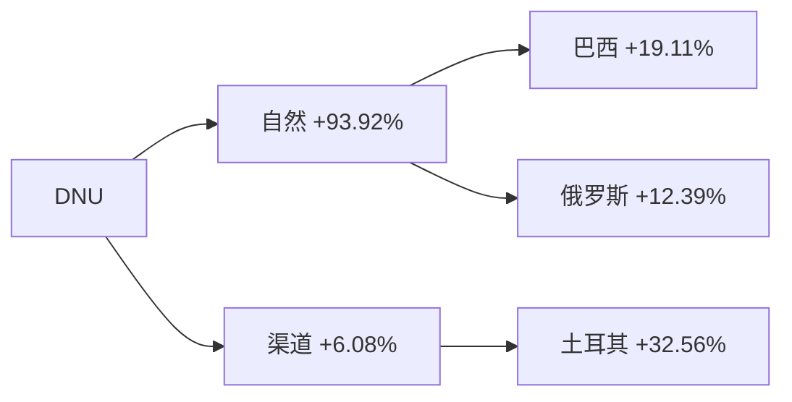
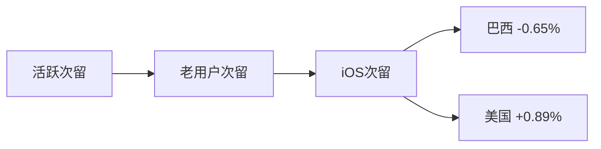
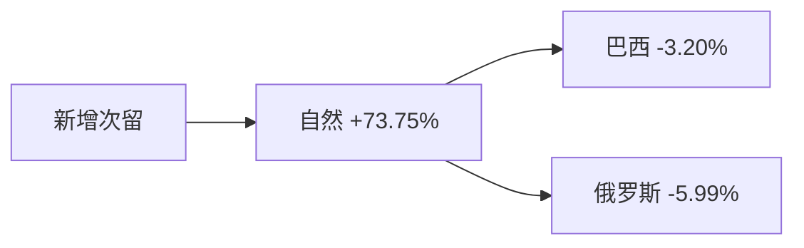
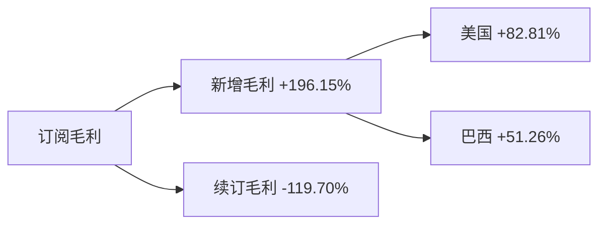
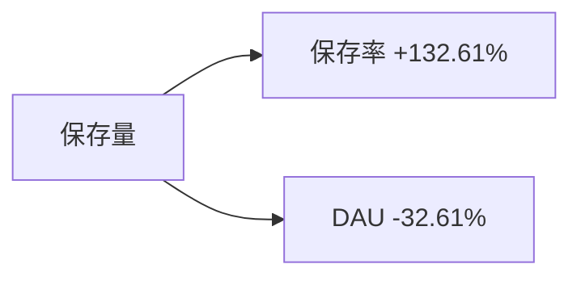

# 周报（2026-06-15 至 2026-06-21）

---

# 一、总结

## DAU

DAU环比下跌**2.30%**（74.0万 → 72.3万, -1.7万），属正常范围波动。其中：

> - iOS端DAU为53.8万，环比-2.12%，老用户/iOS/巴西回落贡献居前；本周期（6/15–6/21）与6/9–6/17 iOS日志丢失修复窗口部分重叠，解读须结合数据口径；
> - 推测wk24六月节（Festa Junina）活跃冲高后自然回落亦有一定影响；
> - 英国DAU环比+6.08%、美国DAU环比+1.15%部分对冲降幅。

## DNU

DNU环比下跌**4.37%**（4.42万 → 4.23万, -0.19万），**连续4周下跌**。其中：

> - 自然新增环比-6.74%为主因，巴西（-5.36%）、俄罗斯（-10.66%）等市场自然新增走弱；
> - 本周期与iOS底层新增表修复窗口重叠，DNU走弱须优先排除数据口径因素；
> - 哈萨克斯坦等国环比跌幅大但绝对量小，不宜作为主因解读；
> - 渠道新增环比-0.68%基本持平，土耳其渠道环比-30.03%拖累，英国、加拿大渠道反向提拉。

## 订阅收入

日均订阅毛利环比下跌**1.04%**（12.70万 → 12.57万, -0.13万），连续3周微跌。其中：

> - 新增毛利环比-3.80%为主因，美国、巴西新增毛利回落贡献居前；
> - 续订毛利环比+3.28%反向提拉，美国续订带动明显。

## 活跃次留

整体活跃次留环比上涨**0.03%**（32.53% → 32.54%, +0.01pct），属稳定波动。老用户/iOS/巴西次留微幅波动，美国、英国次留正向对冲。

## 新增次留

整体新增次留环比下跌**1.24%**（14.42% → 14.24%, -0.18pct），属正常范围波动，需持续观察。

## 保存量

整体保存量环比上涨**7.39%**（45.0万 → 48.4万, +3.3万），涨幅偏大。其中：

> - **保存率**环比+9.91%为主要拉动，但wk24保存率60.85%为近期低点、本周回升含基数效应；
> - 6/9起上报埋点丢失 marks 提示，保存量/保存率解读须优先核对埋点口径，不宜逐功能绑定产品事件；
> - DAU环比-2.30%形成轻微反向拖累。

---

# 二、下钻和归因

## DAU

整体DAU环比-2.30%（740,301 --> 723,297, -17,004）

> 下钻总结：主要由于老用户/iOS/巴西环比-6.47%造成，贡献80.51%；英国、美国反向提拉
>
!logic_lib_str!
> > 知识库命中事件：
> >
> > - iOS部分日志丢失（6/9–6/17），出处：marks（20260608），命中原因：分析周6/15–6/21与修复窗口部分重叠，事件描述：iOS DAU波动须优先排查数据口径
> > - 巴西六月节（Festa Junina）高峰后活跃回落，出处：历史周报20260616，命中原因：时间段重合，事件描述：wk24巴西DAU冲高至31.2万、本周回落至29.4万
!logic_lib_end!
> >
!logic_train_str!
> > 逻辑链：
> >
> > 导致下降
> > - iOS日志丢失修复窗口内口径波动 --> iOS DAU/DNU底层表扰动 --> 整体DAU微跌（与业务回落叠加）
> > - 巴西六月节高峰后活跃自然回落 --> 巴西老用户DAU下滑 --> DAU下降
> >
> > 阻止下降
> > - 英国/美国DAU上涨 --> 部分抵消DAU降幅
!logic_train_end!

!tree_str!
**维度下钻**

!tree_end!

| 指标 | wk22 0525-0531 | wk23 0601-0607 | wk24 0608-0614 | wk25 0615-0621 |
|:------|:------:|:------:|:------:|:------:|
| **整体 DAU** | 732,984 | 718,559 | 740,301 | 723,297 |
| **iOS DAU** | 542,980 | 532,381 | 549,575 | 537,941 |
| **巴西 DAU** | 283,371 | 289,581 | 312,204 | 293,527 |
| **英国 DAU** | 44,735 | 37,360 | 37,506 | 39,787 |

---

## DNU

整体DNU环比-4.37%（44,210 --> 42,277, -1,933）

> 下钻总结：自然新增环比-6.74%贡献93.92%；巴西、俄罗斯自然新增回落为主要可解释项
>
> > 知识库命中事件：
> >
> > - iOS部分日志丢失（6/9–6/17），出处：marks（20260608），命中原因：时间段重合，事件描述：涉及底层新增表，与本周期自然DNU走弱时段重合
> > - relight带动东欧国家新增，出处：marks（20260521），命中原因：上周期热点回落，事件描述：本周自然DNU走弱需结合多国分化解读
>
> > 逻辑链：
> >
> > 导致下降
> > - iOS底层新增表修复期口径扰动 --> 自然DNU走弱（须与业务因素区分）
> > - 巴西/俄罗斯等自然新增走弱 --> 自然DNU下降 --> 整体DNU下降
> > - 土耳其渠道投放缩减 --> 渠道DNU下降
> >
> > 阻止下降
> > - 英国/加拿大渠道投放加码 --> 部分抵消DNU降幅

!tree_str!
**维度下钻**

!tree_end!

| 指标 | wk22 0525-0531 | wk23 0601-0607 | wk24 0608-0614 | wk25 0615-0621 |
|:------|:------:|:------:|:------:|:------:|
| **整体 DNU** | 47,334 | 45,928 | 44,210 | 42,277 |
| **自然 DNU** | 29,060 | 26,974 | 26,925 | 25,110 |
| **渠道 DNU** | 18,274 | 18,954 | 17,285 | 17,168 |

---

## 活跃次留

整体活跃次留环比+0.03%（32.53% --> 32.54%, +0.01%）

> 下钻总结：整体次留基本持平；美国、英国次留正向，巴西iOS次留环比-0.65%为主要负向项
>
> > 知识库命中事件：
> >
> > - 无留存异常 marks，出处：marks，命中原因：本周次留读数稳定，事件描述：iOS日志丢失主要影响活跃/新增底层表
>
> > 逻辑链：
> >
> > 阻止下降
> > - 美国/英国次留微涨 --> 对冲整体次留波动
> >
> > 导致下降
> > - 巴西iOS次留微跌 --> 抵消部分正向贡献

!tree_str!
**关联下钻**

!tree_end!

| 指标 | wk22 0525-0531 | wk23 0601-0607 | wk24 0608-0614 | wk25 0615-0621 |
|:------|:------:|:------:|:------:|:------:|
| **整体 次留** | 32.15% | 31.74% | 32.53% | 32.54% |
| **老用户 次留** | 32.25% | 32.00% | 32.41% | 32.41% |
| **iOS 次留** | 32.07% | 32.19% | 32.56% | 32.45% |
| **巴西 iOS次留** | 36.46% | 35.51% | 38.15% | 36.75% |

---

## 新增次留

整体新增次留环比-1.24%（14.42% --> 14.24%, -0.18%）

> 下钻总结：自然新增次留环比-1.29%贡献73.75%；巴西（-3.20%）、俄罗斯（-5.99%）为主要负向项，绝对跌幅仅-0.18个百分点
>
> > 知识库命中事件：
> >
> > - relight带动东欧新增，出处：marks（20260521），命中原因：历史背景，事件描述：距本周已逾三周，量级有限
>
> > 逻辑链：
> >
> > 导致下降
> > - 巴西/俄罗斯自然新增次留微跌 --> 整体新增次留略降

!tree_str!
**关联下钻**

!tree_end!

| 指标 | wk22 0525-0531 | wk23 0601-0607 | wk24 0608-0614 | wk25 0615-0621 |
|:------|:------:|:------:|:------:|:------:|
| **整体 新增次留** | 13.82% | 13.41% | 14.42% | 14.24% |
| **自然 新增次留** | 14.10% | 13.98% | 14.30% | 14.12% |
| **渠道 新增次留** | 13.42% | 12.90% | 13.20% | 13.08% |
| **巴西 自然新增次留** | 16.97% | 16.54% | 17.98% | 17.27% |

---

## 订阅毛利

日均订阅毛利（剔除退款，$）环比-1.04%（126,992.60 --> 125,669.32, -1,323.28）

> 下钻总结：新增毛利环比-3.80%拖累明显，美国、巴西新增毛利为主要负向贡献；续订毛利环比+3.28%反向提拉
>
> > 知识库命中事件：
> >
> > - 无订阅毛利相关 marks，出处：marks，命中原因：无直接对应标注，事件描述：本周变动以下钻贡献为主
>
> > 逻辑链：
> >
> > 导致下降
> > - 美国/巴西新增毛利回落 --> 订阅毛利微跌
> >
> > 阻止下降
> > - 美国续订毛利环比上涨 --> 部分抵消整体降幅

!tree_str!
**维度下钻**

!tree_end!

| 指标 | wk22 0525-0531 | wk23 0601-0607 | wk24 0608-0614 | wk25 0615-0621 |
|:------|:------:|:------:|:------:|:------:|
| **日均订阅毛利** | 130,001 | 131,198 | 126,993 | 125,669 |
| **新增毛利** | 68,751 | 69,798 | 68,314 | 65,719 |
| **续订毛利** | 69,315 | 71,175 | 69,196 | 71,467 |

---

## 保存量

整体保存量环比+7.39%（450,476 --> 483,750, 33,273）

> 下钻总结：保存率环比+9.91%为主要拉动；wk24保存率60.85%为近期低点，本周回升含基数效应；多二级功能保存率同步上涨 ~7–16%
>
> > 知识库命中事件：
> >
> > - 上报埋点丢失，出处：marks（20260609），命中原因：时间段重合，事件描述：6/9起保存UV埋点异常，须优先排查口径
> > - relight功能热度，出处：marks（20260602/20260521），命中原因：功能相关，事件描述：埋点口径未澄清前仅作背景参考
>
> > 逻辑链：
> >
> > 导致上升
> > - wk24保存率低点回升 + 埋点修复后口径变化 --> 整体保存率上行 --> 保存量上升
> >
> > 阻止上升
> > - DAU环比下跌 --> 保存量增幅部分被抵消

!tree_str!
**关联下钻**

!tree_end!

| 指标 | wk23 0601-0607 | wk24 0608-0614 | wk25 0615-0621 |
|:------|:------:|:------:|:------:|
| **整体 保存量** | 492,739 | 450,476 | 483,750 |
| **整体 保存率** | 68.58% | 60.85% | 66.88% |

> 功能保存率亮点（|wow|>5% 且基数非零）：
>
> - Relight +16.05%（5.05% --> 5.86%）
> - Skin Tone +12.05%（6.87% --> 7.70%）
> - Smooth +11.04%（14.42% --> 16.01%）
> - Acne +11.31%（9.49% --> 10.56%）
> - Reshape +7.99%（17.21% --> 18.58%）

---

# 三、异常指标检测

| 指标 | wk18 0427-0503 | wk19 0504-0510 | wk20 0511-0517 | wk21 0518-0524 | wk22 0525-0531 | wk23 0601-0607 | wk24 0608-0614 | wk25 0615-0621 | 周环比变化 | 指标状态 | 异常说明 |
|:------|:------:|:------:|:------:|:------:|:------:|:------:|:------:|:------:|:------:|:------:|:------:|
| **整体DAU** | 706,965 | 714,276 | 719,006 | 695,294 | 732,984 | 718,559 | 740,301 | 723,297 | -2.30% | 🟡 | 整体DAU下跌，需关注 |
| **整体DNU** | 39,162 | 37,300 | 39,508 | 42,419 | 47,334 | 45,928 | 44,210 | 42,277 | -4.37% | 🔴 | 整体DNU连续4周下跌 |
| **日均订阅毛利（剔除退款，$）** | 130,109.39 | 122,017.72 | 129,574.66 | 131,951.43 | 130,000.60 | 131,197.60 | 126,992.60 | 125,669.32 | -1.04% | 🟡 | 日均订阅毛利连续3周下跌 |
| **新增毛利** | 62,619.56 | 62,842.78 | 66,411.38 | 66,666.33 | 68,750.95 | 69,797.91 | 68,314.27 | 65,718.62 | -3.80% | 🔴 | 新增毛利连续3周下跌 |
| **续订毛利** | 75,201.65 | 66,978.72 | 71,372.00 | 73,733.20 | 69,314.65 | 71,174.67 | 69,195.78 | 71,466.75 | +3.28% | 🟢 | - |
| **整体活跃次留** | 32.00% | 32.82% | 30.90% | 31.97% | 32.15% | 31.74% | 32.53% | 32.54% | +0.03% | ⚫ | - |
| **整体新增次留** | 13.63% | 13.49% | 12.82% | 13.69% | 13.82% | 13.41% | 14.42% | 14.24% | -1.24% | 🟡 | 整体新增次留下跌，需关注 |
| **整体保存量** | 485,569 | 493,486 | 489,753 | 476,680 | 503,309 | 492,739 | 450,476 | 483,750 | +7.39% | 🟢 | - |

*说明：环比增长超过3%为🟢增长，环比变化在0~3%(不含0%，含3%)为⚫稳定，环比变化在0~-3%(含0%，不含-3%)为🟡稳定，环比下跌超过3%(含-3%)为🔴异常。*